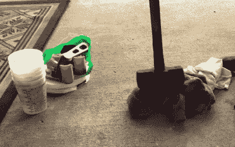

# 从失败到哀号:由 3D 打印废料制成的吉他拨片

> 原文：<https://hackaday.com/2019/12/08/from-fail-to-wail-guitar-picks-made-from-3d-printed-waste/>

在失败的打印和反复的设计之间，需要尝试几次才能确定下来，在 3D 打印时，一定量的浪费材料是不可避免的。好消息是，PLA 是一种生物塑料，可以通过工业堆肥来分解，但即使如此，任何允许你在家中重复使用这种材料的方法都值得一看。

 在最近的一个视频中，【诺亚·泽克】详细介绍了废弃塑料的一个潜在用途[，他将自己失败的 3D 打印品变成了吉他拨片](https://www.youtube.com/watch?v=KRI2KoFFtRs)。这里的想法真的可以应用到任何你可以用薄塑料布制造的东西上，但是你可以用一个商业上可以买到的冲头容易且便宜地生产出镐，这一事实使得这种应用特别有吸引力。

这一过程的第一步是尽可能低的技术含量:用破布包裹你的废弃印刷零件，并用大锤敲打它们。这将它们分解成更小、更易管理的部分，这对下一步很重要。如果零件足够小，并且你有一个相当强大的搅拌机，你不介意致力于塑料回收，我们想象这也将使这一步的短期工作。

适当粉碎后，[诺亚]将塑料放在一块玻璃上，用热风枪加热。PLA 具有相当低的玻璃化转变温度，因此它应该不需要太多时间来软化。然后，他把第二块玻璃放在上面，挤压在一起，得到一个薄而平的塑料片。冷却后，他将吉他拨片从纸中取出，如果颜色旋转成有趣的图案，还会加分。如果你对音乐不感兴趣，[我们看到了一种非常相似的生产彩色地砖的方法](https://hackaday.com/2017/12/30/fresh-baked-plastic-tiles-for-all/)。

 [https://www.youtube.com/embed/KRI2KoFFtRs?version=3&rel=1&showsearch=0&showinfo=1&iv_load_policy=1&fs=1&hl=en-US&autohide=2&wmode=transparent](https://www.youtube.com/embed/KRI2KoFFtRs?version=3&rel=1&showsearch=0&showinfo=1&iv_load_policy=1&fs=1&hl=en-US&autohide=2&wmode=transparent)

