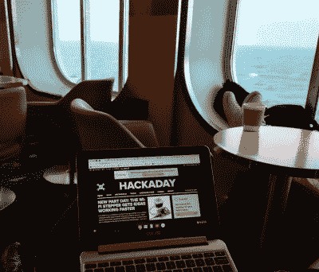
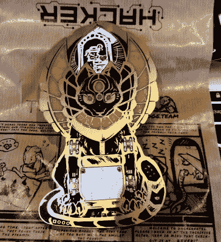
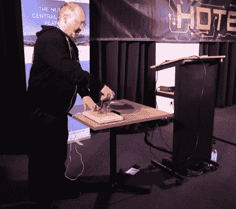
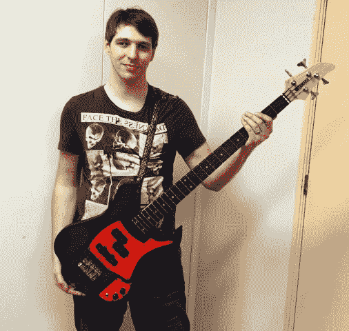
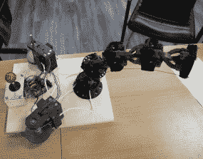
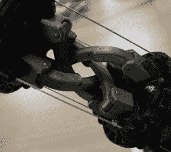
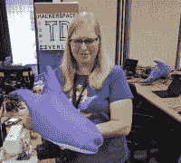
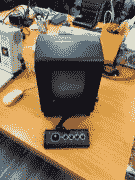
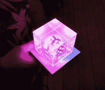
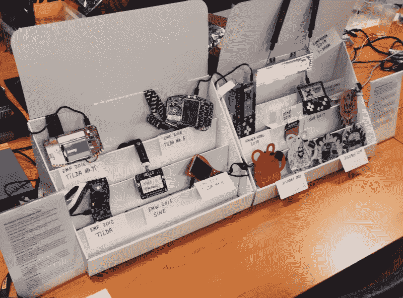

# 来自黑客酒店 2020:徽章，鲨鱼，触须，老派黑客，等等

> 原文：<https://hackaday.com/2020/03/06/from-hacker-hotel-2020-badges-sharks-tentacles-old-school-hacking-and-much-more/>

冬季风暴中的北海是一个壮观的景象，是大风带动的泡沫波峰浪和狂风。如果你是一个不喜欢陆地的人，这不是一个可以花很多时间的地方，所以在几周内穿过它两次一定意味着它的另一边有非常值得一看的东西。

More of that exotic cruise ship lifestyle.

但是欧洲黑客社区对二月天气最好的解药之一是 [Hacker Hotel 2020](https://hackerhotel.nl/) 。大约 350 名来自欧洲大陆西北部所有国家的人来到荷兰东部 [Westcord Hotel de Veluwe](https://westcordhotels.com/hotel/hotel-de-veluwe/) 舒适而热情的酒店，体验度假酒店的便利和奢华，而不是泥泞的场地。

在这样的环境中呆上三天，你会发现一个有点特别的营地，如果你的活动范围延伸到这里，这个营地非常值得一去。

## 一家高档酒店受到黑客待遇

The Hacker Hotel badge 2020 has many hidden depths

在一个潮湿的周四早上，我们的英国人小组提前一天到达，准备帮忙搭建。慢慢地，一个高档商务会议中心变成了黑客营地，会议室变成了演讲厅，照明和视频设备就位，三相电源电缆沿着踢脚板蜿蜒延伸。大楼的一侧搭建了一个大型硬件黑客区，然后 [EventInfra](https://eventinfra.org/) 的人进来布置了一个黑客营级的无线和有线网络，提供无处不在的连接。这两个世界之间的差异是显著的，但它们共同造就了一种独特的体验。

黑客们一个接一个地从四面八方赶来，带着一箱箱通常很酷的东西。一个业余电视卫星地球站，一对超大的 delta 3D 打印机，一个在其他营地常见的投币游戏。和较小的项目；小小的移动机器人，室内大小的多转子，还有几箱过时的中国相框，据说可以被破解来运行 Linux 发行版。

这是一个黑客阵营的命脉，但当然任何黑客阵营的标志性硬件是它的徽章。这家黑客酒店 2020 没有让人失望，它有一个设计精美的古埃及主题徽章，隐藏了一系列跨越多个层次的谜题。我们将在另一篇文章中详细介绍这个徽章，但可以说它是一个杰作。现在，让我们来看一看大会上所有的人和活动。

## 大量的谈话占据了你的大脑

Dimitri throws thew switch to change the [SpaceAPI](https://spaceapi.io/) state and declare the event open.

这是一个软件和信息安全比硬件多一点的活动，但仍然有很多娱乐硬件爱好者和节目其余部分的许多有趣的东西。日程表以组织者 Dimitri Modderman 的欢迎开始，然后直接进入 Walter Belgers 关于 20 世纪 80 年代末和 90 年代初学生入侵 UNIX 的演讲(可惜没有录音)。我很怀念这种感觉，因为与此同时，在另一所欧洲大学的类似实验室里，我经常被发现与文本模式的 SPICE 较劲，或者下载 Amiga 共享软件。

会谈更多地强调信息安全和软件，而不是硬件，甚至来自[Roel van der Valk]的看起来很有前途的开源 SOC 会谈也是关于安全运营中心，而不是片上系统。值得一提的是关于使用 Wireshark 的[、【大卫】、](https://www.youtube.com/watch?v=Q_waW-huZSI)[咖啡烘焙过程和为 Kickstarter 制作咖啡烘焙产品的](https://www.youtube.com/watch?v=4TUngOJJ-dY)，以及常年 locksport 扬声器[、【乔斯·韦耶斯】，关于攻击万能钥匙系统的](https://www.youtube.com/watch?v=cx76qr00YVg)。

[Anco Scholte ter Horst]对荷兰 ISP 自由互联网的建立进行了一次意想不到的讨论。虽然它有很多特定于荷兰和他们的第一个 ISP XS4ALL 的历史，但对一个非荷兰人来说很有趣，因为在 2020 年建立一个 ISP 是很少发生的事情。

## 大量的黑客来取悦你的眼睛

楼上的硬件黑客区是通常的项目阵列，人们聚集在他们的笔记本电脑周围几个小时解决徽章难题。有一些大型展览和一些突出的项目。在入口处，你可能会听到一些吉他音乐。[XDr4g0nX]的低音吉他是 3D 打印的，[我们已经在其他地方报道了它的建造故事](https://hackaday.com/2020/02/29/a-3d-printed-bass-guitar/)。

  A (Mostly) 3D-printed guitar  The robot tentacle shows its reach.  The tentacle “knuckle” mechanism.

[Yvo de Haas]带来了一个触手般的机械手臂，它有一个非常聪明的机制，通过齿轮连接各部分，所有这些都由两台绞盘驱动的一组电缆控制。该机构处于压缩状态，而电缆处于拉伸状态，这使得它确实是一个非常稳定的结构。控制是通过一个操纵杆和一个 Arduino 驱动锚机。我有一种感觉，这是一个我们将在未来看到更多的项目，因为他计划将其扩展到更全面的机器人手臂功能。

  All this shark needs is a laser beam!  One of these retrocomputers is new.  A working MB Vectrex, not something you see every day.  The LED/resin cube in all its glory.

与此同时，另一张桌子上放着[boekenwurm]，上面有两件特别引人注目的作品。第一个是已经进行了一段时间的充气纺织品项目。我提到我在去年的 eth0 周末营看到了一组早期的实验，在这里她把它带到了一个新的水平。欧洲黑客社区似乎对宜家 Blahå填充鲨鱼很感兴趣，作为对她的原型的敬意，她制作了[一只非常令人印象深刻的充气鲨鱼](https://twitter.com/boekenwuurm/status/1229728612598849537)，由电动吹叶机提供空气。然后，她还带来了一个透明树脂立方体内的可寻址 LED 立方体，引起了所有路人的注意。它坐落在一个装有电子设备的基座上，散发着近乎超凡脱俗的光芒。当谈到可寻址 led 时，我们已经看到了一切，但这一个引起了我们的注意。

除此之外，还有一批来自 Benadski 的电脑，以及一个对电视特别感兴趣的业余电台。可悲的是，我被告知他们没有管理他们希望的卫星联系，但他们除了高频 WSPR 信标之外还有很多其他活动。

How many badges do you recognise?

最后，在欧洲电子徽章社区的朋友们的帮助下，我完成了一个项目。我在过去不止一个地方说过和写过关于 BadgeLife 场景的惊人创造力是一场完全来自我们社区内部的艺术运动，它应该被识别和建立。为此，我一直致力于一个社区拥有的旅游博物馆的开端，目的是在欧洲黑客营地展出。在这方面，我并不孤单，在大西洋的另一边，Marie-Lynn Richard 一直在为北美人的利益从事类似的项目。Hacker Hotel 2020 见证了我们欧洲展览的第一个概念验证，这次只有两个展品展示了英国和荷兰活动的徽章进展。为我们未来的外出观看这个空间。

天下没有不散的宴席，第二天我们订好了渡船，就可以帮忙拆船了。酒店从电线和屏幕中脱颖而出，我们感谢工作人员容忍我们的古怪行为，让我们非常受欢迎。现在花点时间思考一下是什么让这个夏令营与我们参加的其他夏令营不同，这很有意思。

除了在北欧潮湿寒冷的冬天令人愉快的东西，这个营地有点不同，因为它的场地舒适。因此，它吸引了稍微多样化的人群，对他们来说，在尘土飞扬的野外过艰苦生活的想法就没那么有吸引力了。由于复杂的规模，它被限制在 350 人左右的某个地方，所以有可能认识大多数与会者，尽管酒店房间可能比一些营地贵一点，但仍有预算选择分享网站上许多平房中的一个。我看着它，不禁想到这个舒适的场地和中小型黑客营地的淡季公式也可以在其他地方工作，我希望我们将来可以看到更多。

所以我们回到了渡船上，虽然有点颠簸，但还是很舒服地渡到了哈威奇。这个营地是明年值得一游的目的地！