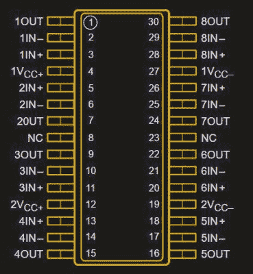
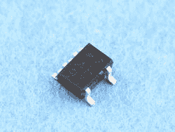
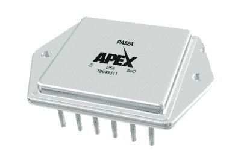
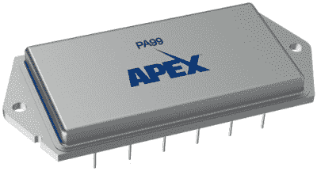
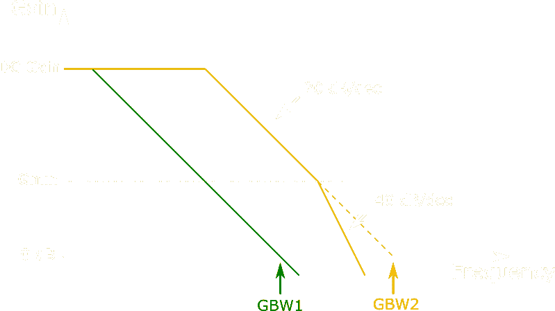
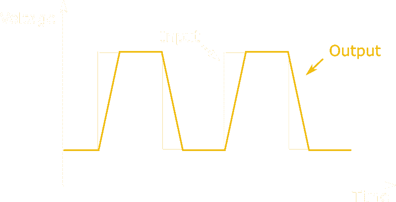
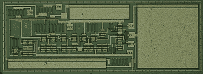

# 从纳安到千兆赫:世界上最极端的运算放大器

> 原文：<https://hackaday.com/2022/01/06/from-nanoamps-to-gigahertz-the-worlds-most-extreme-op-amps/>

运算放大器是模拟电路中最基本的构建模块之一。自 20 世纪 60 年代推出单芯片运算放大器以来，已经开发了数千种不同类型的运算放大器，其中一些更为成功。让一位经验丰富的模拟设计师说出几款运算放大器，他们可能会提到 LM324、TL072、NE5534、LM358，当然还有最早的 uA741。

如果这些器件编号对您没有任何意义，您只需知道这些是通用器件，您可以在任何地方买到，在最常见的应用中也能正常工作。你可以买到更好的运算放大器，在某种规格上有所改进，有时是几个数量级的改进。但是你能真正把运算放大器的概念推进到什么程度呢？今天，我们将向您展示一些超越这些典型“软糖”元件的运算放大器。

在开始之前，我们先来定义一下我们所说的“运算放大器”到底指的是什么。我们正在寻找集成运算放大器，即单个物理元件，具有差分高阻抗电压输入、单端电压输出、DC 耦合和用于反馈配置的高增益。我们排除了任何由分立元件制成的器件，以及固定增益放大器和运算跨导放大器(OTA)等不太通用的电路。

## 频道数量

Pinout of a TL084X2\. The dual supply pins suggest that this is really just two TL084 chips bonded into a single 30-pin package. Image credit: Texas Instruments

从 1963 年的 [uA702](https://hackaday.com/2018/02/20/deconstructing-a-simple-op-amp/) 开始，最早的集成运算放大器仅在单个芯片中集成了一个放大器。然而，从 20 世纪 70 年代开始，双通道和四通道运算放大器开始流行，主要面向有源滤波器的设计人员。如今，对偶和四元组随处可见；也生产一些三路运算放大器芯片，你甚至可以购买 [NJM2710](https://www.njr.com/electronic_device/PDF/NJM2710_E.pdf) ，这是一个六路运算放大器:六个通道。

然而，集成到单个封装中的运算放大器最多只有 8 个:直到几年前，你还可以买到一个 [EL5811](https://datasheetspdf.com/pdf-file/1437100/Renesas/EL5811/1) 、一个 [TL084x2](https://www.digchip.com/datasheets/parts/datasheet/477/TL084X2-pdf.php) ，甚至一个 [LM324x2](https://www.digchip.com/datasheets/parts/datasheet/477/LM324X2-pdf.php) ，所有这些都是八通道运算放大器。在每种情况下，相同的基本电路也有单通道、双通道或四通道版本，因此八通道运算放大器实际上是“双通道”。

如果你想在一个小空间里挤很多放大器，这种东西可能会很有用，但在电路布局和布线方面，使用两个独立的四通道放大器会给你带来更大的灵活性。我们怀疑这就是这些芯片从未在市场上获得多大吸引力的原因。

## 功率消耗

The NJU7700x series are ultra-low-power op amps, using less than a micro-amp. Image credit: New Japan Radio Co.

典型应用中，经典 uA741 的功耗约为 1.7 mA。更现代的设计已经设法降低了这一点:例如， [OPA171](https://www.ti.com/lit/ds/symlink/opa171.pdf) 与’741 兼容，在几乎所有指标(带宽、压摆率、噪声、失调)上都有更好的性能，并且功耗不到半 mA。现代电路设计技术以及半导体制造的进步使得性能/功率比比 20 世纪 60 年代更好。

一些制造商推出了超低功耗运算放大器，其功耗低于一个微放大器。一个例子是 [LPV801](https://www.ti.com/lit/ds/symlink/lpv801.pdf) ，它仅使用 450 纳安。但目前市场上最经济的运算放大器是 [NJU77000](https://www.njr.com/electronic_device/PDF/NJU77000_NJU77001_NJU77002_NJU77004_E.pdf) ，其功耗不超过 290 nA。为了客观地看待这个数字，一个典型的 CR2032 硬币电池的容量约为 220 mAh，这意味着它理论上可以为 NJU77000 供电 86 年——当然，自放电会在此之前耗尽电池。这款运算放大器的规格并不出众，尤其是在带宽方面:1 kHz 的最大值对于处理类似音频的东西来说太低了，但对于气体传感器等移动缓慢的电路来说已经足够了。

## 输出电流

The Apex PA52 is a rather large “chip”, measuring about 36 x 40 mm². Note the BeO warning: the package contains beryllium oxide to achieve high thermal conductivity. Image credit: Apex Microtechnology

另一方面，功率运算放大器可以将大电流驱动到负载中。经典的 [L272](https://www.st.com/resource/en/datasheet/l272.pdf) ，经常被用作电机驱动器，可以在其两个通道中的每个通道上提供一个完整的放大器。但是技术在进步，今天你可以从 Apex Microtechnology 买到结实的 [PA50](https://www.apexanalog.com/resources/products/pa50u.pdf) 和 [PA52](https://www.apexanalog.com/resources/products/pa52u.pdf) 。这些大规模运算放大器可以连续输出 40 A 电流，短时间输出 80 A 电流。虽然它们是一个单一的(相当大的)组件，但在内部它们不是单个芯片，而是混合模块:一组集成电路和分立晶体管直接结合到一个公共衬底上。

然而，所有这些力量都是有代价的；这些不是普通的运算放大器，每个几百美元。事实上，如果您需要的电流超过您的首选放大器所能提供的电流，使用分立功率晶体管制作输出升压电路可能是一个更好的主意。Jim Williams 的[应用笔记 AN18 是这方面的一篇好文章，它展示了提高运算放大器输出电流和/或电压摆幅的各种方法。](https://www.analog.com/media/en/technical-documentation/application-notes/an18f.pdf)

## 电源电压

Danger, high voltage: the PA99 can work at up to 2.5 kV. Image credit: Apex Microtechnology

早期的大多数运算放大器可以在相当大的电源电压下工作:在 20 世纪 70 年代，+/- 15 V 是正常的。在当今的 Arduinos 和 ESP32s 时代，这似乎有些过分，事实上，许多现代运算放大器都乐于在 3.3 V 甚至更低的电压下工作。然而，在另一个极端，工作电压超过 100 V 的运算放大器也相当常见； [LTC6090](https://www.analog.com/media/en/technical-documentation/data-sheets/6090fe.pdf) 和 [ADHV4702](https://www.analog.com/media/en/technical-documentation/data-sheets/ADHV4702-1.pdf) 分别可以在 140 V 和 220 V 下工作。但这一类别中真正的赢家是 Apex 的 [PA99](https://www.apexanalog.com/resources/products/pa99u.pdf) :这款运算放大器可以在电源引脚上工作 2500 V。它的输出电流为 50 mA，增益带宽积为 28 MHz。像它的高电流兄弟一样，它是一种昂贵的芯片，大约 1000 美元，所以你不太可能在任何消费产品中找到它。像这样的专用芯片的主要市场是使用压电致动器或静电偏转的科学仪器和工业设备。

## 带宽

说到带宽，哪种运算放大器速度最快？实际上没有一个单一的、确定的答案。让我们先来看看运算放大器的开环频率响应:它在低频时很高(超过 100 dB)，一直到 DC。在某一频率，增益开始下降，我们称之为-3 dB 点；这是增益达到其 DC 值的 70%的地方。然后，增益继续每十倍下降 20 dB，在单位增益频率下达到 0 dB，0 dB 表示系数为 1。

实际上，这意味着如果配置反馈网络，使总放大器的增益为 1，则该电路的带宽将为单位增益频率。如果你把它的增益设置为 2，它将有一半的带宽。增益为 10 将产生十分之一的带宽，依此类推。由于增益和带宽的乘积始终相同，单位增益频率也称为*增益带宽乘积*。

大多数通用运算放大器可以在任何闭环增益下使用。但这种灵活性是有代价的:单位增益频率必须保持相对较低，以防止振荡。因此，对于高速应用，您可以购买经过*去补偿*的运算放大器。这意味着内部电路已经调整为以更高的带宽工作，但运算放大器不能用于单位增益配置；数据手册将规定放大器可以使用的最小闭环增益。如果你不遵守这个限制，那么你的电路可能会振荡。

下图显示了完全补偿和非补偿运算放大器的开环增益与频率的关系曲线。控制理论告诉我们，如果我们在开环增益每 10 年下降 20 dB 的点上闭合环路，我们将最终得到一个稳定的闭环系统。(实际上，它比这更复杂，但我们现在不会深入研究这一点。)对于全补偿运算放大器，在任何增益下都是如此。但对于失补偿运算放大器，增益每十倍下降 20 dB，最多下降一点；这是`Gmin`，或放大器稳定的最小增益。请注意，此时的带宽远远高于完全补偿放大器的带宽。

Open-loop gain plot of a fully compensated op amp (green) and an otherwise identical decompensated op amp (yellow). Note that the decompensated amp never actually reaches its gain-bandwidth product: GBW2 is extrapolated from the 20 dB/dec part of the graph.

今天你能买到的增益带宽最高的运算放大器是运算放大器 OPA855，工作频率高达 8 GHz。然而，因为它是一个非补偿放大器，你必须以至少 7 的增益使用它，在这种情况下，它将“只”达到 2.5 GHz。最快的非欠补偿运算放大器是 [THS4304](https://www.ti.com/lit/ds/symlink/ths4304.pdf) ，它可以在任何配置下工作，单位增益带宽最高可达 3 GHz。但在你跑去买这种芯片来构建一个多 GHz 放大器之前，请记住，在这样的频率下，适当的电路布局变得至关重要；任何错误位置的杂散电容都会破坏环路的稳定性，使放大器变成振荡器。

## 转换速度

然而，带宽并不是衡量速度的唯一标准。运算放大器数据手册中的另一个特性是压摆率。通常用伏特/微秒(V/us)来衡量，它可以准确地告诉你芯片的输出电压变化有多快。测量运算放大器压摆率的一个简单方法是让它输出方波:输出上升沿和下降沿的斜率等于压摆率。

If you apply a square wave to the input of an op amp, then the output will rise and fall at the op amp’s slew rate.

压摆率主要由运算放大器的内部偏置电流决定，因此通常与电源电流成比例。典型值范围从 uA741 的 0.5 V/us 到 TL072 的 20 V/us。一些运算放大器内部有一个聪明的技巧，称为压摆率提升，当运算放大器检测到输出跟不上输入时，偏置电流会暂时增加。

最高压摆率出现在[电流反馈放大器](https://en.wikipedia.org/wiki/Current-feedback_operational_amplifier)(CFA)中，这种放大器在许多方面与运算放大器相似，但又有很大不同，因此本文中我们不把它们算作运算放大器。与普通运算放大器相比，它们具有低开环增益、高输入失调电压和偏置电流，并且不能用于所有反馈应用。它们通常用于高压摆率是最重要要求的高速电路。

因此，具有最高压摆率的运算放大器结合了 CFA 和常规运算放大器的特性也就不足为奇了，这在一定程度上模糊了它们之间的界限。例如， [EL5102](https://pdf1.alldatasheet.com/datasheet-pdf/view/111910/INTERSIL/EL5102.html) 的压摆率高达 3500 V/us，但开环增益只有 66 dB，而大多数基本运算放大器的开环增益为 100 至 120 dB。其输入偏置电流也相当大，典型值为 2 uA。 [MIC920](http://ww1.microchip.com/downloads/en/DeviceDoc/mic920.pdf) 做得好一点，但在 85 分贝，它仍然不是一个伟大的运算放大器。这一类别中的真正赢家是 [PA107](https://www.apexanalog.com/resources/products/pa107u.pdf) ，它可以将其输出移动到 3000 V/us，但开环增益仍达到 140 dB。它的电源功耗约为 50 mA，因此在设计低功耗时不适合使用。

## 不寻常的材料

几乎所有你今天能买到的集成电路都使用硅作为基本材料。一些高速电路，包括上面提到的一些高速运算放大器，是用硅锗(SiGe)制成的，尽管这只是纯硅芯片的顶层。砷化镓(GaAs)、氮化镓(GaN)甚至碳化硅(SiC)等其他半导体也有可能用于制造运算放大器；然而，鉴于与普通硅的显著成本差异，这些材料主要用于专门的分立晶体管和超高速集成电路。

The die of KTH’s silicon carbide op amp. Image credit: KTH

一些研究项目显示了有趣的结果:瑞典皇家理工学院展示了用碳化硅技术制造的运算放大器，可以在高达 500 摄氏度的超高温下工作。它的性能远非一流，但它的坚固性意味着它应该能够在像金星表面[这样恶劣的环境中工作。](https://spectrum.ieee.org/the-radio-we-could-send-to-hell)

在地球上，硅已经被牢固地确立为首选半导体，而且这种情况不太可能在短期内改变。但正如我们所见，硅芯片非常灵活，几乎可以为任何想象得到的应用提供多种运算放大器设计。