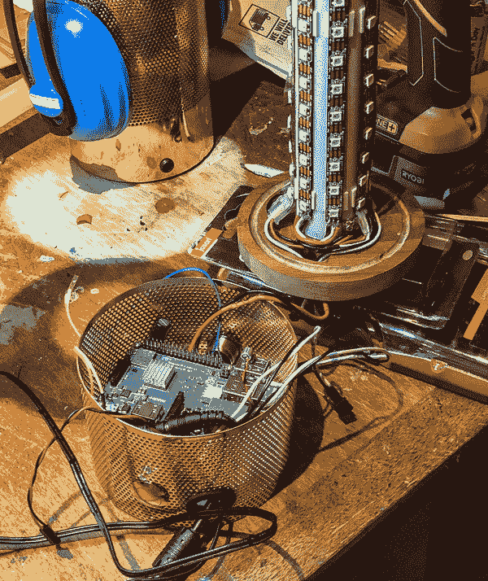

# 在嫉妒的推动下，这盏智能灯真的闪闪发光

> 原文：<https://hackaday.com/2019/03/06/fueled-by-jealousy-this-smart-lamp-really-shines/>

作为熔岩灯的爱好者，[Julian Butler]看到一位同事的现代 LED 灯代表了经典的照明装饰，他知道自己也需要一个。唯一的问题是，它的 Kickstarter 早就结束了，他们不再可用。所以他做了任何一个优秀的黑客都会做的事情:他仔细研究它，做了一堆笔记，[并构建了他自己的版本，最终比最初的](https://blog.julianbutler.com/2018/12/my-digital-lavalamp-or-mki-epilepsy.html)还要好。

 在他的博客上的三集系列中，[Julian]向我们介绍了他的[离子心情灯的设计和建造，该灯在 2014 年筹集了超过 72，000 美元](https://www.kickstarter.com/projects/lavallc/ion-a-music-detecting-mood-light-with-bluetooth-lo)。Kickstarter 活动的细节加上他自己对该设备的第一手观察足以给他一个高层次的总结:该设备在扩散器后面有一个 RGB LEDs 核心，并使用一些软件技巧来产生一些令人愉快的效果和图案。他不关心蓝牙或智能手机应用程序，所以他真正需要做的只是把一些新像素的 led 放在一个玻璃圆筒里，他就完成了。当然，这听起来总是很容易…

正如您从这三个部分的系列文章中已经猜到的那样，到达那里的实际旅程需要一段时间。寻找发光二极管很容易，使用 Fadecandy 控制器使发光二极管闪烁出一些很酷的图案相当简单。但是[Julian]做了一些实验，去了几次工艺品商店，才找到一种材料，可以根据他的口味充分分散 led。虽然最后，他认为他最终采用的多层丙烯酸树脂实际上比原来的离子在混合单个 led 的光方面做得更好。

使用 Fadecandy 使驱动 led 变得容易，但他仍然需要一些东西来提供命令。为此，他在 LED 灯柱上添加了一个装饰底座，隐藏了树莓皮和所有与灯相关的电子设备。这包括一个麦克风，使他的灯具有同样的声音反应功能，使离子如此受欢迎。底座确实让他的灯比原来的版本大了一点，但金属网格结构足够吸引人，整体看起来很不错。

当然，你可能想知道*[Julian]是如何让 led 对声音做出反应的，或者在休息后做视频中展示的任何其他华丽的效果。使这成为可能的软件[构成了系列文章](https://blog.julianbutler.com/2019/02/my-digital-lavalamp-or-mki-epilepsy.html)的第三篇也是最后一篇，它本身就是一个完整的项目。故事的简短版本是，他使用 Python 和 Processing 进行实时计算流体动力学，但在此之前，他进行了必要的调整，以加快 ARM 硬件上的模拟。你知道，正常的灯的东西。*

 *这不是我们第一次看到使用 Fadecandy 板的项目。从创造一个受 Tron 启发的桌子到[建造 5760 个 LED“太空隧道”](https://hackaday.com/2017/02/26/enter-the-space-tunnel/)，如果你有一个可以通过应用一个荒谬的 LEDS 数来解决的问题，这看起来是一个很好的选择。

 [https://www.youtube.com/embed/kiJ81XEa2kA?version=3&rel=1&showsearch=0&showinfo=1&iv_load_policy=1&fs=1&hl=en-US&autohide=2&wmode=transparent](https://www.youtube.com/embed/kiJ81XEa2kA?version=3&rel=1&showsearch=0&showinfo=1&iv_load_policy=1&fs=1&hl=en-US&autohide=2&wmode=transparent)

*