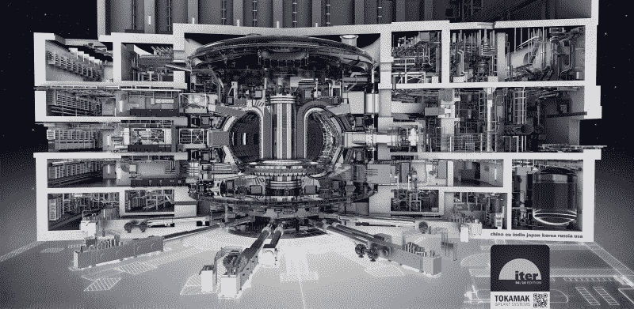
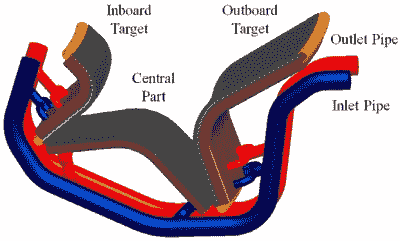
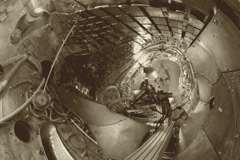
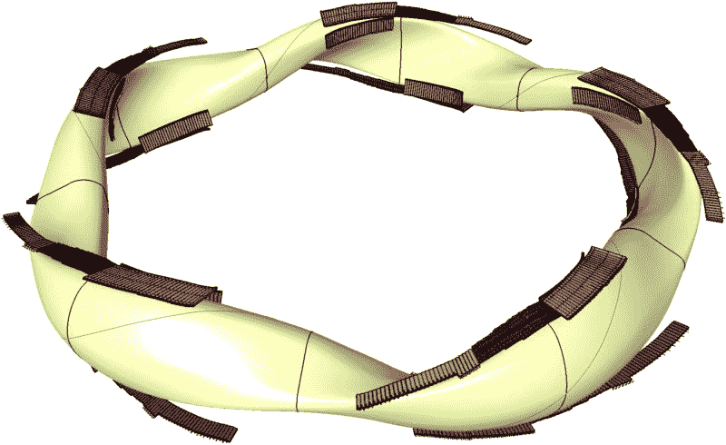

# 为聚变加油:MAST 的 Super-X，JET 的 ITER 氘氚实验，等等

> 原文：<https://hackaday.com/2021/06/02/fueling-up-for-fusion-masts-super-x-jets-deuterium-tritium-experiments-for-iter-and-more/>

我们在世界各地运行核裂变反应堆已经有很长时间了，但是核聚变似乎还需要一二十年的时间。虽然没有人能预测我们何时能达到持续核聚变的目标，但测试硬件的尖端技术正以令人乐观的快速发展。从这个月开始，持续几年，我们正在经历一个核聚变和等离子体物理学的激动人心的时代。

兆安培球形托卡马克(MAST)得到了很大的升级，以测试新的冷却偏滤器设计。JET (Joint European Torus)将测试为 ITER 提供动力的氘氚燃料混合物(该研究项目的名称最初是国际热核实验反应堆的首字母缩写，但后来被改为 ITER)。Wendelstein 7-X stellator 将于明年带着升级的冷却分流器重新上线。

在这里，MAST 升级版的 Super-X 偏滤器到目前为止已经显示出在将热能带出托卡马克反应堆时，偏滤器所暴露的温度降低了十分之一。这意味着偏滤器的设计和最终的聚变反应堆将在维修期间持续更长时间。在 stellator 方面，Wendelstein 7-X 的新偏滤器可以让它[演示](https://www.ipp.mpg.de/4828222/01_20)stellator 聚变反应堆的首次连续运行。与此同时，JET 的燃料实验应该允许我们测试氘氚燃料，而 [ITER](https://en.wikipedia.org/wiki/ITER) 则致力于在 2025 年实现首个等离子体。

## 硬模式下的核物理

我们之所以这么快就想出了如何在商业环境中使用核裂变，本质上可以总结为这是一个很容易自行发生的过程。核裂变的困难更多地在于控制核链式反应，在热中子和普通轻水反应堆(lwr)的情况下，需要在中子减速和吸收之间取得平衡。

另一方面，核聚变是一个完全不同的游戏。核聚变使用尽可能轻的同位素(氢同位素)并试图融合它们，而不是使用一些最重的同位素并向它们发射一些中子以将它们的一部分转化为能量。这显然不是一个容易自行发生的过程，除非你碰巧带了非常大量的氢，并允许巨大的重力压力启动聚变过程，就像恒星中的情况一样。

A 2016 drawing of the different sections of the ITER fusion reactor which is currently being constructed.

虽然在地球上，我们可以找到更多天然铀-235 的时代遗留下来的天然裂变反应堆，但核聚变显然仍局限于恒星，包括我们的太阳。因此，我们在地球上以持续的反应完成核聚变的唯一方法是通过创造合适的压力、温度和其他条件，让氢同位素克服对[库仑势垒](https://en.wikipedia.org/wiki/Coulomb_force)的恐惧并融合，以便它们可以在这个过程中释放大量能量。

简而言之，这就是为什么从首次发现[核聚变](https://en.wikipedia.org/wiki/Nuclear_fusion)过程到现在已经过了一百多年的原因。一百年来的精心实验以及新材料和分析技术的使用，提高了我们对高温等离子体物理的理解，以及我们在这样一个封闭的等离子体中创造和维持聚变条件的能力。

## 追求收支平衡

决定核聚变反应堆设计效果的一个重要指标是 Q 因子。这是输入和输出能量的比率。为了让聚变反应堆开始运转，它必须预热，这需要能量。维持 1 亿摄氏度或更高的工作温度需要一定的能量输入；防止等离子体冷却是研究的一个领域。

理想情况下，反应变得自持，其中聚变反应提供维持等离子体温度和聚变反应所需的能量。然而，即使需要一些输入能量，Q 因子也必须大于 1，才能产生任何实际的能量输出。这基本上意味着比反应堆的磁场发生器和其他元件所需的更多的能量输出。

下个月的 JET [氘氚燃料实验](https://www.nature.com/articles/d41586-021-00408-1)的目标是看看能量输出是否能通过这些燃料混合物得到提升。目前，JET 已经达到了 0.67 的 Q 值，并希望能有所提高。据[预计](https://www.theengineer.co.uk/beyond-iter-next-steps-in-fusion-power/)ITER 的继任者(DEMO)将需要达到至少 25 的 Q 值，以使聚变反应堆具有经济价值。ITER 的 Q 值预计会达到 10。

Schematic description of a proposed divertor module for the planned Korean K-DEMO fusion reactor.

MAST 升级部门正在测试的 Super-X [偏滤器](https://en.wikipedia.org/wiki/Divertor)可能有助于提高聚变反应的效率。这些偏滤器的目的之一是通过去除不需要的元素来净化等离子体，例如在聚变过程中产生的氦原子。保持等离子体稳定和纯净是使聚变反应堆有效工作的两个基本因素。

即便如此，这些包含等离子体的托卡马克设计中的磁场继续形成持续头痛的来源，因为等离子体不满足于以简单、可预测的模式移动。在[扭结不稳定性](https://en.wikipedia.org/wiki/Kink_instability)和香蕉轨道([新古典输运](https://en.wikipedia.org/wiki/Neoclassical_transport))之间，等离子体倾向于表现出远离磁场中心的突然运动。有效地处理这种情况仍然是一个主要问题，因为它可能导致燃料在逃离磁场时丢失。

这是一个星状器的设计可能比托卡马克设计有优势的领域。

## 冷流

Interior of the Wendelstein 7-X stellarator during maintenance.

与简单的圆形托卡马克设计相比，[星状器](https://en.wikipedia.org/wiki/Stellarator)在最好的情况下看起来也很古怪，但这是这些聚变反应堆跟随等离子体行为而不是试图控制它的结果。几乎看起来像有机的磁线圈配置是对等离子体建模的结果，以找到本质上与过热等离子体一起工作而不是与之对抗的配置。

作为一种现代的星状器设计， [Wendelstein 7-X](https://en.wikipedia.org/wiki/Wendelstein_7-X) (W7-X)融合了这些复杂设备的所有知识。自从 2015 年的[第一次等离子以来，W7-X 的性能基本上完美无瑕，以至于在 2018 年开始了下一轮升级。这涉及到水冷分流器的安装等变化。](https://www.ipp.mpg.de/17019/meilensteine)

In ten curved double strips, the divertor plates follow the twisted plasma inside the Wendelstein 7-X. (Credit: IPP)

非制冷偏滤器的运行时间有限，但新的改进型 W7-X 的目标是连续运行 30 分钟。考虑到对于托卡马克设计来说，超过一分钟的运行时间被认为是一个相当好的长度，这将是一个重大的成就。

虽然 W7-X 并不打算产生比投入更多的能量，但它的重要功能是证明 stellarator 聚变反应堆设计至少与托卡马克设计一样有能力。这使得接下来的一系列实验相当令人兴奋。不幸的是，由于新型冠状病毒疫情已经让世界占据了一年多，W7-X 的升级被推迟了，所以实验的恢复可能要到明年才能进行。

## 很多值得期待的

在等离子体物理学和物理学的其他基础领域中，关于核聚变反应堆的许多内容一直是一门紧张而又相当无情的课程。当 20 世纪 50 年代关于核聚变“只有几年的时间”的乐观假设在 Z 箍缩设计被证明不可行时被无情地扼杀时，这个领域似乎在公众的看法中消失了许多年。

快进几十年后的无数科学论文，似乎我们现在可以谨慎地认为自己正处于真正可行的核聚变反应堆的尖端。虽然这不是一个“在未来几年内”的交易，但 ITER 和相关的托卡马克如中国的 CFETR 给了我们托卡马克式反应堆的希望。与此同时，W7-X 的进展形成了一种替代方法，可能比托卡马克更好或更差。

由于 ITER 的氘氚燃料等离子体至少还需要 14 年的时间，我们对目前在 JET 和 MAST 实验室进行的托卡马克实验有很多期待。当我们在未来几年从 W7-X 获得第一批实验结果时，也许它们将有望启动 ITER 的星际飞行器版本。无论情况如何，这十年看起来是核聚变慢慢重新成为焦点的十年。