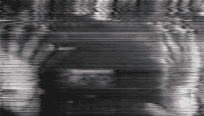

# 全彩色、全动态视频——在录音带上！

> 原文：<https://hackaday.com/2020/04/03/full-colour-full-motion-video-on-an-audio-cassette/>

我们介绍的许多项目都以某种形式使用视频，但视频总是数字的，它以数字流的形式存在于计算机内存或存储器中，并且通常是压缩的。对于我们中一些从小使用复合视频长大的人来说，有点遗憾的是我们很少近距离接触模拟流，所以[Kris Slyka]的项目[将视频放在传统的音频磁带](https://youtu.be/D5zV1mC4E3w)上是一个难得的机会。

It’s fair to say this isn’t the highest quality video.

记性好的读者可能会想起 20 世纪 80 年代末的费雪牌像素电视玩具，它在以数倍于正常速度运行的传统盒式磁带上录制黑白视频。这个系统没有采取这种策略，而是将分辨率和帧速率降低到可以以常规盒式磁带速度录制的程度。结果并不是特别高的质量，但在立体声录音的一边是亮度，另一边是色度的情况下，它确实可以工作。

广告下方的视频是对系统的一次运行，并解释了视频信号的工作原理。同时，[编码器](https://github.com/NuclearLighthouseStudios/Cassette-Video-Encoder)和[解码器](https://github.com/NuclearLighthouseStudios/Cassette-Video-Decoder)的代码都可以通过 GitHub 的魔力获得。如果你有进一步的兴趣，看看[我们对一个视频波形](https://hackaday.com/2018/01/18/know-your-video-waveform/)的检查。

 [https://www.youtube.com/embed/D5zV1mC4E3w?version=3&rel=1&showsearch=0&showinfo=1&iv_load_policy=1&fs=1&hl=en-US&autohide=2&wmode=transparent](https://www.youtube.com/embed/D5zV1mC4E3w?version=3&rel=1&showsearch=0&showinfo=1&iv_load_policy=1&fs=1&hl=en-US&autohide=2&wmode=transparent)

