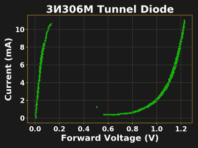
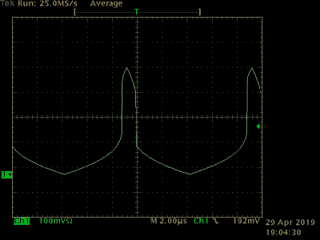
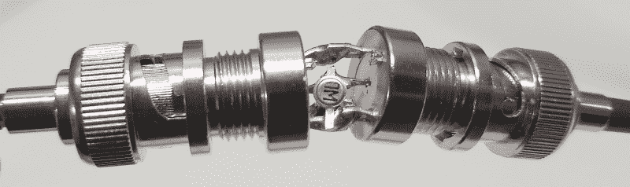
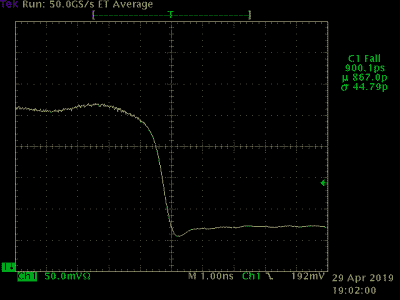
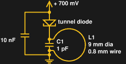
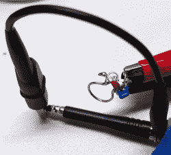
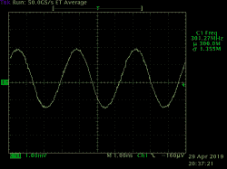
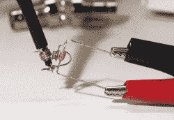
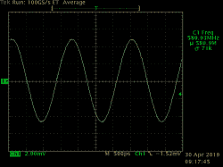
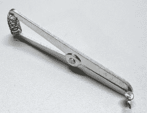

# 负电阻的乐趣 II: Unobtanium 俄罗斯隧道二极管

> 原文：<https://hackaday.com/2019/05/16/fun-with-negative-resistance-ii-unobtanium-russian-tunnel-diodes/>

在本系列的第一部分中，我们看了一个由两个普通晶体管制成的“玩具”负微分电阻电路。虽然这种电路允许使用负阻器件进行实验，而无需采购稀有器件，但其性能受到严重限制。实际的隧道二极管并非如此，它们利用量子隧道效应产生负微分电阻特性。虽然这种双端设备曾经统治着最快的电子设计，但随着其他技术的兴起，它们的使用已经急剧下降。因此，一般的电子黑客可能从未遇到过。今天结束。

 由于现代在线市场的高效率，这些二极管世界的稀有动物并非完全得不到。尽管个人很难买到新生产的二极管，但在易贝仍能找到大量过剩的隧道二极管，每十个一个，价格低至 1 美元。虽然对于新设计来说，使用任何数量的现代技术都会更好，但探索这些奇怪设备的属性可能是一次有趣的学习经历。

在这一期中，我深入挖掘了自己收集的半导体珍奇品，寻找几年前购买的一些俄罗斯 3и306m 砷化镓隧道二极管。让我们来看看只用一个二极管能做些什么——如果它是正确的那种。

【注:文中图片均为小图；点击查看完整版本]

## 3и306m 隧道二极管

 我在 2016 年买了一套十个这样的军用级砷化镓二极管，用来做一些脉冲发生器的实验。您可能还会看到该器件被列为“3I306M”，因为西里尔字母“и”对应于英文“I”。w140.com 的 TekWiki 有一个关于俄罗斯过剩二极管的[好页面，以及关于隧道二极管](http://w140.com/tekwiki/wiki/Russian_tunnel_diodes)的[好的一般信息，尤其是那些用于经典 Tektronix 示波器的二极管。一些二极管被优化用于放大器、脉冲发生器或开关电路。从](http://w140.com/tekwiki/wiki/Tunnel_diodes)[3и306m 数据手册](http://w140.com/tekwiimg/3/32/3i306.pdf) (PDF，俄语)中，我们可以收集到一些关于这种特殊二极管(一种开关类型)的信息，但我发现使用曲线跟踪器直接测量一些参数更容易，它可以生成器件的 I/V 特性曲线。

Tunnel diode waveform shows sharp edges

在上一篇文章中，我介绍了我的快速曲线跟踪器，它只不过是一个信号发生器、一个 10 欧姆电阻和一个示波器。我还提到了这种方法的问题:电压测量被示波器屏幕上的电流测量所破坏。理想的做法是捕获跟踪数据，并在您最喜欢的绘图软件中绘制曲线，您可以在其中补偿误差。这一次，我正是这样做的，将轨迹导出为 CSV 文件，然后使用 matplotlib 在 python 中生成绘图。

从曲线中可以看出，随着电压增加，流经器件的电流最初上升至约 11 mA，直到 150 mV，此时电流突然下降至约 500 uA，然后再次上升。这是负微分电阻(NDR)区，电流随电压增加而下降。关于这条曲线有趣的是，在这个区域只有两个点被捕获。观察电压测量的波形可以看出发生了什么——二极管以非常高的速度开关。

## 切换性能

Tunnel diode switching time test jig – just a couple of BNC connectors soldered together.

该二极管用于开关，因此它应该产生锐边。为了更好地了解这一点，我用两个紧密焊接在一起的 BNC 插孔制作了一个测试夹具:隧道二极管焊接在 BNC 端子上。一端连接到 50 欧姆信号发生器，另一端连接到 50 欧姆端接示波器，这样可以测试二极管的极快开关速度。

Fall time of tunnel diode is less than 1 ns

二极管的开关时间似乎与输入波形无关，当电压达到阈值时，二极管就会切换，因此我用 100 kHz 左右的三角波形驱动它。我测得输出转换的下降时间低于 900 ps，而上升时间略长，为 1.1 ns。对于只有一个器件(忽略信号发生器)的电路来说，这是相当令人印象深刻的。如果你喜欢这种东西，这可能只是锐化经典 555 振荡器的 100 ns 边缘的门票。

这种电路的缺点与所有隧道二极管应用一样，都是输出电平低:这些二极管在低电压和低电流下工作，因此无法产生强大的输出。

## 300 兆赫振荡器

Tunnel diode LC oscillator

虽然这种特殊的二极管可能用于开关，但它可以很容易地用于振荡器。就像我在第一部分中对[晶体管电路所做的一样，我用这个二极管作为有源元件构建了一个 LC 振荡器。隧道二极管的负电阻抵消了 LC 储能电路的正电阻，导致振荡随着时间的推移而增加，而不是减少。](https://hackaday.com/2019/05/08/fun-with-negative-resistance-jellybean-transistors/)

300 MHz oscillator and probe loop

谐振器最初由一个 9 mm 的铜线环路和一个 2 pF 电容并联组成，我是这样认为的。一个 10 nF 旁路电容处理通过二极管的返回电流，一个 700 mV 电源为振荡器供电，尽管我发现电路一旦启动，将继续振荡至 330 mV。

该电路最初以 295 MHz 振荡。当我将 2 pF 电容换成 1 pF 器件时，频率仅上升到 300 MHz，我意识到二极管本身的电容使频率保持较低。通过计算线环的电感，我能够估计二极管电容约为 18 pF(数据手册只说小于 30 pF)。该二极管电容增加了 LC 储能电容，降低了谐振频率。

300 MHz tunnel diode oscillator output

出于同样的原因，在探测这样的电路时必须小心。我的 10x 示波器探头声称具有 10 pF 的标称电容，如果直接探测电路，也会有类似的降频效果。相反，我将接地夹连接到探头的尖端，形成一个电感拾波环路。将两个环路保持在一起就像一个变压器，并提供足够的耦合来检测信号和测量频率。由于耦合在某种程度上是任意的，因此幅度调整没有经过校准，但仍然可以看到电路工作的变化，例如由于改变电源而引起的变化。

## 581 兆赫振荡器

581 MHz tunnel diode oscillator with two components

不满足于 300 兆赫，我决定剥离电路到最低限度，以加快速度。我把二极管引线切短，直接焊接到 100 pF 轴向电容上。这种情况下，引线本身提供必要的电感，与二极管电容谐振。再次使用 700 mV 的电源电压，我发现电路以 581 MHz 振荡。我不知道如何使用集总元件来加快速度，也许有人可以在评论中提出不同的方法。空腔谐振器？

Output of two-component tunnel diode oscillator at 581 MHz

无论如何，我发现一个双端器件可以如此简单地形成这样一个振荡器，这太神奇了。我也非常欣赏从事这些工作的设计师:使用这些二极管防止电路中不必要的寄生振荡肯定是一个重要的考虑因素。这也是为什么我还没有尝试用这些二极管来构建放大器。有一句古老的谚语说，构建振荡器最简单的方法是设计放大器，现在我想知道这句话在隧道二极管时代是否真的流行。

为了测量这个更快的振荡器，我用一段裸铜线在示波器探头末端构建了一个更小的拾取环路。不要被输出的完美正弦波形所迷惑；这是一个在 1 GHz 范围内测量的 581 MHz 信号，因此没有足够的带宽来显示许多失真。他们可能在场，也可能不在场，但我们无法用这个设备来判断。与之前的振荡器一样，探头环路的随机耦合会产生任意幅度，因此无法比较两个电路的输出。

## 惨痛的教训

Soldering heat sink can prevent thermal damage

这些砷化镓二极管既脆弱又迷人。我在这些实验中使用的四个二极管中，我毁掉了两个。第一个问题是在曲线跟踪过程中施加了过多的电压。最好的方法可能是从低电平开始，这些器件的有效区域低于 1 V，然后慢慢推进。第二个受害者是过热。数据手册提醒注意，加热引线不要超过 3 秒钟，温度不要超过 260°C，并在二极管体和引线上的焊点之间使用散热器。我在煮过头后读了这篇文章。我没有推荐的 2 毫米宽的铜镊子，但最后用我最初购买的用于焊接锗元件的夹紧式铝水槽凑合。

二极管也对静电敏感，数据手册警告不要用二极管测试仪测试它们。当我阅读这篇文章时，我已经在 DMM 上测试了一个具有二极管测试功能的二极管，尽管二极管似乎幸存了下来——至少它没有立即被破坏——但测试仪没有记录二极管的任何极性。因此，使用数据手册中的图表来确定哪一端是哪一端。

底线:如果你玩这些二极管，要小心，并确保购买一些备件。

## 接下来是什么？

以上就是关于负阻器件的简短动手系列。如果你有使用这些不寻常的二极管或类似器件的第一手经验，请务必在评论中告诉我们，尤其是如果你能得到一个比 581 MHz 快得多的二极管。我真想看这些东西尖叫。