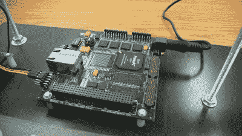
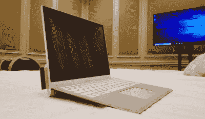
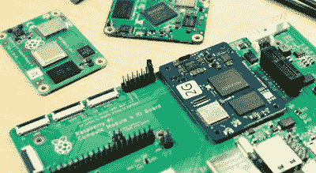
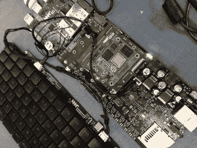

# 未来带来 CPU 模块，未来就是现在

> 原文：<https://hackaday.com/2022/09/14/future-brings-cpu-modules-and-the-future-is-now/>

模块化对我们来说是一个有趣的话题。看到一个复杂的系统被分成几个部分，而且这些部分是可以替换的，这是一种满足感。毕竟，我们经常希望更换设备的某些部件，以进行维修或升级，而且经常在易贝寻找笔记本电脑部件，为你的 Thinkpad 配备最适合你的部件组合，这很有趣。我一直对模块化很着迷，我相信黑客们应该知道在过去十年中 CPU 模块方面发生了什么。

This “swap your Thinkpad keyboard” [video](https://www.youtube.com/watch?v=V74pSO8of4M) thumbnail captures a modularity-enabled sentiment many can relate to.

鉴于台式电脑无与伦比的模块化，我们已经习惯了交换组件，当有人试图将电话或笔记本电脑这样的整体概念分割成模块时，这是一个大新闻。有时，CPU 本身被放入一个模块中。从 Project Ara 的宏伟构想，到英特尔的 Compute Card，再到 Framework laptop 的标准化主板，各公司一直在试图利用 CPU 模块标准化可以给他们带来的好处。

也有一些爱好者驱动的和爱好者友好的模块化标准——你已经可以使用这种标准来获得强大的布局要求高的 CPU 和 RAM 组合，并将其放在你简单的自行设计的板上。我想告诉你一些值得注意的模块化 CPU 概念——它们的想法、复杂性、限制和故事。当你在你的一个雄心勃勃的项目上工作时，你知道，就是这个项目，你很可能会从这样的标准中受益匪浅。或者，也许你会发现有必要设计下一个标准供其他人使用——毕竟，我们都知道标准永远不会太少！

## 模块化怎么还活着？

我们喜欢可修复性和可升级性。可悲的是，许多面向消费者的小工具生产公司并不像我们一样重视这些——随着时间的推移，你会看到以前无处不在的模块化方面，如可交换 CPU 甚至笔记本电脑上的 RAM，变得越来越不普遍。简单地说，让我们购买新设备比让我们升级和维修旧设备更有利可图。尽管如此，模块化仍然存在的原因——在某些重要的方面，设计模块化产品更简单。例如，您不必使用高速 CPU 和 RAM 互连来布局自己的主板，而是能够专注于必须适合您选择的 IO 的部分，从而大大简化设计。

这是模块化计算在商业上可行的恰当证明，[PC/104 标准](https://en.wikipedia.org/wiki/PC/104)已经成为工业计算的主要部分，这在很大程度上是因为如果你的旧主板出现故障，很容易得到替换主板。毕竟，工业客户愿意为某种程度的模块化支付额外费用，因为这意味着他们可以快速修复设备，而不会因为生产线闲置而损失大量资金。此外，当您的设备需要升级时，由于系统要求不断提高，处理能力不断增强的 PC/104 主板几乎不会出现短缺。

消费者没有那么大的影响力来使消费产品模块化。从我们今天的立场来看，这是有道理的，但这是可悲的，也不一定是这样。当我们有像谷歌和英特尔这样的公司带着自己的目的开始有吸引力的模块化项目，然后把无数重要的方面搞砸，并最终搁置一切时，这也没有帮助。一方面，以这种方式拙劣地生产产品是大公司众所周知的惯用手法——另一方面，令人沮丧的是，我们满怀希望，然后却以一次不太努力的失败为代表。如果你不知道事情会变得多糟糕，这里有一个例子。

## 企业犯错的方式

英特尔是一家制造 CPU、芯片组和各种爱好者只能梦想有一天能摆弄的东西的大公司。他们既有大量的资源，也有开发模块化解决方案的客户群，而且他们一直在试图获得自己的模块化、有点业余爱好者可访问的嵌入式想法，每隔几年就有一个新的想法。到目前为止，这些想法都失败了，很大程度上是由于英特尔自己善变的决定——正如我们许多非常熟悉英特尔爱迪生和伽利略产品线的人可以证明的那样。

That slot on the left is where you would’ve had inserted your Intel Compute Card – if you had one.

例如，2017 年，英特尔推出了计算卡概念——一种具有 CPU、RAM 和存储的卡，你可以放在口袋里，插在任何东西上。两年后，他们搁置了这个概念。特别是，[一篇来自 NexDock 的礼貌尖刻的博客文章，](https://nexdock.com/blog/the-tale-of-nexdock-and-intel-compute-card/)这家公司当时正试图开发一种计算卡 Dock，揭示了英特尔的行为是多么粗鲁。读到“英特尔计算卡过于复杂的加密和认证要求”有点可笑，而读到英特尔支持不足也不足为奇。

尽管英特尔吹捧 NexDock 的努力是一项成就，但这不足以保证适当的合作和透明度，NexDock 最终在英特尔从未认真对待的事情上花费了大量的金钱和时间。英特尔开发 CPU+RAM 模块的最新成果被称为[英特尔计算元素。](https://www.anandtech.com/show/14467/intel-launches-the-nuc-compute-element-for-modular-computing-systems)这显然不是为你准备的:它是用于构建定制的 nuc 和其他具有需求定制硬件的系统，这反映在[模块的价格标签上。](https://nl.mouser.com/ProductDetail/Intel/BKCM8v5CB8N?qs=xZ%2FP%252Ba9zWqaZHt1E3IznVQ%3D%3D)从“如果”的角度来看，这看起来不错，但现在，我们已经学会了不要期望太多。

## 有了足够的资源，我们可以自己到达那里

英特尔在 2017 年展示了他们的计算卡概念。2016 年，一个惊人相似但开源且对爱好者友好的项目正在成形。[eoma 68 项目](https://www.crowdsupply.com/eoma68/micro-desktop)邀请我们为 CPU 卡的未来做出贡献——你可以在一个小的低功耗卡上拥有 CPU、RAM 和存储，可以插入笔记本电脑形状的外壳、游戏控制台、小的 NUC 式桌面盒子，甚至可以独立使用 HDMI 显示器和带电源的 USB 集线器。如果您要去某个地方，您可以将系统从台式机机箱中取出，并将其插入笔记本电脑外壳，然后在返回时再插上。与英特尔的计算卡有许多相同的目标和相同的外形，但没有企业的支持，这是一个大胆的目标，即使你将获得 A20 CPU 而不是 x86 系统。

EOMA68 项目由一位雄心勃勃的工程师设计，致力于完成工作，其目标是绝不妥协兼容性，同时保持卡可用于小规模设计和生产——确保在第一批计算卡过时后，构建向后兼容的卡仍然是现实的。在一个机智的举动中，PCMCIA 连接器和外壳被用于 IO 连接——便宜且仍然广泛可用。我们小心翼翼地设计了一种引脚排列，它可以兼容未来几代不同的 CPU，旨在实现可升级性而不丧失功能——众筹活动毫不费力地达到了目标，表明人们相信这个项目所代表的意义。

然而，生产一批 EOMA68 卡被证明是一场斗争。制造是一场艰苦的战斗，连接器一个接一个缺货，替换品导致低产量问题。时间是一个残酷的情妇，只会在每一次延迟的基础上堆积额外的问题，该项目的最后一次更新令人放心，但尚未取得成果。然而，这是我们中的一个人应该开始的旅程——即使没有发布，这个小项目也实现了英特尔无法实现的事情。除此之外，作者还保留了一个丰富的研究数据库，开发过程已经在邮件列表上公开讨论，这对任何研究模块化计算的人来说都是无价的资源。

## CM4 外形不再是他们的专利

毫无疑问，您对 Raspberry Pi 计算模块很熟悉，但可能并不熟悉所有引脚兼容的替代产品。当[pi4 问世时，](https://hackaday.com/2019/06/23/raspberry-pi-4-just-released-faster-cpu-more-memory-dual-hdmi-ports/)其中一个问题是——考虑到新增加的 PCIe 接口，下一个计算模块会是什么样子？大多数人期待新一代 SODIMM 可安装模块，而[我们得到的](https://hackaday.com/2020/10/19/new-raspberry-pi-4-compute-module-so-long-so-dimm-hello-pcie/)与此相去甚远。一旦对低间距无对齐引脚连接器的哀叹平息，PCIe 的承诺就太多了，黑客们已经推出了各种载板和基于计算模块的黑客技术。几乎有太多要涵盖，[但我们肯定会尝试！](https://hackaday.com/2021/10/14/the-compute-module-comes-of-age-say-hello-to-the-real-cutting-edge-of-raspberry-pi/)

当然，这种 SoM(系统级模块)的引脚排列+连接器+尺寸组合没有任何排他性，前面提到的无数载板对任何明智的设计师来说都很有吸引力，足以避免创建一个全新的生态系统。因此，您拥有多块不同的电路板——[pine 64 SOQuartz](https://wiki.pine64.org/wiki/SOQuartz)、 [Banana Pi BPI-CM4](https://liliputing.com/banana-pi-bpi-cm4-compute-module-with-amlogic-a311d-is-pin-compatible-with-raspberry-pi-cm4/) 和 [Radxa CM3、](https://www.cnx-software.com/2021/11/07/radxa-cm3-raspberry-pi-cm4-alternative/)等等。与 CM4 相比，它们都有一些优势——我个人最喜欢的是 SOQuartz 上的 eDP 兼容显示端口和 CM3 上的 SATA 端口，但还有更多优势。业余爱好者也加入了 CM4 兼容板的行列，例如[ULX4M FPGA 板、](https://www.crowdsupply.com/intergalaktik/ulx4m)甚至还有来自 Antmicro 的[RISC-V CM4 兼容板](https://antmicro.com/blog/2021/04/arv-som-announcement/)。

这些模块并不完全像你每天可以在平板电脑和台式电脑之间交换的计算机卡，但如果你碰巧有一台期待 CM4 基板的设备，它确实可以提供意想不到的令人愉快的升级。在 CM4 模块短缺的时候，这也是一个天赐良机。更重要的是，像图灵皮和 MNT 改革这样的玩家已经为他们自己的生态系统创造了适配器。

## 改革笔记本电脑，CPU 模块生态系统免费

如果你关注过[诺维那、](https://hackaday.com/2014/04/02/bunnie-launches-the-novena-open-laptop/)这样的项目，你会知道恩智浦的 i.MX 系列处理器是最开放友好的 ARM CPUs 之一。Novena 六年后，[MNT 改良笔记本电脑](https://hackaday.com/2021/08/26/hands-on-mnt-reforms-the-laptop/)明智地[选择了 i.MX8 CPU。](https://mntre.com/reform2-handbook/system.html)然而，他们不想开发复杂的多层基板，而是选择了 DDR-form factor[I . MX8M-hosting SoM](https://boundarydevices.com/product/nitrogen8m-som/)from Boundary Devices——使改造后的主板设计更加便宜和简单。Boundary Devices 的 SoM 的独特之处在于，它是最开放的 i.MX8M 模块，适用于努力实现尽可能开放的笔记本电脑。

再次重申，引脚排列+连接器+尺寸组合没有任何排他性，DDR 外形模块只是一个边缘带有一组镀金焊盘的 PCB。你可以看到这是怎么回事，对不对？MNT 改革的团队开发了一些定制的 som 和适配器，与 i.MX8 模块的表层连接兼容。迄今为止，已经有了一个用于 Pi CM4 的适配器，因此可以与另外三个上述 CPU 板兼容，[一个恩智浦 LS1028A 板](https://twitter.com/minut_e/status/1384841545573183491)具有一半的 CPU 内核，但 RAM 是两倍，[甚至还有一个 Xilinx Kintex-7 FPGA 托管板](https://twitter.com/minut_e/status/1412878466849067009)，据说是软件合成 RISC-V CPU [ala 的前身。](https://hackaday.com/2022/08/06/heres-how-the-precursor-protects-your-privacy/)

更重要的是，MNT 最近[宣布开发口袋改革，](https://hackaday.com/2022/07/01/mnt-reform-goodness-now-even-smaller-with-pocket-reform/)一款 7 英寸笔记本电脑形状的配套设备。为了不错过这样一个绝佳的机会，MNT 袖珍改革使用这种确切的模块形式因素作为其较大的同胞。现在，MNT 产品系列成为了一个具有可交换 CPU 卡的生态系统——我们并不十分期待这种情况发生，但这是一个我们并不是每天都能得到的惊喜。如果你正在开发一个无与伦比的网络平台，你也应该考虑在 PCB 上安装一个 DDR 插座，并从 MNT 生态系统提供的一切中受益。

## 未来还会有更多，已经很多了

随着每个项目敢于创建一个标准——或者更好地坚持一个现有的标准——模块化计算在黑客项目中越来越成为现实。特别是 CM4 和 MNT CPU 模块标准都是可访问的和黑客友好的。如果你想开发一个定制的高度功能化的可穿戴设备，或者用笔记本电脑主板替换你从小到大的 Thinkpad，现在是开始的最佳时机。就像 I2C 设备已经慢慢地[结合在 JST-SH 连接器上一样，](https://hackaday.com/2022/05/04/the-connector-zoo-i2c-ecosystems/)也许很快，我们就会随心所欲地将强大而时尚的计算机构建成我们想要的任何东西，我们的零件抽屉将获得一个名为“CPU 模块”的新抽屉。

标题图片:“英特尔赛扬 LGA775 CPU 的背面”