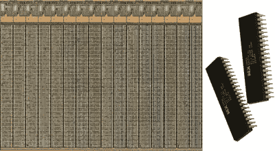
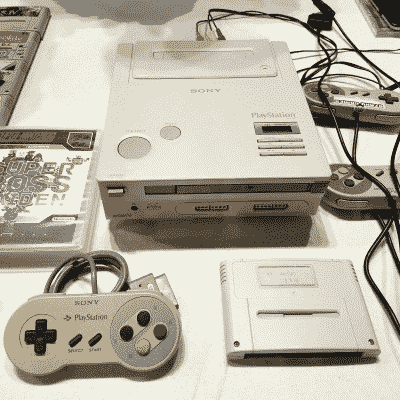
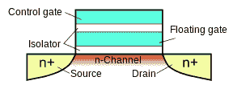
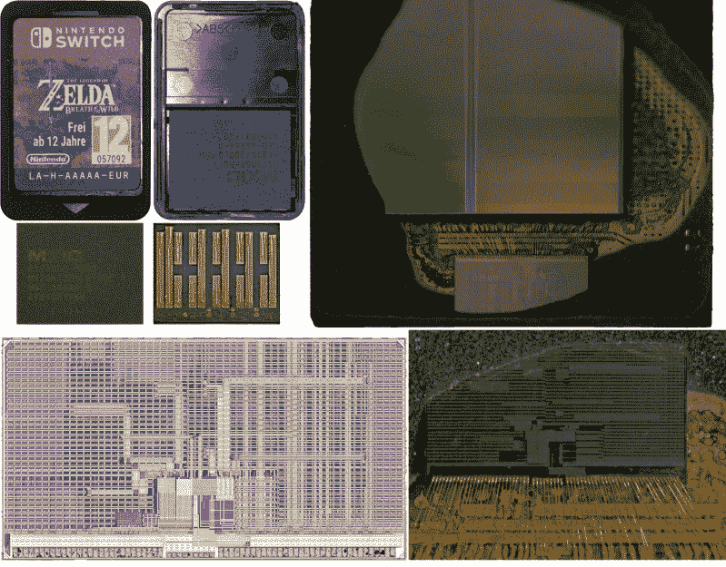

# 游戏卡带和让数据永久保存的技术

> 原文：<https://hackaday.com/2020/12/03/game-cartridges-and-the-technology-to-make-data-last-forever/>

游戏卡带可能是所有常见存储方案中最难的。除了钝性外伤力或对游戏盒边缘连接器施加电涌之外，很难意外损坏游戏盒。无论是 1970 年代末的雅达利 2006 卡带还是 1990 年代的任天堂 64 卡带，上面的数据也是如此。

这里的秘方是 MROM(mask rom)，这是一种只读存储器芯片，可以将软件转化为硬件存储设备。当在芯片制造期间金属化互连时，使用对每个数据集唯一的掩模层。这意味着存储在它们上面的数据和游戏机本身的处理器一样持久。然而，这不是一项我们可以在自己的爱好项目中使用的技术，而且由于制造本质上是定制芯片的相关成本，它也不能用于个人长期数据存储。

尽管 MROM 具有真正持久存储的价值，但几十年来已经失宠。您可能会惊讶地发现，消费市场中目前使用的许多东西在短至一年到十年的时间内(取决于环境条件)很容易发生数据损坏。

那么，如果我们需要在未来几十年保持可读的只读数据，我们该怎么做呢？

## 《全面回忆》的多种口味

Mask ROM ICs next to a die shot.

ROM(内存)中的“M”有多种类型；MROM 与 [PROM](https://en.wikipedia.org/wiki/Programmable_ROM) 同属于“一次可编程”类别。一些类型可以重复写入，如 [EPROM](https://en.wikipedia.org/wiki/EPROM) (前者需要紫外光来擦除内容)和 [EEPROM](https://en.wikipedia.org/wiki/EEPROM) ，其中额外的“E”意味着可以用电流擦除。磁存储是最容易读取和(重新)写入的存储介质之一，这就是为什么磁带、软盘和硬盘驱动器在许多领域都是存储介质的选择。

最后，还有“一闪即逝”类型的存储器，如 SRAM 和 DRAM，它们需要恒定的电源来保持数据完整。

选择哪种类型的存储器很大程度上取决于需求。对于系统内存，RAM 提供低延迟、随机的数据访问，而对于长期存储(除了系统重启之外)，磁性存储一直是最受欢迎的目的地，NAND Flash (EEPROM 的兄弟)只是最近才变得更受欢迎。NAND 的主要优势是速度更快。

然后是应该在系统生命周期内保存的数据，例如 BIOS 和使系统启动所需的类似要素。EPROM 在这里很常见，直到几十年前 EEPROM 将其淘汰。现代 EEPROM 的数据保持能力约为 10 年，之后可能会开始丢失存储的数据。

在 EPROM、EEPROM、Flash 和类似的基于[浮栅 MOSFET 的](https://en.wikipedia.org/wiki/Floating-gate_MOSFET)存储设备中，数据丢失的主要原因是在本质上很小的电容器中存储的电荷丢失，这可能是时间因素，也可能是由于写入造成的累积损坏。这也说明了为什么这种存储设备不适合长期存储。

## 固态复兴

The only known to exist SNES-CD (PlayStation) prototype.

经常有人问，如果现代游戏机如此耐用，等待时间接近于零，为什么不使用墨盒。其原因可以追溯到 90 年代初，当时任天堂和索尼致力于他们命运多舛的 [SNES-CD](https://en.wikipedia.org/wiki/Super_NES_CD-ROM) 项目，世嘉开发了他们的[世嘉 CD](https://en.wikipedia.org/wiki/Sega_CD) 附加组件，Hudson Soft 发布了其 [PC Engine CD-ROM 附加组件](https://en.wikipedia.org/wiki/TurboGrafx-16#TurboGrafx-CD)，索尼当然接着推出了他们的第一系列无卡带 [PlayStation](https://en.wikipedia.org/wiki/PlayStation_(console)) 游戏机。CD-r om 的主要优点是:每张光盘大约有 650 MB 的空间，而每盒只有几十 MB。

随着全动态视频和类似功能成为 20 世纪 90 年代游戏机大战的一个显著特征，加载屏幕的出现，以及基于光盘的游戏通常会有的在两个或更多光盘之间交换的乐趣，都不会阻止粉丝或游戏发行商。复制 CD-r om 既便宜又容易，在生产过程中可以更新光盘上的软件，而不需要过多的成本。

在这方面，具有讽刺意味的是，索尼的 PlayStation 5 现在正在尽最大努力消除使用光学媒体(目前是蓝光)带来的加载时间。在过去的几代游戏机中，索尼(和微软)的方法已经不再是从光盘上玩游戏，而是像 PC 一样使用安装盘。这样一来，游戏就可以从(快得多的)内部硬盘上运行了。

PlayStation 5 和微软最新的 cubetastic XBox 都使用基于 NAND 闪存的固态硬盘，而不是机械硬盘。这允许他们通过 PCIe (NVMe)使用直接 GPU 到存储的传输，这种功能在 PC 上被称为 DirectX 术语中的' [DirectStorage](https://www.tomshardware.com/news/microsoft-directstorage-api-windows-2021-gaming-nvme-ssds-nivida-rtx-io) ，本质上是一种 [DMA](https://en.wikipedia.org/wiki/Direct_memory_access) 。也许具有讽刺意味的是，这种使用 DMA 从固态媒体加载游戏资源的趋势或多或少地将那些游戏机带回了盒式磁带。只不过需要额外的安装时间，从光盘或下载软件，这一步可以跳过，如果你想玩游戏，你可以把游戏放在一张支持 NVMe 的卡上出售。

## 你得到的数据不错

对于任何人来说，1979 年的游戏卡今天仍然可以在最初的游戏机上使用都不足为奇。毕竟，我们也不指望 20 世纪 70 年代的 ASICs 会神奇地自行消失。同样，我们希望能够播放 20 世纪 80 年代的音频 CD 和 20 世纪 60 年代的盒式录音带，但如何处理 1998 年刻录的 cd-r om 或几年后保存在 128 MB SD 卡上的照片呢？

简单的回答是“视情况而定”，主要取决于存储设备的保存条件。光盘可能是这里最臭名昭著的，光盘腐烂是一个众所周知的现象。CD-r om 在标签的反面也有数据承载层，这意味着标签上的划痕会使光盘不可读。这是一个缺陷，DVD 已经修复了，但是由于光盘是由粘合在一起的层组成的，它们都容易出现比特腐烂和/或分层。

Basic model of a floating-gate transistor.

[NAND Flash](https://en.wikipedia.org/wiki/Flash_memory) 和其他依靠存储电荷的存储类型(浮栅 MOSfet、 [FGMOS](https://en.wikipedia.org/wiki/Floating-gate_MOSFET) )依靠带电元件周围的电阻结构来防止电子泄漏。不幸的是，FGMOS 的一个特性是在单元中写入(改变电荷)会破坏这些结构。在更小的 ASIC 制造工艺节点中向更高密度 NAND 闪存的转变意味着更小的结构更容易损坏。

这里的基本总结是，FGMOS 设备的数据保留持续时间取决于其初始额定数据保留时间减去写入周期数，再乘以某个设备特定因素。简单地说，你对 FGMOS 设备写得越多，它的数据保留性能就越差，正如在 2017 年的论文中提到的那样。这意味着前面提到的 20 年前的 128 MB SD 卡可能就可以了，因为它将使用更老、更健壮的处理节点。主要问题是这张卡在被搁置之前被写了多少次？

FGMOS 设备的最后一个考虑因素是温度的影响。2015 年，人们震惊地得知，当存储在 30°C 时，NAND 闪存驱动器只能保证保留其数据大约一年，在 55°C 时大约一周。在 Anandtech 上，这个问题得到了更详细的分析，尽管这并不意味着在夏天将 SD 卡或 SSD 留在停在外面或阁楼上的汽车中可能对数据保留没有帮助。

## 没有简单的答案

哪种存储方法是正确的似乎主要取决于一个人的需求和当时的经济倾向。对于大规模生产来说，MROM 仍然非常方便，因为它允许产品的固件与定制 ASIC 的其余部分一起添加，同时保证数据永远不会被修改。PROM 是这里的另一个选择，它需要一个附加的编程步骤(烧断 efuses 或等同物)，但是在其他方面提供了许多与 MROM 相同的好处。

对于嵌入式应用，通常使用高耐久性 EEPROM(通常称为 Flash)，以及 PROM(所谓的一次性可编程芯片)。EEPROM 至少能保证十年的性能，而 PROM 实际上是无限的。

Full teardown of Switch cartridge and die shot of ROM.

与此同时，任天堂显然正在使用 Macronix 的一种名为 [XtraROM](https://www.macronix.com/en-us/products/ROM/Pages/default.aspx) 的闪存用于其 Switch [游戏卡](https://en.wikipedia.org/wiki/Nintendo_game_card)。这款 XtraROM 在 85°C 下的额定寿命为 20 年，AtariAge 论坛上的人们[猜测它的耐用性。](https://atariage.com/forums/topic/270216-nintendo-switch-cartridge-eprom-or-maskrom/)

将这些数字与之前引用的 AnandTech 关于 NAND 闪存数据保留的文章联系起来，如果运气好的话，Switch cartridge 可能在 30-40 年后仍能工作，就像我们今天使用的雅达利和 NES 游戏卡带一样，因为它们可能会在室温或接近室温的条件下储存大部分时间。当然，这是假设 Macronix 的预测是正确的。

在火星上，美国宇航局的好奇号火星车 T2 号一直在努力解决冗余计算机核心中的闪存问题。禁用部分内存最初解决了这个问题，但好奇号团队一直在进行远程故障诊断[，就在去年](https://mars.nasa.gov/news/8416/curiosity-resumes-operations-after-switching-computers/)。

## 为你需要的坚持做计划

事情的要点似乎是，如果你要发送东西到太空或另一个星球或同样遥远的地方，你可能想把所有的必需品，如操作系统和其他核心文件放入 MROM 或 PROM。对于视频游戏机来说，这就有点难说了。对于现在使用视频游戏来说，今天，任何存储方法都可以，但在 2040 年购买一个 Switch cartridge 并发现其数据被破坏将是一个悲剧。

我见过一些人在 SD 卡上长期存储(例如，将一个项目的文档贴在一个 microSD 卡上)在室温下大约十年可能是没问题的，除非你运气不好。绝对不要指望放在高温工业环境中的 SD 卡上的操作系统能撑过几年。

在不久的将来 [PCM](https://en.wikipedia.org/wiki/Phase-change_memory) (作为 [3D XPoint](https://en.wikipedia.org/wiki/3D_Xpoint) )可能会提供类似磁存储的写耐久性以及数据保持的好处。然而，正如一位智者曾经说过的那样:“文件的一个副本不是副本。”基本上保持这些备份，无论你认为你的系统多么防弹，总是添加比你认为你需要的更多的冗余。