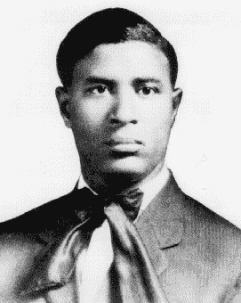
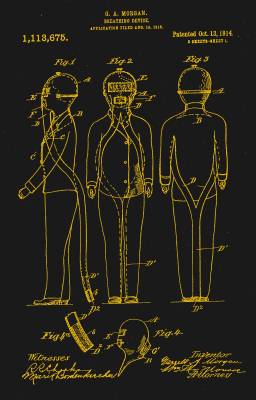
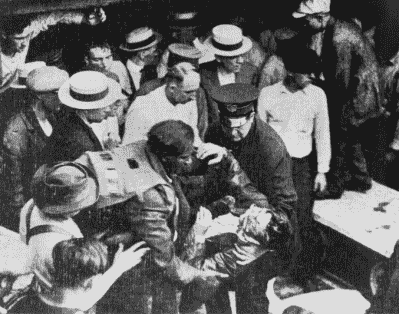
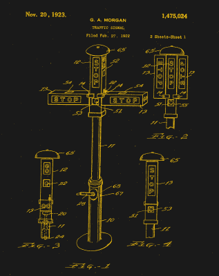

# 加勒特·奥古斯都·摩根让世界更安全

> 原文：<https://hackaday.com/2020/11/24/garrett-augustus-morgan-made-the-world-safer/>

有些人发明的目的是为了追求名誉和声望。似乎很少有发明家像加勒特·奥古斯都·摩根那样真正关心他人。他的发明拯救了许多人的生命，包括一些在爆炸撕裂伊利湖下的隧道后被加勒特救下的人。

尽管没有受过什么正规教育，加勒特的好奇心让他涉足了许多领域，从缝纫机修理到防毒面具，再到运输问题。他取得了巨大的成功，并改善了许多人的生活。

## 接缝和拉直器

Image via [Wikipedia](https://en.wikipedia.org/wiki/Garrett_Morgan)

加勒特·奥古斯都·摩根于 1877 年 3 月 4 日出生于肯塔基州的克莱斯维尔。悉尼和伊丽莎白·摩根都曾是奴隶，在他们所生的 11 个孩子中，他排行第七。他的母亲有部分美洲土著血统。

加勒特只受过六年级教育，口袋里只有 10 美分，他 14 岁就离开家去找工作，这在当时对他这个年龄的孩子来说很常见。他首先在辛辛那提登陆，做了几年杂工。

1895 年，他搬到克利夫兰，开始修理缝纫机。这是他培养自己对事物运作方式的品味的地方。十几年后，他开了自己的缝纫机店。在此期间，他结婚了，几年后，他和他的妻子玛丽·安妮，一个女裁缝，开了一家折扣女装店，雇佣了 32 名员工在室内制作所有的套装、外套和裙子。

一天，加勒特正在缝制一块羊毛织物，由于缝纫机针的高速运转，这块织物不断被烤焦。他试验了一些化学物质来包裹针头并保持其凉爽。据说，他用一块布擦了擦手，然后去吃午饭。当他回来时，织物中的波浪状纤维已经被化学物质完全拉直了。

出于好奇，他在邻居家的狗的皮毛上尝试了这种解决方案，结果也是如此。然后他鼓起勇气在自己的头发上试了试，发现了头发松弛剂。他把这种溶液变成了一种面霜，并成立了 G.A .摩根头发精炼公司，向非洲裔美国人出售他的头发松弛剂。该公司非常成功，加勒特从销售中赚到了足够的钱来继续发明。

Image via [US Patent #1113675](https://patents.google.com/patent/US1113675)

## 穿着睡衣的英雄

1914 年，加勒特申请了一项安全头罩的专利，这种头罩可以防止佩戴者吸入烟雾和有毒气体。这种烟罩的工作原理是烟会上升，它的特点是长长的软管能从地面带来凉爽、洁净的空气。该罩还使用湿海绵来冷却和过滤进入的空气。

加勒特向消防部门推广了该设备，并经常亲自演示其有效性。它在第二届国际安全卫生博览会上获得一等奖，并成为第一次世界大战中使用的防毒面具的原型。

当向公众展示引擎盖时，加勒特与这项发明拉开了距离。他会雇一个白人演员来扮演发明家，而他自己则扮演一个名叫大酋长梅森的印第安人。加勒特会亲自在帐篷里点燃一堆化学火，然后在里面坐 20 分钟，以此来证明头罩的有效性。

Garrett rescues someone from the tunnel. Western Reserve Historical Society via [Popular Mechanics](https://www.popularmechanics.com/technology/design/a22802/garrett-morgan-inventor/)

1916 年的一个清晨，加勒特的呼吸装置自发地接受了测试。当城市工人在伊利湖下钻一条淡水供应隧道时，他们发现了一个天然气袋。爆炸导致几名工人被困在地下，呼吸的主要是有毒的烟雾和灰尘。

有人把加勒特从床上叫醒，他和他的弟弟弗兰克穿着睡衣，拖着加勒特的通风头罩冲向隧道。在救援行动停止之前，他们设法挽救了两条生命。

不幸的是，宣传影响了销售，因为人们发现烟罩的发明者是非裔美国人。加勒特和他的兄弟直到很久以后才因为他们在伊利湖的英勇行为得到这座城市的认可。尽管市长在现场，称他们为英雄，但报纸只是顺便提及他们。

Image via [US Patent #1475024](https://patents.google.com/patent/US1475024A/)

## 更好的交通信号

无论他如何被接受，加勒特都无法阻止他发明东西的欲望。他是汽车的早期采用者，并最终开发了摩擦驱动离合器。1923 年，在目睹了一个臭名昭著的十字路口的事故后，他设计了一种新的机动交通信号。

当时，交通信号基本上是“停”和“行”，两者之间没有警告。加勒特的信号有一个警告灯，告诉司机他们需要尽快停止——黄灯。它还有一个“停止所有方向”的设置，让行人有时间过马路。虽然加勒特获得了交通信号的专利，但据报道，他以 4 万美元的价格将权利卖给了通用电气公司。

加勒特在 1943 年开始患上青光眼，并失去了大部分视力。他于 1963 年去世，一个月前，他的成就得到了政府的认可。

加勒特·奥古斯都·摩根是一位伟大的发明家，他想让人们的生活变得更好，并且用了各种各样的方法。他在伊利湖的英勇行为和他的救生发明一样值得肯定。