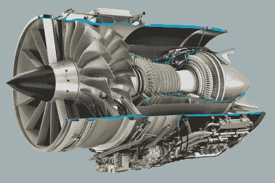

# 通用电气公司的发动机将重新点燃民用超音速飞行

> 原文：<https://hackaday.com/2018/10/24/ges-engine-to-reignite-civil-supersonic-flight/>

2003 年 10 月 24 日，最后一架协和式飞机降落在英国的菲尔顿机场，从那以后，商业航空旅行就一直停留在低于音速的速度上。协和式飞机退役的原因有很多，从不断上涨的燃料成本到 2000 年一次导致机上所有乘客和机组人员丧生的坠机事件后的负面宣传。乘坐协和式飞机也非常昂贵，而且只在某些航线上可行，因为对陆地上音爆的担忧意味着它必须保持亚音速，除非它在海洋上空飞行。

协和式飞机的失败已经让制造商和民用航空业十五年没有投资新的超音速飞机了。这是商业技术“倒退”的罕见例子；今天制造的最新最伟大的客机，连协和式飞机最高时速 1354 英里(2179 公里/小时)的一半都达不到。在一个痴迷于速度和性能的时代，商业航空旅行根本跟不上周围世界的步伐。谁能想出一种方法为乘客和货物提供超音速飞行，而不陷入终止协和式飞机计划的相同陷阱，谁就能赚一大笔钱。

随着[宣布他们已经完成了他们新的 Affinity 发动机](https://www.ge.com/reports/fast-friends-worlds-first-supersonic-business-jet-gets-new-engine/)的初步设计，通用电气公司正在寻找答案。结合通用电气公司开发高性能战斗机发动机的经验和民用发动机的最新效率改进，Affinity 是 55 年来为民用航空市场设计的第一款新型超音速发动机。它不会在 2023 年之前飞行，并且可能在之后的几年内不会有商业用途，但这是让航空旅行赶上我们现代生活的重要的第一步。

## 有血统的发动机

自从为协和式飞机提供动力的奥林巴斯 593 发动机于 1966 年首次点火以来，喷气发动机技术已经取得了长足的进步。材料科学和计算机控制系统的进步使发动机变得更轻、更智能，通用电气打算充分利用所有这些进步。但这并不是说发动机是一个全新的创造；事实上，它的血统可以追溯到离协和式飞机不远的一个时代。

Affinity engine cutaway. Image credit: Aerion

1970 年，通用电气设计了 F101，他们的第一台带加力燃烧室的涡轮风扇发动机，为罗克韦尔 B-1 枪骑兵战略轰炸机提供动力。尽管 B-1 本身经历了艰难的开发过程，但该发动机取得了绝对的成功，并最终衍生出两种不同的继任者:战斗机(如 F-14、F-15 和 F-16)的 F110 和民用的 CFM56。

虽然 CFM56 于 1974 年完成，但直到 20 世纪 80 年代初才开始在民用市场上使用。早期版本的 CFM56 存在一些关键问题，导致了几起死亡事故，但这些问题在发动机的后续版本中得到了解决。它最终成为历史上最受欢迎的涡轮风扇发动机之一，累计飞行时间接近 10 亿小时。

Affinity 基于成熟的 CFM56 内核，并针对超音速运行进行了优化，例如减小风扇直径以减少波阻。该发动机还将使用最新的全权限数字发动机控制(FADEC)技术，以提高亚音速和超音速模式下的效率和可靠性。它的最高速度约为 1.6 马赫，比协和式飞机稍低，但仍是现代客机如空客 A330 的两倍。据报道，1.4 马赫的巡航速度被选为性能和效率之间的折衷，同时仍然允许发动机在起飞和着陆期间遵守噪音规定。

 [https://www.youtube.com/embed/pESZu-m8IR0?version=3&rel=1&showsearch=0&showinfo=1&iv_load_policy=1&fs=1&hl=en-US&autohide=2&wmode=transparent](https://www.youtube.com/embed/pESZu-m8IR0?version=3&rel=1&showsearch=0&showinfo=1&iv_load_policy=1&fs=1&hl=en-US&autohide=2&wmode=transparent)

## 为纯种马造的马车

当然，如果目前市场上没有可以利用它的飞机，一种新的超音速民用发动机不会有多大用处。像它的前身 CFM56 一样，Affinity 将会提前到来。当制造商准备开始开发新的超音速民用飞机时，将会有一个引擎在等着他们，通用电气将会垄断市场。

但他们可能不必像等待 CFM56 那样等待太久。许多超音速客机目前正在开发中，最远的是 AS2 航空公司。AS2 是与通用电气和传奇的洛克希德·马丁公司“臭鼬工厂”共同设计的，是一架公务机，目前计划在 2026 年开始运营。然而，试飞最早可能在 2023 年开始，这与通用电气的 Affinity 计划相吻合。

## 异想天开

虽然 Affinity 和像 Aerion AS2 这样的飞机是令人兴奋的前景，但它们仍需数年才能投入使用，在此之前任何事情都可能发生。就像 VSS *企业号*和副驾驶迈克尔·阿尔斯伯里的损失推迟了维珍银河的民用亚轨道飞行计划一样，AS2 测试期间的一个事件可能会使超音速客机飞行脱轨多年。通用电气和 Aerion 都表示，他们认为该计划没有严重的技术障碍，但事实仍然是，发动机和飞机今天只不过是 CAD 文件和新闻渲染。

但是，即使有了尖端技术，协和式飞机面临的一些关键挑战仍然存在，如高票价和有限的超音速航线。即使新一代民用飞机和发动机能够突破音障，突破经济障碍可能仍然是更大的挑战。