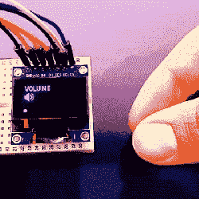

# 利用温度传感器进行手势检测

> 原文：<https://hackaday.com/2019/01/04/gesture-sensing-with-a-temperature-sensor/>

好的科幻小说背后都有可靠的科学事实，当托尼·斯塔克(Tony Stark)第一次在大银幕上首次亮相时，他的设计工具挥挥手就能发挥作用，制造商和黑客们也在 DIY 解决方案方面紧随其后。多年来，这些想法已经变得更加完善，正如我们可以从这个带有 PIR 传感器的[手势识别](https://create.arduino.cc/projecthub/electropeak/easy-motion-and-gesture-detection-by-pir-sensor-arduino-101fcc)项目中看到的。

该项目使用 TPA81 8 像素热电堆阵列，可检测 8 个相邻点的热量水平变化。Arduino 通过 I2C 读取这些温度点，然后使用一个简单的阈值函数来检测手指的运动。这些动作然后被用来做一些事情，包括调高或调低音量，如旁边的图像所示。

最精彩的是，TPA81 8 像素传感器已经存在多年了。虽然它有能力探测到微小的热变化，比如最远 2 米处的蜡烛火焰，但是它有点贵。最近的部分，如松下 AMG8834，包含 8×8 这样的传感器网格，更有能力满足您的黑客/制作乐趣，但价格也有所增加。

这项技术不仅仅局限于手势，还可以用在寻热机器人上，这些机器人可以很好地被训练成跟着猫走，只是为了激怒它。