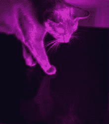

# 使用这款 ESP8266 摄影灯激发创造力

> 原文：<https://hackaday.com/2020/08/21/get-creative-with-this-esp8266-photography-light/>

在当今快节奏的社交媒体世界中，如果你想让你的照片吸引眼球，你必须要有优势。无论是 Photoshop 中的灵巧触摸，还是令人惊叹的镜头，重要的是与众不同。另一个很好的方法是尝试照明和颜色。为了做到这一点， [[Andrei]为家庭工作室制作了一个袖珍 RGB 照片灯。](https://www.instructables.com/id/Build-a-Pocket-RGB-LED-Light-for-Your-Home-Photo-S/)

【安德烈】为照相机拍摄的猫模特。

这是一个任何有经验的制造者都应该能够在一个周末完成的项目。当然，这并没有什么错。基本外壳是 3D 打印的，可在任何 FDM 打印机上复制。照明是通过古老的 WS2812B LED 提供的，准确地说是 68 个。最后，有一个运行 WLED 的 ESP8266，[一个专门用于控制 LED 灯条的平台的 web 服务器。](https://github.com/Aircoookie/WLED)这使得用智能手机调节 led 变得很容易。

得益于 WS2812Bs LEDs，全系列 RGB 颜色可供[Andrei]尝试。他做了很好的工作，用一些精选的猫的照片来展示它的能力。虽然我们不会期望在严肃的摄影中使用这样的设备来获得干净的白光照明，但它是艺术摄影的完美工具。

[我们之前也讨论过其他的演播室灯光构建](https://hackaday.com/2018/09/25/diy-studio-lights-to-improve-your-videos/)。休息后的视频。

 [https://www.youtube.com/embed/oGFKtS7f0pQ?version=3&rel=1&showsearch=0&showinfo=1&iv_load_policy=1&fs=1&hl=en-US&autohide=2&wmode=transparent](https://www.youtube.com/embed/oGFKtS7f0pQ?version=3&rel=1&showsearch=0&showinfo=1&iv_load_policy=1&fs=1&hl=en-US&autohide=2&wmode=transparent)

