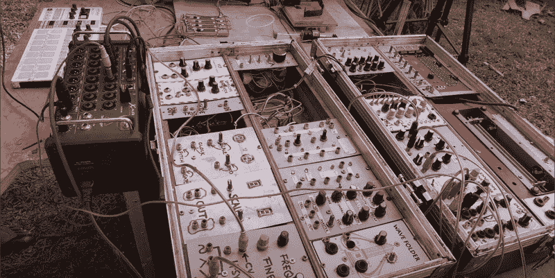

# 用这个自制合成器来听一些非洲音乐

> 原文：<https://hackaday.com/2021/12/05/get-down-to-some-african-tunes-with-this-homebrew-synth/>

~~南非~~ [Afrorack]声称已经在非洲建造了第一台自制的模块化合成器。虽然我们不能确定这一点(坦率地说，这实际上并不重要)，但我们可以肯定的是，这个钻机的最新添加的[听起来相当不错](https://www.youtube.com/watch?v=Mrhl_vO5bqg)。(视频，嵌入下方)毫无疑问，非洲国家是节奏之王，生活在不太富裕的地区，你需要有一定的足智多谋来利用你周围的材料。即使你有足够的资金，你也不能去当地的电器商店买一个丢失的零件。

模块化合成器看起来非常好，粗糙，就像一个真正的家酿，使用一个油罐作为低音鼓，用塑料小艇中的大米作为乐器，看起来很粗糙，但听起来很好。所有三个增加到钻机是简单的弹簧加载螺线管事务，但由于现成的东西是一个昂贵的奢侈品，手动缠绕线圈是为了。使用由金属杆和两个适当修剪的芬达瓶盖形成的线轴，位于看起来像蛋糕架的线轴支架，构建了钻孔动力绕线机。在早期的一个镜头中，我们确实傻笑了一下，电线是用手引导的，随后很快调整到用抹布引导。该死的摩擦烧伤！我们正饶有兴趣地关注着接下来会有什么新的内容，但是现在，只要坐下来，听一些恶心的非洲电子音乐就好了！

想看一场混乱变成有意义的事情吗？有几个游戏玩家闲着没事干？[chip tune synth](https://hackaday.com/2020/08/05/the-game-boy-as-a-midi-synthesiser/)怎么样？

 [https://www.youtube.com/embed/Mrhl_vO5bqg?version=3&rel=1&showsearch=0&showinfo=1&iv_load_policy=1&fs=1&hl=en-US&autohide=2&wmode=transparent](https://www.youtube.com/embed/Mrhl_vO5bqg?version=3&rel=1&showsearch=0&showinfo=1&iv_load_policy=1&fs=1&hl=en-US&autohide=2&wmode=transparent)

谢谢[aaron]的提示！