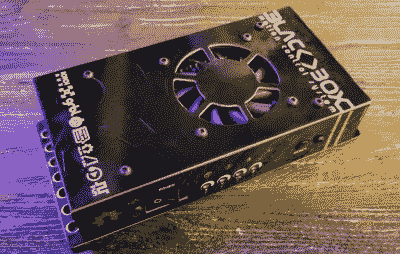

# 从 OpenBuilds 开始使用新软件

> 原文：<https://hackaday.com/2019/03/23/get-moving-with-new-software-from-openbuilds/>

如果你正在阅读 Hackaday，你可能听说过 OpenBuilds。即使这个名字听起来不熟悉，你也绝对在这些页面上看到过用它们的组件构建的东西。OpenBuilds 不仅是一个获得步进器、线性导轨、丝杠、滑轮、轮子和其他任何你需要的东西的好地方，也是一个对开发开源机器充满热情的人的活跃论坛的所在地。

似乎这还不足以成为访问 OpenBuilds 网站的理由，[Peter Van Der Walt]最近写信告诉我们关于他和他的团队正在开发的一些新的免费开源软件,这些软件旨在使你的作品比以往任何时候都更容易切割、激光、铣削以及你可能想象到的任何其他东西。如果你有一台移动的机器，他们有一些工具你可能会想看看。

BlackBox CNC controller

“OpenBuilds CAM”是一款基于网络的工具，可导入 SVG 和 DXF 文件，并为各种切割创建刀具路径，无论您的机器是使用一束愤怒的光子还是简单的刮刀。然后可以将生成的 GCode 插入到“OpenBuilds CONTROL”中，正如您可能已经猜到的那样，它会对连接到您的计算机的硬件进行实际控制。这里也不用担心供应商锁定，控制将与任何 Grbl 兼容的板对话。

但是如果你没有冲浪板呢？好吧，碰巧 OpenBuilds 提供了一个非常漂亮的新设备，他们称之为 BlackBox。这个结实的数控控制器包括一系列功能，彼得说团队对此非常兴奋，包括强大到足以运行 NEMA 23 电机的步进驱动器。有趣的是，他们实际上已经用巧妙的焊接屏蔽印刷电路板制作了黑匣子的外壳；[一个我们不常见到的奇妙把戏](https://hackaday.com/2015/06/03/how-to-build-beautiful-enclosures-from-fr4-aka-pcbs/)。

休息后的视频显示了使用 CAM 和 CONTROL 的 CNC 路由器版本的“Hello World ”,应该会让您对典型的工作流程有一个相当好的了解。如果你看起来很熟悉，[它可能来自我们之前对 LaserWeb](https://hackaday.com/2016/12/23/convert-that-cheap-laser-engraver-to-100-open-source-toolchain/) 的报道，LaserWeb 是几年前由【Peter Van Der Walt】领导的[类似的基于网络的项目](https://hackaday.com/2016/07/17/open-source-laser-cutter-software-gets-major-update-new-features/)。

 [https://www.youtube.com/embed/kI-0n1tFO5U?version=3&rel=1&showsearch=0&showinfo=1&iv_load_policy=1&fs=1&hl=en-US&autohide=2&wmode=transparent](https://www.youtube.com/embed/kI-0n1tFO5U?version=3&rel=1&showsearch=0&showinfo=1&iv_load_policy=1&fs=1&hl=en-US&autohide=2&wmode=transparent)

