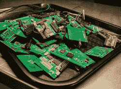

# 克服你的恐惧

> 原文：<https://hackaday.com/2020/10/24/get-over-your-fears/>

有些项目太复杂了，这是肯定的。但是我愿意打赌，有些你认为太难的事情实际上并不困难，也许你需要做的就是做一个好的示范来克服你的个人障碍。这里有三个例子。

上周末我在看[新的 Raspberry Pi 计算模块](https://hackaday.com/2020/10/19/new-raspberry-pi-4-compute-module-so-long-so-dimm-hello-pcie/)。它们有一大堆高速走线:比如千兆以太网、HDMI 和那些高速 SDI 串行摄像头接口。我完全没有高速设计和布局的经验，坦率地说，这让我心惊肉跳。但是，树莓也给我送来了 IO 演示板，以及伴随的 KiCAD 设计文件和评估板。看起来，它们只是电线——可能是成对长度匹配和阻抗受控的——但也只是电线。打开 KiCAD 板文件并点击痕迹，就像我对自己的设计所做的那样，我就不那么害怕了。这对我是一个启示。

 在一篇关于他从零开始[建造十台不同的 Linux 单板计算机](https://hackaday.com/2020/10/20/thinking-about-creating-a-raspberry-pi-replacement/)*的经历的精彩文章中，杰伊·卡尔森对我产生了类似的影响。我从来没有考虑过打破一些 CPU 和 DRAM 的行动热板，我也从来没有过布局与高密度 BGA 芯片 PCB 之前。我还没有完全进入邓宁-克鲁格的领域；我仍然对将一个紧密的 BGA CPU 分散到一个 DRAM 中的布局复杂性有一种健康的尊重。但是杰伊对什么是容易什么是困难的坦率评估使这一切看起来都在可行的范围之内。*

 *当迈克和我在播客上谈论杰伦的工作时，迈克坦白了他对 BGAs 的恐惧。我已经做了足够多的回流板焊接，其引线间距比问题中的 0.8 mm 间距 BGA 精细两倍，所以对我来说这似乎不是不合理的。我 100%肯定迈克也能成功，但他需要一个 BGA 大师。有什么好的业余爱好者视频吗？

作为一个书呆子，我更关注*知识*和*灵感*，但也许*勇气*同样重要——至少我认为我低估了它。我不需要铺设 HDMI 线路，或者从零开始构建 Linux 系统，但我不再担心我做不到，这是因为我已经看到了其他黑客做同样事情的详细例子。我可能第一次就没做对，但我不怕尝试，而且我不会在越过其他人的肩膀看之前说同样的话。前进吧科拉吉奥。

This article is part of the Hackaday.com newsletter, delivered every seven days for each of the last 200+ weeks. It also includes our favorite articles from the last seven days that you can see on [the web version of the newsletter](https://mailchi.mp/hackaday.com/hackaday-newsletter-649368). Want this type of article to hit your inbox every Friday morning? [You should sign up](http://eepurl.com/gTMxQf)!*