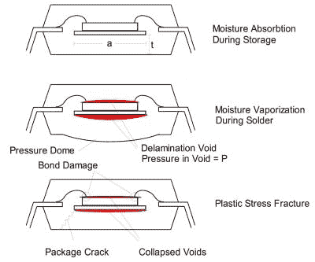
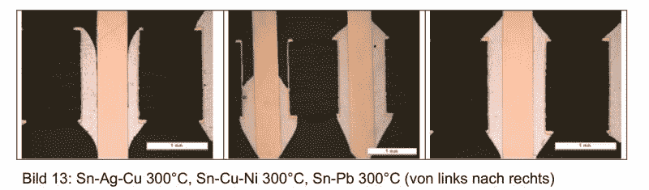
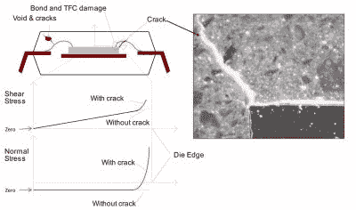
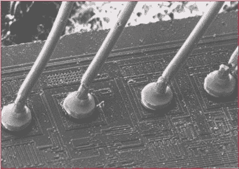

# 了解 IC 焊接和封装背后的物理原理

> 原文：<https://hackaday.com/2019/05/03/get-to-know-the-physics-behind-soldering-and-the-packaging-of-ics/>

人们经常感觉焊接被认为是一种艺术形式，而不是由物理和化学的冷酷现实支撑的东西。从松香的有机化学，到 ic 封装内易碎的金线和硅芯片的材料特性，以及热应力对 IC 封装不同部分的影响，这是一个复杂的话题，值得比以往更多的关注。

在网上随意询问一个人的朋友、熟人、同事和完全陌生的人，通常会发现相同的模式:人们在某个时候拿起了烙铁，要么通过反复试验找到了似乎有效的方法，要么从其他人那里学到了似乎有效的方法。我们能说一些关于焊接的科学知识吗？

## 定义问题

影响元件焊接的问题——无论是手工焊接还是回流/波峰焊——本质上都归结为氧化、湿气进入和温度循环。第一个相当明显:铜会氧化，这意味着焊料不会形成良好的连接。第二个主要与组件的(塑料)包装有关，因为它们会吸收水分，这会导致一些问题。

第三个也是最后一个问题是迄今为止人们争论最多的问题。这里的争论本质上是关于什么构成了一个好的焊点。通常，使用较高的焊接温度被列为一件好事，因为它可能会缩短每个焊盘的焊接时间，并随之缩短元件的加热时间，同时还会产生更好的接头。一会儿我们会明白为什么不是这样。

## 湿气和焊接不能混合

当从 Mouser 或 DigiKey 等商店订购元件时，很可能会首先遇到潮湿问题，人们会收到装在袋子里的元件，袋子外面列有元件可以焊接的日期，里面还有一张小卡片，上面有对潮湿敏感的染料，以指示储存时是否有湿气进入袋子。

虽然乍一看这似乎很奇怪，但当人们意识到 IC 封装不防水，但随着时间的推移，其模塑料将允许水分通过时，这就开始有意义了。当焊接到有源电路中时，这不是一个大问题，因为它永远不会变得足够热以迅速变成蒸汽，但当将元件焊接到 PCB 时，水分进入可能是致命的。这方面最极端的例子叫做“波普康宁”。这涉及到在焊接过程中已经进入模具周围的模制部件的湿气的加热。

由于这种加热，水分进入气态，这大大增加了它的体积，从而增加了它对周围结构施加的压力。这可能会使塑料模制破裂，破坏芯片本身的特性，断开焊线等等。本质上，它会破坏芯片或将其损坏到后续故障不可避免的程度。防止湿气进入造成损害的一种可能方法是“烘烤”芯片，轻轻加热芯片，以便将湿气赶出芯片封装。

## 焊接是一个无氧过程

助焊剂的主要功能是去除现有的氧化层，并防止新的氧化层形成。为了实现前者，大多数焊剂包含一种或多种化学物质，当暴露于焊接过程的热量时，这些化学物质开始分解，导致酸的形成，这些酸将与待焊接表面上的任何氧化反应。用于电子设备的焊剂将使用弱酸，而用于管道配件的焊剂将使用腐蚀性更强的酸，通常使用会产生盐酸的氯化锌或其他氯化物。最常见的电子助焊剂是松香助焊剂，也称为树脂助焊剂。

松香很难定义，因为有许多形式和分类。需要注意的是，粗略的分类包括从松树中提取的[天然松香](https://en.wikipedia.org/wiki/Rosin)，经过化学改性更加耐热的天然松香，以及通常被称为“树脂”的合成松香。天然松香用途广泛，还可以用来增加小提琴弓弦的阻力，使演奏更加容易。

天然松香焊剂活性较弱，但可以通过添加不同的活化剂化学品来增强。这意味着任何类型的松香焊剂都有不同的特性，包括不同的活化和最高温度。

随着要焊接的表面被清除氧化，酸已经完成了它的工作。下一步是确保元件焊接时表面不会再次氧化。这是通过化学物质来实现的，化学物质的任务是提供一个氧气屏障，使氧化变得不可能。通常这也是松香或等效物质的任务。这意味着只要这种屏障存在，保护作用就会持续。这一特性导致了焊接温度的问题。

## 温度:越多越好

因为松香向酸的转化依赖于热活化，所以当焊接温度升高时，酸会更快地产生。但这也意味着松香消耗得更快，氧气屏障消失得更快。更高的温度也会增加氧化速度，因此有一个最佳的焊接窗口，它由起始助焊剂的量和焊接温度共同决定。

如果我们看看一种常见的铅基焊料，如凯斯特公司的 [245 芯 Sn63Pb37](https://www.kester.com/products/product/245-flux-cored-wire) ，我们可以从其材料安全数据表(MSDS)中看到，该数据表使用的是松香芯(#65997-06-0)的化学文摘社编号，它使用的是伊士曼化学公司的一种改性松香，称为 [Staybelite Resin-E 部分氢化树脂](http://ws.eastman.com/ProductCatalogApps/PageControllers/MSDS_PC.aspx?Product=71049355)。它的数据表列出了它的特性，熔点在 55.2℃和 72.1℃之间，沸点为 265℃

根据 ESA ( [ECSS-Q-ST-70-08](http://esmat.esa.int/ecss-q-st-70-08c.pdf) ，第 5.6.7 节)的建议手工焊接温度约为 280-350°C(在旧的 PSS-01-708 标准中高达 320°C)，在上述铅基焊料的情况下，这意味着松香焊剂将在 55°C 时首先开始活化，随后在约 184°C 时熔化铅(60/40 含铅时为 191°C)。这给出了大约 100-170℃的热窗口。

From left to right: Sn-Ag-Cu, Sn-Cu-Ni and Sn-Pb, all at 300 °C.

弗劳恩霍夫 ISIT 工程师 Thomas Ahrens(德语链接到 PDF)研究了在不同的手工焊接温度下会发生什么。这项研究显示了更高的焊头温度(300-375°C)如何大大缩短 PCB 损坏(“测量”)发生前的时间。它还显示，对于通孔元件，300°C 的温度可产生出色的结果，而所用的无铅焊料(Sn-Ag-Cu、Sn-Cu-Ni)需要稍高的温度才能正确流到 THT 接头上。

## 不要改变温度

除了前面提到的湿气进入问题，IC 封装是非常脆弱的结构，波特兰州立大学的 Shirley 博士在其题为“[塑料封装可靠性](http://web.cecs.pdx.edu/~cgshirl/Plastic_Package_Reliability.htm)”的演讲中对此进行了细致的描述。除了与湿度相关的问题，本文件还涵盖了热应力。这大部分是由装配过程中的热循环引起的，它可以采取各种各样的形状。

温度循环的影响会在模塑料、管芯、接合线等中引起新的缺陷(例如裂纹)。它还会导致新裂缝的形成。这就是为什么前面提到的 ESA 焊接标准要求将小型散热器连接到任何热敏器件的引线上。热循环的影响可能与机械剪切一样灾难性，实际上会破坏焊线。

大家可能还记得，在 IC 的数据手册中，通常可以找到推荐的最高焊接温度。这些指示了在损坏变得不可避免之前包裹可以变得多热。因为现实并不完美，所以尽可能远低于这些数字是个好主意。即使损坏不会立即显现，IC 部件过热以及快速加热然后冷却的行为也可能导致损坏，这可能意味着部件将在组装后几周或几个月内出现故障。

## 把所有的放在一起

当涉及到焊接和正确地进行焊接时，重要的信息是它背后的科学。在像 NASA、ESA 这样的机构，以及那些为他们制造设备的人，失败实际上不是一个选项，这就是为什么他们花了这么多精力来理解这些故障模式以及如何防止它们。同时，焊料和助焊剂的制造商有几十年的知识和经验。

做错事的代价是什么？在业余爱好使用，你可以逃脱相当糟糕的事情，当谈到焊接。在没有预热的情况下，在 450°C 的温度下焊接两秒钟，芯片不会立即死亡，但其中一个可能会导致小的裂缝，这些裂缝会在热循环中慢慢破坏芯片。如果你只在室内使用几年，你可能永远不会注意到。

重要的是要知道什么是*需要*来获得正确的焊点并且不超过它。当科学表明在 300°C 下焊接铅基焊料有效时，那么在 375°C 下焊接就没有意义了。如果有的话，在焊料能够与之结合之前，煮掉松香焊剂并在焊盘上氧化会有不良接头的风险。

最后，由于美国宇航局的焊接实践，他们拥有[精神和机遇](https://mars.nasa.gov/mer/)以及许多其他火星探测器和卫星多年来表现完美。更不用说自从 1977 年发射以来，旅行者 1 号和 2 号(T3)就一直在星际空间旅行。如果这些不是[完美的焊点，](https://en.wikipedia.org/wiki/Voyager_program)那我就不知道什么是了。