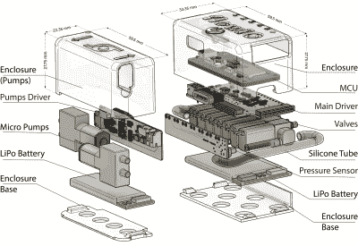

# 让您的 Flex 与 FlowIO 平台一起使用

> 原文：<https://hackaday.com/2021/08/20/get-your-flex-on-with-the-flowio-platform/>

Hackaday Prize 2021 参赛作品 [FlowIO 平台](https://hackaday.io/project/179845-flowio-platform)承诺对气动技术的意义就像 Arduino 对电子技术的意义一样。模块化平台包括一个通用控制器/阀组，一系列不同尺寸的泵，以及一些可选的连接和传感块。有了 Arduino 软件支持以及 Javascript 和 web-GUI，无论用户的经验水平如何，都有一种方法可以对此进行编程。

flowIO exploded view from [http://www.softrobotics.io/flowio](http://www.softrobotics.io/flowio)

最后这一点对于麻省理工学院媒体实验室的阿里·什塔尔巴诺夫(Ali Shtarbanov)为这个项目设定的任务来说是至关重要的。他提醒我们，在过去的几十年里，任何制造电子产品原型的人都有很大的障碍。在互联网真正运转起来之前，关于如何开始的信息也很难获得。

对于软件来说，情况类似，像 Scratch 和 Python 这样的工具降低了进入门槛，让更多的人尝试一下，建立一些信心。

但是，尽管像[软机器人工具包](https://softroboticstoolkit.com/)和[可编程空气](https://hackaday.com/2019/06/14/pneumatics-for-the-masses/)这样的项目做了一些早期的工作，开始降低对软机器人和相关应用的气动支持的门槛，项目作者仍然发现了进一步改进的领域。FlowIO 从一开始就被设计成可穿戴的。与之前的开源作品相比，它看起来更小，更便携，支持更多的空中端口和更大的传感和连接阵列。

## 知识共享硬件

虽然你[可以采取所有的计划](https://www.softrobotics.io/flowio)(需要免费注册帐户)并为自己建立一个自己的 FlowIO 钻机，项目作者提供了另一种解决方案。遵循维基百科免费分享和分发*信息*的模式，flovio[为了公共利益免费提供其*硬件*。在对该项目的捐赠支持下，更多的硬件被生产出来并分发给那些需要的人。唯一的要求是多余的套件被传递或返回基地进行升级，而不是填埋。](https://www.softrobotics.io/getflowio)

 [https://www.youtube.com/embed/RbHt3Iqr3lU?version=3&rel=1&showsearch=0&showinfo=1&iv_load_policy=1&fs=1&hl=en-US&autohide=2&wmode=transparent](https://www.youtube.com/embed/RbHt3Iqr3lU?version=3&rel=1&showsearch=0&showinfo=1&iv_load_policy=1&fs=1&hl=en-US&autohide=2&wmode=transparent)

The [HackadayPrize2021](https://prize.supplyframe.com) is Sponsored by: