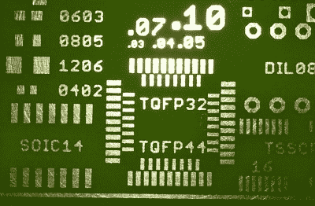

# 让你的印刷电路板在商场制造

> 原文：<https://hackaday.com/2018/09/18/get-your-pcbs-made-at-the-mall/>

正如我们最近在 Hackaday 上看到的一些关于这个主题的帖子，社区内关于多氯联苯生产的分歧似乎越来越大。这个社区的一部分人接受(相对)便宜的专业制作，你把设计寄出去，几周后就会收到一堆印刷电路板。其他人更喜欢在家里制作多氯联苯的方法，如使用 CNC，激光雕刻机，甚至传统的墨粉转移。这些 DIY 印刷电路板需要一些技巧和奉献精神来生产，但优势是你可以在设计的同一天就拿到电路板。但是可能还有第三种选择，这种选择似乎已经被忽略了。

 【维吉尔】写了一种非常有趣的生产专业外观的原型 PCB 的方法，这种方法不需要数周的等待结果，也不需要任何复杂的技术或专门的设备。在这种方法中，[一台 UV 打印机被用来将你的掩模直接沉积在覆铜板](https://www.youtube.com/watch?v=mvPqqd03yRM)上，然后你可以用任何你喜欢的溶液对其进行蚀刻。你说没有紫外线打印机？别担心，商场里可能有人知道。

正如[维吉尔]解释的那样，商场里为顾客提供个性化商品的小售货亭通常使用 UV 打印机，这种打印机允许他们在几乎任何材料上喷墨。你不需要让他们在你的手机背面贴上一个标志，你只需要让他们把你面具的矢量文件放到裸铜板上，你可以把它存在 u 盘里。他们可能会告诉你，他们不能保证墨水会粘在裸铜上，但只要告诉他们你愿意冒这个险。这是那种你的钱会乐意为你说话的情况。

在 UV 打印机完成它的工作后，蒙版可能会有些易碎。[维吉尔]喜欢在回家的路上用塑料包裹木板，以确保它们不会被损坏。然后在蚀刻溶液中快速浸泡，接着用清水和一些异丙醇冲洗，以去除剩余的 UV 油墨。结果真的不言而喻:非常少的手工操作就能得到漂亮清晰的线条。

我们已经介绍了一些相对简单的在家快速生产 PCB 的方法，只要你不介意花几百美元在 T2 组装硬件。这似乎是两全其美的事情，尽管它也有要求你与另一个人交谈的缺点。我们希望听到任何尝试这种特殊方法的读者的意见。

 [https://www.youtube.com/embed/mvPqqd03yRM?version=3&rel=1&showsearch=0&showinfo=1&iv_load_policy=1&fs=1&hl=en-US&autohide=2&wmode=transparent](https://www.youtube.com/embed/mvPqqd03yRM?version=3&rel=1&showsearch=0&showinfo=1&iv_load_policy=1&fs=1&hl=en-US&autohide=2&wmode=transparent)

