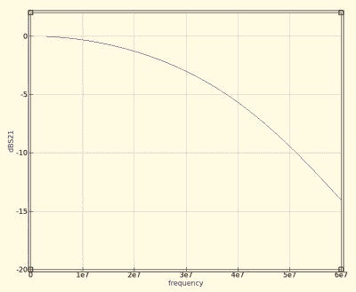
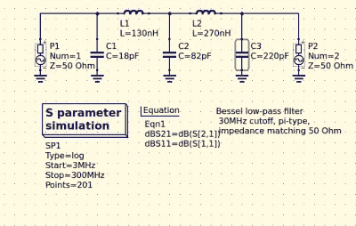
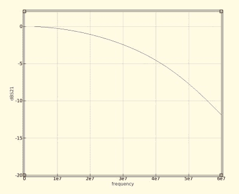

# 正确使用 RF 低通滤波器

> 原文：<https://hackaday.com/2018/08/17/getting-an-rf-low-pass-filter-right/>

如果您以任何方式与无线电联系在一起，您将会遇到低通滤波器作为一种手段来消除发射机输出中不需要的谐波。这是一个由电容和电感组成的网络，通常被称为 pi 网络，因为原理图与希腊大写字母 Pi 大致相似，传统上，正确处理它们是一种黑色艺术。有表格和公式，但即使经过令人印象深刻的计算，结果也往往与预期不符。

The 30MHz low-pass filter, as QUCS delivered it.

令人高兴的是，与许多其他领域一样，近几十年来，经济实惠的高性能计算的出现使滤波器设计不再是一项艰巨的工作，只需告诉一些软件您想要的滤波器的特性是什么，它就会完成剩下的工作。结果很好，任何人都可以成为滤波器设计师，但正如经常发生的情况一样，仍然存在障碍。该软件为所需的截止和阻抗计算理想电感和电容，在选择最接近的优选值时，我们会修改结果的特性，甚至可能破坏最终的滤波器。因此，值得看一看这里的过程，并检查以这种方式调整组件值的效果。

The idealised graph produced by QUCS for our filter.

我们设计的滤波器非常简单，一个 5 阶贝塞尔滤波器，软件是 Ubuntu Linux 机器上易于使用的 [QUCS](http://qucs.sourceforge.net/) 包。插入所需的数字，它会吐出一个电路图，然后我们可以模拟显示一个漂亮的曲线，在 30MHz 上有一个 3dB 点。这是一个非常理想的图表，经验告诉我，使用这些设计的实际滤波器具有较低的截止频率，但对于我们的目的来说，这是一个足够好的开始。

如前所述，元件值不是商业可用系列的首选值，所以我不能购买现成的。我可以给我自己的感应器上发条，但是那里有一个属于它自己的痛苦的世界，我不想去那里。RS，Mouser，Digikey，Farnell *等*的存在是为了把我从这种电子毁灭的深渊中拯救出来，我究竟为什么不买现成的呢？

My revised filter circuit with off-the-shelf component values.

因此，上图中的每个元件都需要向上或向下移动一点，以达到理想值。这对我的滤波器性能有什么影响？更改每个值并重新运行仿真，可以看到图形每次都会发生微妙的变化，在不完全破坏滤波器的情况下调整这些值有时会很困难。特别是对于网络中有更多元件的高阶滤波器，可以观察到单个元件对图形不同部分梯度的影响，但根据经验，值越高，截止频率越低。就我而言，我总是选择更高的值，因为我希望过滤的最近谐波是两倍的频率，所以我有足够的空间来处理。

The revised curve from the filter with preferred values.

将我的元件值替换为首选值后，我可以再次运行仿真，从结果图中我可以看到，我很幸运没有过多破坏其特性。正如预期的那样，截止频率向上移动了一点，但是保留了相同的曲线形状，没有出现任何波纹或者变得更浅。

如果我将该滤波器与实际发射机配合使用，我会确保其截止频率至少比发射频率高四分之一。实际上，我发现截止频率比仿真预期的更尖锐、更低，例如，如果我将这一个与 30 MHz 发射机一起使用，我会发现它对载波的衰减超过了我认为可以接受的程度。还必须承认，以这种方式改变元件值也将改变滤波器的阻抗，而不是计算出的 50 欧姆，但是实际上，只要值的变化不大，这似乎不足以引起问题。

我们没有制作这种滤波器，但过去我们制作过另一种滤波器，巧合的是，它在相同的频率范围内。当我写[一个关于自动化示波器读数的特性](https://hackaday.com/2016/11/29/controlling-your-instruments-from-a-computer-doing-something-useful/)时，我使用的例子是一个 7 阶 30 MHz 低通滤波器的特性。它甚至可能是标题图片中的一个，是我随机从滤板袋中抽出来的。