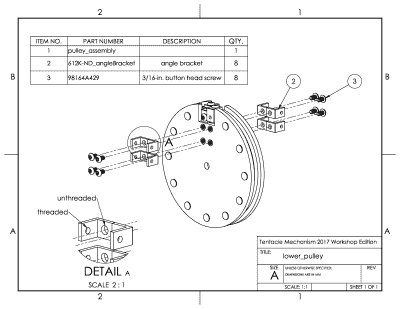
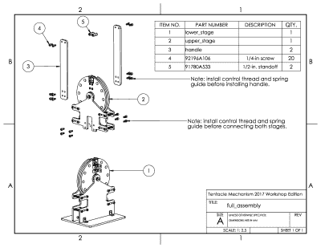
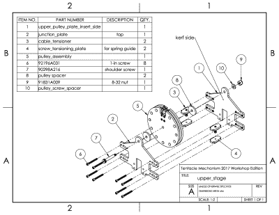
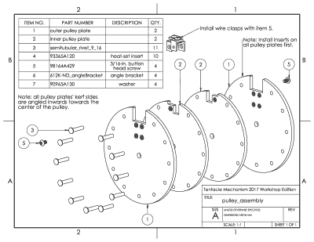
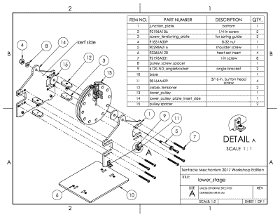
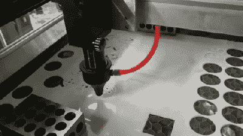
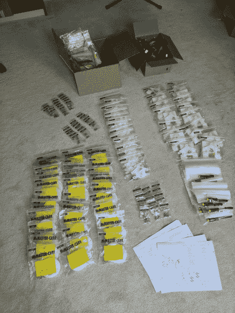
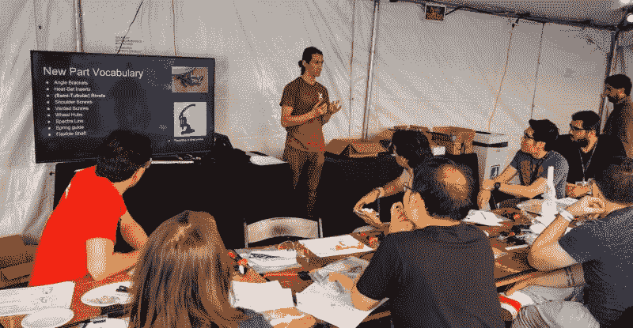

# 准备好教你的第一次硬件研讨会

> 原文：<https://hackaday.com/2018/08/16/getting-kitted-to-teach-your-first-hardware-workshop/>

我小时候总是喜欢上艺术课。在获得个人指导的同时，手里还拿着那些原始材料，这是一件很特别的事情。也许是老师耐心的声音或蜡笔的味道最终打动了我。无论哪种方式，我都开始思考:“我想这么做；我想教这些东西。”

去年在黑客日超级会议上，我得到了机会。拥有真正硬件的硬件车间是如此罕见；我只需要带一个到餐桌上！接下来是我的欢乐和悲伤的故事，它把一个团队聚集在一起，向电缆驱动的电子动画世界迈出了第一步。如果你正在考虑尝试教授你自己的硬件工作室，请继续阅读。我在这个故事中尽可能多地加入了我自己的经验，以帮助你走上成功之路。

好消息是 Supercon 每年都有回报。如果你想参加像这样的大型研讨会，[现在就去买一张今年会议的门票](https://www.eventbrite.com/e/hackaday-superconference-2018-tickets-47386813234)。如果你想举办一个硬件研讨会，[的提案征集活动](https://docs.google.com/forms/d/e/1FAIpQLSc01bflKDzB7lVT0FJ-kLhndtUItp_5LwZypbmil_QSqlsjOw/viewform)仍然开放！好吧，我们开始吧。

2016 was the year of the tentacle

2017 年 7 月，我看到了研讨会提案的呼吁。一年前，我从斯坦·温斯顿系列教程中获得了一些灵感，建造了自己的电缆驱动触手机构。这种两阶段的机制作为一种聚会技巧获得了巨大的成功，我在这几页上写了一份关于打造你自己的[的简要指南。一年后，触须零件还在我的车库里游荡，我想:为什么不把触须机械制造车间带到 Hackaday Supercon 呢？](https://hackaday.com/2016/09/13/the-bootup-guide-to-homebrew-two-stage-tentacle-mechanisms/)

## 胜利意味着…确定您的研讨会的范围

定义成功将是我的第一个挑战，我的注意力需要集中在我的目标受众:研讨会的与会者。这些人是谁？这个工作室是如何让他们的超级电脑变得更棒的？我想这些人可能来自各行各业。从梦游到月球漫步，他们在修补方面的背景可能是从 0 到 NASA ( [字面意思](https://hackaday.com/2017/12/13/extraterrestrial-autonomous-lander-systems-to-touch-down-on-mars/))的任何地方，我需要确保每个人都玩得开心。我意识到不是每个人都能完成，但我想确保每个人*都能在他们自己的时间内完成，这样所有人都可以达到同一个目标:一个可以工作的触手。*

考虑到观众，我伪造了我的论点:我希望研讨会的与会者得到一个使用激光切割材料的坚实的原则路线图，我希望每个人都带走一些已经完成或可以完成的实物，而无需额外的指导或工具。我希望与会者回到他们当地的黑客空间，舒服地将设计插入激光切割机，并取出适合的零件。

## 组装什么？

从 0 到触手需要大约 2.5 个小时，我需要对旧设计做一些认真的修改，使它在周六早上的工作中变得相当大——就在一杯咖啡后的片刻！首先，我意识到我的旧版本太复杂了。有两个控制器和两个灵活的阶段。老实说，构建两个相同的控制器只是简单的重复，所以我几乎毫不夸张地将我的旧设计减半。我们只有一个控制器，而不是两个。我们要做一个两个自由度的短触手，而不是四个自由度的长触手。谁知:作坊触手诞生了！

车间触手应该很容易建立，所以它需要一个小 BOM。为了达到这个目标，我重新设计了控制器和触手，以减少独特部件的数量。少了一些独特的部件，那颗刚刚飞过房间、再也看不到的丢失的螺丝钉就少了一点珍贵。在最糟糕的情况下，如果我在所有套件中完全忽略了一个零件，从 Supercon 到所有机械零件之母:McMaster-Carr 只需 30 分钟的车程。反正我的大部分螺母和螺栓都是从那里采购的，所以如果我在制作套件时犯了一些严重的错误，我实际上可以在研讨会结束前把它们拿回来。

我尽我所能预制了一切。这意味着，我将花 10 分钟时间讨论激光切割机的主要功能及其对零件的影响，而不是让与会者自己用激光切割零件。每个套件只需要钻出两个相同的部分，但孔不允许错位，所以我们不能使用手钻…或者我们可以吗？我带着这个问题求助于我的朋友艾米，她给了我一个我需要的专业建议:训练指南。钻孔导向器是手钻的辅助工具，它可以引导手钻垂直进入孔中，确保直切。转眼间。有了电钻指南，我们*就可以*使用手钻了！我最后用激光切割了一个定制的，就是为了这个特殊的目的。它完美地工作。

## 伟大的指导带来伟大的研讨会:

在任何给定的教室里，通常有一个老师对大约 20 多个学生。每 20 分钟被 20 个以上的问题包围，对于试图读懂他们的课堂笔记的老师来说，意味着厄运。幸运的是，我有一个可以提前准备的秘密武器:建筑说明。以下是它们的快照:

在交付日，我的计划是(1)简要介绍套件和研讨会工具，同时突出重点，然后(2)让他们按照说明进行组装。

说明书现在是必备的，但是它们应该是什么样的呢？一方面，我想如果我的说明书有点像乐高手册，他们可能会飞起来。乐高的目标受众从 5 岁开始，没有一个英语(或丹麦语)的书面单词！另一方面，我必须首先记住为什么我的目标受众在这里。

这是一群与会者，他们很可能受到工程领域的启发而进行建设。难道我不应该试着像对待真正的工程师一样对待他们吗？最终，我满足于一系列工程风格的分解图。在专业领域，我可能会把这些交给技术人员，并期望他们带着触手回来。不过，对于这次研讨会，我在图纸上做了一些额外的注释，认为“显式比隐式好得多。”在这种情况下，就像乐高一样，每个页面都有一个该步骤所需部件的部件列表。希望这些指导能让我们大多数人在正确的轨道上独立工作。当然，如果有其他事情发生，他们仍然可以问我问题。

## 工具包:的制作…

至于实际的套件制作，我需要采购几千个零件。首先，我用零件号和供应商元数据装饰了所有的 CAD 模型，然后直接从软件包中导出了零件列表。不需要手工记账！只要我的模型没有丢失任何螺丝，我就知道我需要订购和制造什么。

### 激光切割零件

九月底很快就要到了。大约一个月后，我需要为所有 15 套服装裁剪 450 多件。我有几个选择:通过第三方切割，或者使用车库里的自制激光切割机。第三方可能真的会派上用场，但他们会按分钟向我收费。在家裁剪只会浪费我的时间，而且额外的好处是，我可以在我认为合适的时候调整任何尺寸公差。我想我应该先试试在家切割的路线。

my Millennium-Falcon-Piece-of-Junk doing its thing like a champ

令人惊讶的是，整个工作只花了大约 9 个小时就完成了，没有任何重大故障！(Woohoo！原来你可以*在家里*制造一台值得生产的激光切割机，如果你用心去做的话！)在批量切割零件之前，我进行了一些测试，以找到我可以可靠地切割零件的最大速度。在做同样的工作之前，多拨几分钟的号码可以节省我几个小时的时间，在某些情况下可以节省多达 60 次。我还把这 9 个小时分散在两个星期里，这样我就不会在车库里无所事事，而让激光做所有的重活。

在我第一次生产激光切割零件时，我发现了一个有趣的现象。从一片 Delrin 上切下大块材料有助于释放内应力，从而导致切割时板材弯曲。为了抵消弯曲，我在尽可能多的地方压下了床单。我尽了最大努力防止塑料变形，现在我想知道第三方激光切割机商店在运行作业之前是否会做任何调整。一天结束时，我很高兴自己能够完成这项工作，而不是冒险收到一批不合规格的零件。

### 特殊零件

大部分零件来自麦克马斯特-卡尔公司，除了几个特殊项目。其中之一是弹簧导管，电缆穿在其中的柔性护套使该机构首先工作！因为这些是定做的，所以我提前一个月下了订单。(他们几乎没有按时来，所以明年我一定会给自己更多的空间！)

下一个专业项目是一套来自全球速卖通的柔性轴。这些轴形成了触手机构的核心，让触手弯曲而不扭曲。我知道这些零件很可能会用船运，所以我也提前一个月下了订单。

最后一个特色项目是微型轮毂。每个触手都需要牢牢固定在软轴上。一个带固定螺丝的轮毂完美地完成了这个任务。幸运的是，这么多以前需要机械车间制造的机器人部件现在都是现成的了。Pololu 的人也很友好，给了我一个批量订购轮毂的折扣。

### 打包好

这可能是我最喜欢的部分:装袋！一旦我把所有的部件都放在客厅里，我只需要把它们放在正确的位置。简单对吗？

I found a use for all those McMaster baggies!

为了帮助这次冒险，我招募了一些朋友。使用说明中的零件清单，我们能够在大约 12 个工时内将所有东西打包，谢天谢地，这是由 3 个人共同完成的！我总是希望有一群朋友过来，把我做的一系列项目打包，无论是为了完成我的第一个 Kickstarter 还是开始我的第一个硬件研讨会。你的朋友们聚集在一条装袋流水线上，这种仪式有些特别。

装袋也是我进步最大的地方。为了帮助我的与会者，我决定将零件分装起来。这意味着说明书的每一页都有自己的袋子。当交付日到来时，这个想法被证明是多余的。由于一些任务围绕着反复使用相同的工具，通过*类型*打包零件会更有帮助。这样，他们可以一次完成一些批量操作，比如热粘所有的热定形镶件。最后，如果我按类型打包零件，我可以称它们的重量，以确保它们有正确数量的螺母或螺栓。如果我打算做 30 多个工具包，这个额外的 QA 步骤将是一个很好的选择。

在打包零件和编写说明的过程中，我意识到我几乎是在为我的研讨会参与者编写一个要执行的行为脚本。我在…编程？尽管如此，通过一些开放式的说明，我发现触手制造者找到了自己的导航工具。了解人们是如何思考建造过程的，将有助于我在下一次研讨会上重新调整说明和包装。

## 交货日

终于:表演时间到了！我把车间分成两部分。我们称它们为“讲座”和“实验室”

在“讲座”中，我简要介绍了他们将在该套件中遇到的部件。我是一个无耻的预言家，认为工程师应该不断扩大他们的“零件词汇”你使用的零件越多，你就越有能力从你庞大的零件心理袋中找出解决方案来解决复杂的问题。(哎，我能不能一年就站在我的基座上说一次工科应该怎么样？)

在“实验室”里，他们建造了他们的触角。我花了几分钟时间让每个人都注意到一些关键点，但在剩下的时间里，他们开始按照说明进行建造。我是“倒教室”模式的粉丝，在这种情况下，每个人都需要做同样的练习。在这里，他们可以按照自己的节奏走，只需根据需要戳我。

成功了！没人睡着！图片来源:[Jenni]

《实验室》结果相当不错…除非你把没人完成的事实也算进去！分配了 2.5 个小时，我们可能可以少讲一点，多做 30 分钟的工具包。(4 个小时是最理想的，但还有其他精彩的研讨会，你一定不想错过。)随着期限的临近，我想:我该怎么办？但是，嘿，这是一个硬件会议。我邀请所有人和我一起坐在研讨会区域外的桌子上，结束会议。在大约 45 分钟的时间里，我们设法穿过了大约 7 个工作触角！对于剩余的未完成的套件，每个人都有零件和说明。如果他们还有什么问题，可以给我发电子邮件。就这样，我的第一次研讨会结束了，我擦去了额头上的汗水。这是一个完成的任务。

如果你去年设法参加了这个研讨会，非常感谢你加入我并以你的热情支持我。我花了很大的力气把它组合在一起，我会毫不犹豫地再做一次。超级大陆 2017 可能是触手的最后一个超级大陆，但是[谁知道今年我们会看到什么呢](https://www.eventbrite.com/e/hackaday-superconference-2018-tickets-47386813234)？