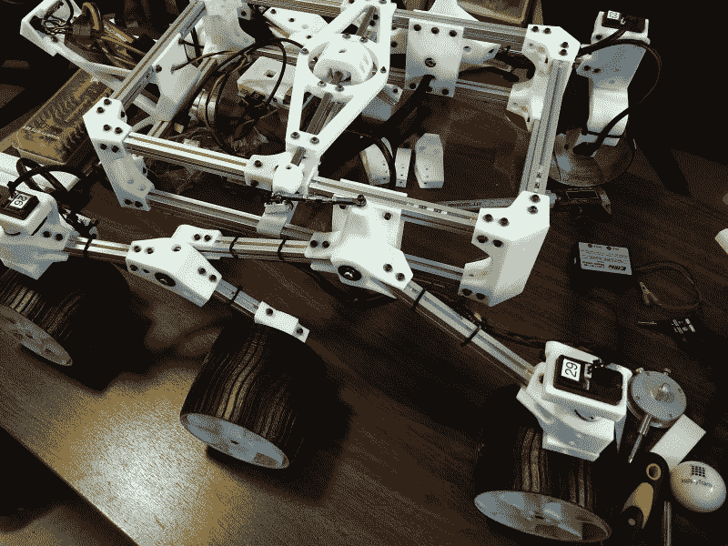
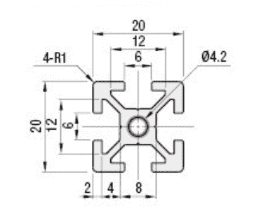
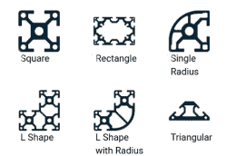
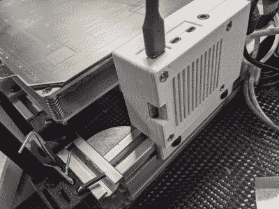
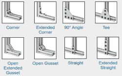
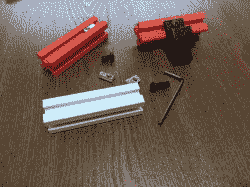

# 铝型材入门

> 原文：<https://hackaday.com/2021/05/25/getting-started-with-aluminum-extrusions/>

t 型槽挤压曾经有些神秘，但由于在许多 3D 打印机中的使用，今天它们已经很常见了。然而，用一些挤压件组装一套工具是一回事，用这些材料设计你自己的作品是另一回事。如果你小时候有过玩具工厂，那么你应该知道挤压。你把一些材料从模子里推出来做成一个形状。当然，铝型材不是由模型粘土制成的，通常是 6105-T5 铝。奇怪的是，似乎没有一个官方标准，但它是如此普遍，不同供应商之间通常没有太大的差异。

我们使用挤压来制造 3D 打印机、激光切割机和 CNC 机器的框架。但你可以在任何需要结实、多功能框架的地方使用它。似乎有很多人使用它们，例如，在货车内建造定制的固定装置。如果你需要一个定制的工作台，一个灯具，甚至一个相框，你可以使用拉伸来建造任何你喜欢的东西。

## 为什么是挤压？

Hackaday’s own Roger Cheng shows the versatility of aluminum extrusion and [shares a wealth of tips he developed](https://hackaday.com/2018/05/08/how-to-build-anything-out-of-aluminum-extrusion-and-3d-printed-brackets/) for his [Sawppy the Rover](https://hackaday.io/project/158208-sawppy-the-rover) project.

当然，如果你足够方便，你可以不用铝挤压来建造所有这些东西。毕竟，用木头甚至铝做一个盒子并不难。但是储备便宜的铝既坚固又方便。一般来说，你需要的只是一种切割挤压方块的方法(或者，买你想要的长度)和一种在相对较软的铝上钻孔的方法。在某些情况下，您可能想要钻一些孔——要么是已经存在的孔，要么是新钻的孔。

然而，你需要的是很多特殊的零件。有支架和专用螺母以及各种配件。你可以把它想象成一套类似于成人勃起器的东西。有一件事让挤压变得更容易，那就是在许多情况下，你可以 3D 打印出你需要的支架，而不是购买一个奇特的支架或必须储备许多不同的物品。一个很好的例子是郑健国在他的指南 [*中提到的所有支架和固定部件，以及 3D 打印支架*](https://hackaday.com/2018/05/08/how-to-build-anything-out-of-aluminum-extrusion-and-3d-printed-brackets/) 。

## 挤压几何学

A typical 2020 profile

并不只有一种挤压，但它们都有一些共同的特征。一般来说，挤出会像一个正方形或长方形。最基本的挤压件是方形的，会有一个中心孔和一个或多个 T 形槽来连接东西。如果你想做一些有吸引力的东西，你可能不想在所有的边上都有 T 形槽，但通常，用 3D 打印机或其他机器，你会在所有的边上都有一个槽。

有些拉伸是公制的，有些是英制的。通常根据尺寸称之为方形剖面，如 20×20 剖面(每边 20 毫米)。

Some of the profiles available on the Misumi website

更复杂的拉伸通常会重复该模式，因此 40×20 的拉伸看起来像两个 20×20 的拉伸连接在一起。当然，它们并不是那样制造的——这是一种固体挤压，它们像 Play-Doh 一样被挤压出来，这是丹·马洛尼去年钻研的一个有趣的故事。但是，也有其他的挤出形状，例如具有半径的形状或出于特殊目的而形状像三角形的形状。

你需要做两件事:将挤压件牢固地连接在一起，并将东西固定在挤压件上。例如，如果你在做一张桌子，你会想要做一个框架来支撑有四条腿的桌面。你可以在框架上安装一个层压桌面，在腿上放上调平脚。当然，你可以像下面视频中的[埃文]和[凯特琳]一样变得更加狂热。

 [https://www.youtube.com/embed/CEv60KeZ-M0?version=3&rel=1&showsearch=0&showinfo=1&iv_load_policy=1&fs=1&hl=en-US&autohide=2&wmode=transparent](https://www.youtube.com/embed/CEv60KeZ-M0?version=3&rel=1&showsearch=0&showinfo=1&iv_load_policy=1&fs=1&hl=en-US&autohide=2&wmode=transparent)

## 挤压连接

Rod holders mounted to a piece of extrusion.

在许多情况下，将脚或支架等附件附加到挤出与将多个挤出连接在一起有很多共同之处，所以让我们先来解决这个问题。诀窍是使用特殊的螺母安装在 T 型槽内。你有几个选择。如果足够薄，方形螺母可以滑入槽中。当你把螺栓拧紧到螺母上时，你可以在螺母上放一个拉簧来固定它。然而，通常情况下，人们只是拧上螺栓，然后将整个东西滑入插槽中。

这样做的缺点是，你必须能够接触到插槽的开口端。如果你想在另外两个螺母之间添加一些东西，或者如果插槽被一个支架堵住了，你将不得不把所有东西都拆开来装上新的螺母。这是一种预设螺母，他们还制作了矩形螺母，称为 T 型螺母，用于相同的目的。

A Raspberry Pi 4 in a 3D printed case attached to some extrusion. The black bolts affix to the T-nuts in the slot. (Model: [https://www.thingiverse.com/thing:2581565](https://www.thingiverse.com/thing:2581565))

例如，如果你要将一个带有两个安装孔的步进电机支架固定到你的框架上，你可以插入螺母，或者将它们松松地拧在插入支架的螺栓上，然后将它们滑入槽中。当你把组件放在正确的位置时，你只需拧紧螺栓。

唯一棘手的部分是螺栓的长度。你需要一个螺栓，它将穿过支架并进入螺母，而不会从另一侧出来并接触到挤压件。如果支架是 10 毫米厚，螺母是 6 毫米厚，你可以用一个 15 毫米长的螺栓留一毫米的余量。如果螺栓太短，连接处就不牢固。

如果你需要添加一些东西到你不能进入 T 型槽入口的挤压中间，你需要一种特殊的 T 型螺母。这些是最不安全的附件，但通常已经足够了。这些螺母呈椭圆形，所以当它们旋转 90 度时会卡在槽中。也有带弹簧或固定螺钉的螺母，因此您可以将它们以一定角度放入插槽中，然后旋转长边以压缩弹簧，使螺母离开插槽。当你松手时，弹簧将螺母推入槽的边缘，将其锁定到位。这些有时被称为嵌入式或滚入式螺母。

你也可以得到 T 型头螺栓，螺栓头适合插槽，而不是螺母。这些看起来像 T 型螺母，但有一个螺栓，而不是螺纹孔。他们也生产有多个螺纹孔的 T 型螺母。例如，一个角支架(我们很快就会谈到)可能每隔 20 毫米有三个孔，相应的螺母也有三个孔，孔的间距相同。当然，你总是可以只用三个普通的坚果。

## 连接拉伸

Just a few of the bracket types in the McMaster-Carr catalog.

您可以使用 T 型螺母和螺栓连接步进电机支架或机柜滑轨。但是您也可以将支架附加到两个或多个拉伸上，以将它们连接在一起。他们用铝、钢或聚合物制造这些支架，当然，你也可以 3D 打印它们。然而，你需要小心。通常，支架仅在二维方向上约束挤出，因此您需要使用第二种方法来过度约束关节。

大多数括号和你想象的一模一样——它们的形状有点像 L 或 T 或加号，但是有令人眼花缭乱的选项。也有用于制造具有 XYZ 构造的盒子的角连接器。然而，你也可以得到看起来像两个 L 形 T 型螺母的内支架。一个固定螺丝固定住 L 形的每一条腿。有些有一个有角度的固定螺丝，以帮助对齐连接，在这种情况下，你必须使用不同类型的内部连接器，这取决于连接器面临的方式。您通常会成对使用这些来保持挤出的两侧，尽管这并不总是必要的。您可以在下面的视频中看到一个简单的内部连接器示例。

 [https://www.youtube.com/embed/TwYfSlTkd1U?version=3&rel=1&showsearch=0&showinfo=1&iv_load_policy=1&fs=1&hl=en-US&autohide=2&wmode=transparent](https://www.youtube.com/embed/TwYfSlTkd1U?version=3&rel=1&showsearch=0&showinfo=1&iv_load_policy=1&fs=1&hl=en-US&autohide=2&wmode=transparent)

有时，您可能只想首尾相连地连接两个拉伸。线性连接器可以做到这一点。它只是一个金属条，适合插槽，并有几个固定螺丝的孔。你也可以买支架，这样你就可以把一块挤压物放进去，作为额外力量的斜撑。

也有一种简单的方法来连接两个挤出，根本不使用支架。虽然工作量更大，但使用的零件更少。假设您想以直角连接挤出 A 和 B。第一步是在挤压件 a 上攻一个(或多个)中心孔，然后在挤压件 B 上钻一个足够大的普通孔，让螺栓穿过这个孔。你把一个螺栓拧进螺纹孔，但在拧紧之前，你把螺栓头滑入 B 的 T 形槽。B 中的孔被定位，以便您可以完成拧紧螺栓。

## 配件

你可以从你购买的同一个地方买到许多与挤压件一起工作的东西。有盖板、支脚和脚轮。你可以在 T 型槽中安装弹簧来固定像丙烯酸这样的片状材料。有轮子、门、把手和铰链，所有这些都是为了适应 T 型槽。

如果你浏览任何像 Thingiverse 这样的 3D 打印网站，你会发现有许多设计，如[线轴支架](https://www.thingiverse.com/thing:2537713)，灯丝导轨，工具支架和灯，它们可以通过摩擦配合或螺母安装在 T 形槽中。请记住，如果你想添加一些东西，它需要螺丝，你可能会想要某种形式的下降螺母。

## 从哪里获得挤压

购买挤压产品最便宜的方法是获得你能得到的任何长度的剩余产品——通常是剩菜——然后把它们切成你自己想要的尺寸。如果你真的自己切割，你会希望确保切割干净且呈方形，这样当你将挤出物连接在一起时，它们会呈方形。当然，你会想要使用金属切割刀片。

然而，如果你购买新的挤压型材，你通常可以将它们精确地切割成你需要的任何尺寸。这也可以减少你无论如何都要切的长片的昂贵运费。除了切割，你经常可以得到不同颜色或金属合金的材料。如果你不想自己动手，也可以要求在一端或两端钻孔。

有很多地方可以买到挤压型材和相关物品。Misumi 和 [8020](https://8020.net) 一样是一个常见的选项。像[固安捷](https://www.grainger.com/product/80-20-Framing-Extrusion-2RCP9?s_pp=false&picUrl=//static.grainger.com/rp/s/is/image/Grainger/2RCP8_AS01?$smthumb$)、 [Fastenal](https://www.fastenal.com/products/details/0961258?term=80/20&r=~%7Ccategoryl1:%22600930%20Raw%20Materials%22%7C~%20~%7Ccategoryl2:%22602694%20Extruded%20T-Slot%20Bars%209and%20Accessories%22%7C~%20~%7Ccategoryl3:%22602693%20Extruded%20T-Slot%20Bars%22%7C~) 和[麦克马斯特-卡尔](https://www.mcmaster.com/structural-framing/t-slotted-framing-rails/)这样的大供应商有很多这种东西，但是它们通常都很贵。

## 3D 打印连接

Plastic printed extrusions with metal T nuts. Note the ball spring on the leftmost uninstalled nut.

你可以 3D 打印许多[支架](https://hackaday.com/2017/12/16/if-3d-printer-then-custom-aluminum-extrusion-brackets/)(包括一个显然是[世界上最好的](https://www.thingiverse.com/thing:1758722))和[配件](https://www.thingiverse.com/thing:2957550)，如果你想制作一些模型，你甚至可以 3D 打印[挤压件](https://www.thingiverse.com/thing:280318)，尽管你需要你的打印公差非常严格。[塑料 T 形螺母](https://www.thingiverse.com/thing:3050607)有多种设计，采用普通螺母进行螺纹连接，并带有各种各样的支架。

尽管如此，还是有一些事情需要注意。第一，用常识。塑料支架和挤压件不会像金属支架和挤压件那样坚固，尽管我们已经看到人们[过分热衷于这个想法](https://www.thingiverse.com/thing:2504299)。此外，并不是所有的挤压件都完全相同，因此适合 X 品牌的螺母设计可能不适合您现有的螺母。和 3D 打印一样，你需要调整和调整。

如果你想让你的设计变得新奇，甚至可以用 [3D 打印的支架来装便宜的坚果](https://hackaday.com/2018/05/08/how-to-build-anything-out-of-aluminum-extrusion-and-3d-printed-brackets/)。无论哪种方式，如果你正在建造一张桌子，一台机器，一个机器人，或者几乎任何你能想象的东西，铝型材都是你工具箱里的好东西。