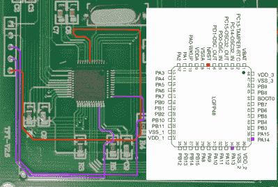

# Ghidra 曾经将华氏温度植入空气质量计

> 原文：<https://hackaday.com/2021/02/15/ghidra-used-to-patch-fahrenheit-into-an-air-quality-meter/>

尽管世界上大多数人不能告诉你华氏温度是多少，但在地球上的一些地方，这个单位仍然被普遍使用。因此，对于这些地区的人们来说，当廉价的中国空气质量测量系统只能以摄氏度为单位进行报告时，这确实是一个麻烦。幸运的是，[BSilverEagle] [设法修补了这样一个单元](https://frdmtoplay.com/patching-in-fahrenheit/)，使其以华氏温度显示温度。

 逆向工程从找到一种转储固件的方法开始。很高兴听到[BSilverEagle]使用了去年 11 月在 Hackaday Remoticon 的[【Eric Shlaepfer 的】PCB 逆向工程研讨会](https://hackaday.com/2020/12/01/remoticon-video-how-to-reverse-engineer-a-pcb/)中演示的一些技巧来追踪 STM32F103C8 MCU 的调试头和 SWD 引脚。之后，OpenOCD 可用于转储固件映像，不会遇到读保护。然后使用 [Ghidra](https://ghidra-sre.org/) 对固件进行逆向工程，以便【BSilverEagle】能够计算出温度的计算位置以及摄氏符号的图示符的存储位置。从那里开始，这是对原始固件的这两个部分的直接重写，以计算华氏温度值，更改字形并刷新 MCU。

那么，如果它不能为你当前的地区提供有用的单元，为什么要首先购买它呢？成本。购买这款消费类(ish)设备的成本与购买单个零件、设计和制造 PCB 以及为其编写固件的成本大致相同。他们用例的唯一缺点是缺少华氏温度。对于那些要求完全控制自己的硬件的人来说，这不成问题。

需要一个使用 Ghidra 的训练营吗？Matthew Alt 和 Ghidra 一起制作了一个关于逆向工程的视频系列。