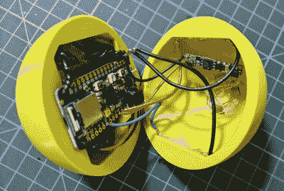

# 巨型 DIY 鼠标释放球

> 原文：<https://hackaday.com/2021/01/29/giant-diy-mouse-sets-the-ball-free/>

转而使用分离键盘，你首先会注意到的是，在两半键盘之间有这么多空间。(好吧，只要你做得对)。这是保存你的猫、你的咖啡杯，或者对[亚采克]来说，你的[神奇的 DIY 轨迹球鼠标](https://blog.jfedor.org/2021/01/bluetooth-trackball-mark-ii.html)的完美地方。

 不要被橙色的塑料底座所迷惑——所有的电子产品都被卷在那个性感的大球里，【亚采克】把它打印成两半，然后粘在一起。在球的内部有一个 Adafruit Feather nRF52840 Sense，它有一个机载加速度计，陀螺仪和磁力计。正如你将在休息后的视频中看到的，羽毛从这些数据中读取数据，并应用传感器融合算法来确定球在 3D 空间中的方向，然后将其位置发送给计算机。为了发送点击事件，[亚采克]在键盘的固件中植入了一些鼠标按键。其他羽毛传感器中有一个 PDM MEMS 麦克风，因此检测球上的点击并将其转换为点击声对于未来的版本来说不是不可能的。

真正聪明的部分来了:球里面有两个簧片开关。一个用作电源开关，另一个用于设置轨迹球的“向上”方向。这个球在 3D 打印的底座上无线充电，底座上还有一个小型钕磁铁，用于激活簧片开关。休息之后看看演示，展示了[亚采克]在一个鼠标准确度测试程序上测试轨迹球。

如果你喜欢你的 DIY 轨迹球看起来更标准，点击 Ploopy 项目。

 [https://www.youtube.com/embed/QbE3H4vglHw?version=3&rel=1&showsearch=0&showinfo=1&iv_load_policy=1&fs=1&hl=en-US&autohide=2&wmode=transparent](https://www.youtube.com/embed/QbE3H4vglHw?version=3&rel=1&showsearch=0&showinfo=1&iv_load_policy=1&fs=1&hl=en-US&autohide=2&wmode=transparent)

