# 巨型发光二极管，红宝石激光器，全息显示器，以及其他在罗马制造商博览会上看到的很酷的东西

> 原文：<https://hackaday.com/2019/10/25/giant-leds-ruby-lasers-hologram-displays-and-other-cool-stuff-seen-at-maker-faire-rome/>

上周末，来自欧洲各地的黑客齐聚罗马，参加自称为“欧洲版”的创客大会。这个为期三天的活动是世界上最大的创客博览会之一，仅在周五就有来自意大利和欧洲各地的 27，000 名学生参加。

这是在罗马国际会展中心举行的，这是一个巨大的会议中心，位于罗马机场以南两个火车站的地方，有点偏僻。我听说这是联合会举办的最大的活动，但是没有数据支持这种说法。有一件事是肯定的，三天的时间对我来说是不够的，我无法享受展会上的一切。这里聚集了一大批真正有才华的硬件黑客，你会认出他们中的许多人是 Hackaday 周围常见的令人敬畏的项目的创造者。

这里有一个我最喜欢的旋风之旅。名单上有 POV 全息显示器、巨型浇铸树脂发光二极管、由全球速卖通零件制成的光泵红宝石激光器、立方体形式的 blinky good，以及意大利观众对科学讲座的欣赏(在这种情况下，与空间有关)。让我们来看看。

## 全息图 IRL、手工耳机、盲文显示器，以及时尚地清洁您的工作室

 [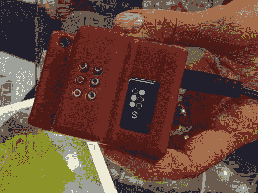](https://hackaday.com/2019/10/25/giant-leds-ruby-lasers-hologram-displays-and-other-cool-stuff-seen-at-maker-faire-rome/mfr19-lumi-industries-molbed-braille-display/) Braille display [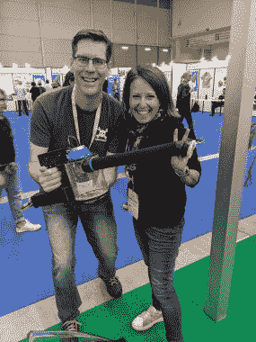](https://hackaday.com/2019/10/25/giant-leds-ruby-lasers-hologram-displays-and-other-cool-stuff-seen-at-maker-faire-rome/mfr19-lumi-industries-diyson-manuela-pipino-with-mike-szczys/) DIYson handheld vacuum  DIY Headphones

Manuela Pipino 在展会的第一天找到了我，手里拿着 DIYson。戴森 V7 手持真空吸尘器的这个名字很聪明，大部分是 3D 打印的，是我今年最喜欢的项目之一。她的摊位上展出了大量有趣的东西。米露工业专注于 3D 打印，我将在未来的文章中谈论他们的新树脂打印机。我非常喜欢看到耳机，利用了自己动手做的磁膜构造技术。她还展示了[MOLBED 盲文显示器](https://hackaday.io/project/12442-molbed-modular-low-cost-braille-electronic-display)，这是他们 2016 年 Hackaday 奖的参赛作品。

 [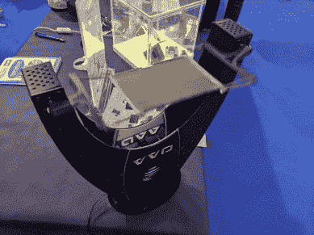](https://hackaday.com/2019/10/25/giant-leds-ruby-lasers-hologram-displays-and-other-cool-stuff-seen-at-maker-faire-rome/mfr19-lumi-industries-hologram-display/) Hologram display at rest [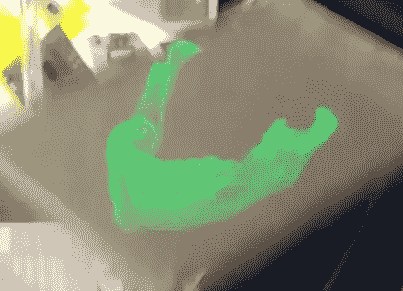](https://hackaday.com/2019/10/25/giant-leds-ruby-lasers-hologram-displays-and-other-cool-stuff-seen-at-maker-faire-rome/mfr19-lumi-industries-vvd-screenshot/) Jawbone seen in screenshot of hologram display <https://hackaday.com/wp-content/uploads/2019/10/VID_20191019_104836-1.mp4?_=1>

[https://hackaday.com/wp-content/uploads/2019/10/VID_20191019_104836-1.mp4](https://hackaday.com/wp-content/uploads/2019/10/VID_20191019_104836-1.mp4)

我花了几分钟敬畏这个[体积可视化设备(VVD)](https://www.lumindustries.com/3d-vis/) 在米露工业桌的角落里嗡嗡作响。这是全息图视觉显示的一种持续性。全息胶片被固定在由柔性材料制成的框架中。薄膜两侧的马达使其上下摆动，下方的强光源与运动同步。你的眼睛看到的是漂浮在半空中的全息图，尽管由于滚动快门效应，很难捕捉到视频，这并不奇怪。

## 实际上是巨大的发光二极管

 [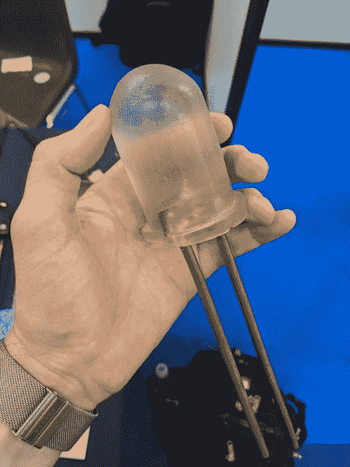](https://hackaday.com/2019/10/25/giant-leds-ruby-lasers-hologram-displays-and-other-cool-stuff-seen-at-maker-faire-rome/mfr19-partfusion-big-led-early-version/) Early prototype  Clear resin shows 5050 LED package [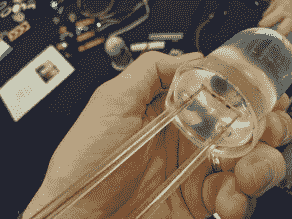](https://hackaday.com/2019/10/25/giant-leds-ruby-lasers-hologram-displays-and-other-cool-stuff-seen-at-maker-faire-rome/mfr19-partfusion-big-led-construction/) Welding rod and PCB [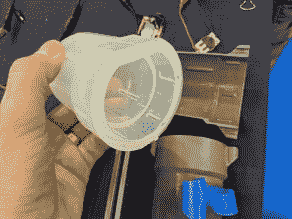](https://hackaday.com/2019/10/25/giant-leds-ruby-lasers-hologram-displays-and-other-cool-stuff-seen-at-maker-faire-rome/mfr19-partfusion-big-led-mold/) Silicon mold and 3D printed frame in background [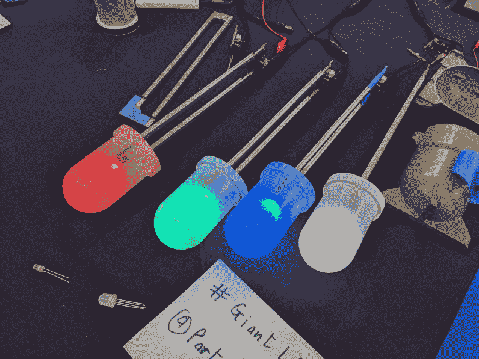](https://hackaday.com/2019/10/25/giant-leds-ruby-lasers-hologram-displays-and-other-cool-stuff-seen-at-maker-faire-rome/mfr19-partfusion-big-leds/) Big LEDs on display

我第一次看到这些巨大的浇铸树脂发光二极管是在 Hackaday Meetup 上，并在罗伯特·菲兹西蒙的展台前驻足。我喜欢他不只是炫耀 led，而是带来了模具和测试版本。他的工艺使用黄铜焊条连接到 5050 封装中容纳单个 LED 的电路板。整个东西是用大约 200 毫升的树脂在一个模具中浇铸而成的，这个模具是由一个带有 3D 打印框架的硅树脂内衬制成的，以防止其变形。引线被铸造成围绕焊条的方形，并且在底部注入能量。树脂被轻微掺杂以漫射光线，这也隐藏了铸件中的任何气泡或瑕疵。它们看起来很壮观，我听说你可能很快就会在[的 Tindie 商店](https://www.tindie.com/stores/partfusion/)找到它们。

## 全球速卖通制造的光泵红宝石激光器

 [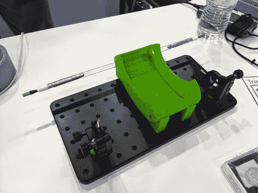](https://hackaday.com/2019/10/25/giant-leds-ruby-lasers-hologram-displays-and-other-cool-stuff-seen-at-maker-faire-rome/mfr19-ruby-laser-overview/) Optical-pump ruby laser [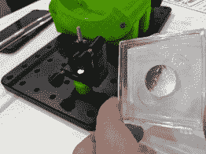](https://hackaday.com/2019/10/25/giant-leds-ruby-lasers-hologram-displays-and-other-cool-stuff-seen-at-maker-faire-rome/mfr19-ruby-laser-mirror/) Mirror and optic jig [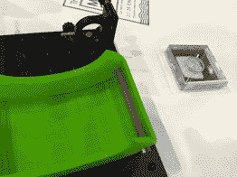](https://hackaday.com/2019/10/25/giant-leds-ruby-lasers-hologram-displays-and-other-cool-stuff-seen-at-maker-faire-rome/mfr19-ruby-laser-ruby-rod/) Ruby rod

很高兴见到马特奥·贝雷托尼展示他制作的红宝石激光器。展会组织者禁止他在自己的展位上使用激光，这让他有点难过，但我很高兴他继续展示它。闪光灯管、红宝石棒、镜子和镜头都来自全球速卖通，他怀疑它们都是工厂机器的二手货。闪光管和红宝石棒被放在一个 3D 打印的外壳中，他一直在测试这个外壳，上面覆盖着箔片和电镀铜，以增加输出的功率。

## 罗马黑客日聚会

[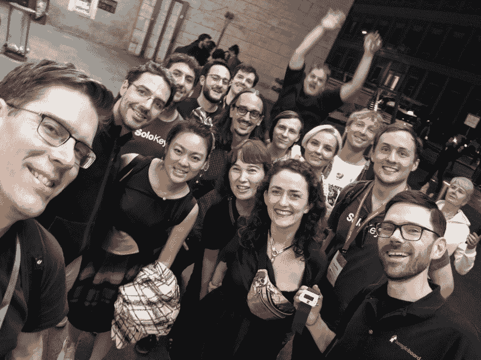](https://hackaday.com/wp-content/uploads/2019/10/MFR19-Hackaday-meetup.jpg)

由于会议中心不在任何地方，我们在罗马 Termini 举行了一个小型的聚会——距离集会约一小时的中央火车站和地铁站。考虑到有点偏远的位置，我们有大约 20 人参加(这张照片是聚会的最后部分，抱歉，如果你在这之前就分道扬镳了，没有拍成照片)。

 [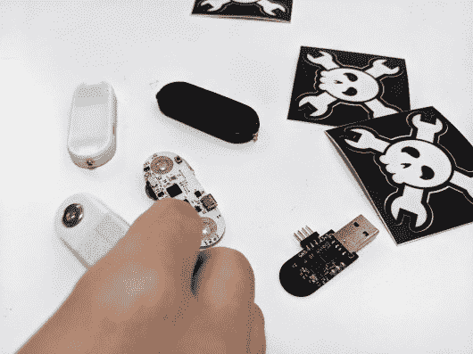](https://hackaday.com/2019/10/25/giant-leds-ruby-lasers-hologram-displays-and-other-cool-stuff-seen-at-maker-faire-rome/mfr19-meetup-uecg-modules/) uECG wearable module and USB recevier [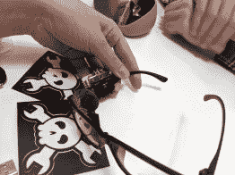](https://hackaday.com/2019/10/25/giant-leds-ruby-lasers-hologram-displays-and-other-cool-stuff-seen-at-maker-faire-rome/mfr19-meetup-uecg-hud-glasses/) HUD Glasses [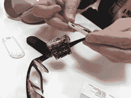](https://hackaday.com/2019/10/25/giant-leds-ruby-lasers-hologram-displays-and-other-cool-stuff-seen-at-maker-faire-rome/mfr19-meetup-uecg-hud-heartbeat/) HUD screen shows uECG output [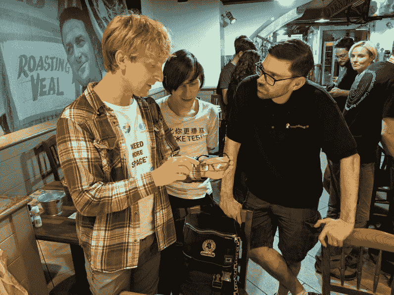](https://hackaday.com/2019/10/25/giant-leds-ruby-lasers-hologram-displays-and-other-cool-stuff-seen-at-maker-faire-rome/mfr19-meetup-uecg-hud-demo/) 

很高兴在 the Bring-a-Hack 上见到来自 Ultimate Robotics 的团队。几天前我刚刚在 Hackaday.io 上看到过[他们的 HUD 眼镜](https://hackaday.io/project/167854-uglass-an-ar-module-on-your-glasses)，立刻就认出了他们。我试了试，虽然我在网上看到它们时持怀疑态度，但它们真的很好用！更酷的是，眼镜无线连接到[他们的 uECG 模块](https://hackaday.io/project/164486-uecg-a-very-small-wearable-ecg)，这是一个团队参加 Hackaday 奖的可穿戴心电图，可以实时显示你的心脏电活动。

 [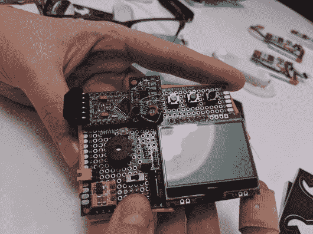](https://hackaday.com/2019/10/25/giant-leds-ruby-lasers-hologram-displays-and-other-cool-stuff-seen-at-maker-faire-rome/mfr19-partfusion-larry-bank-posture-coach-prototype/) Posture aid prototype [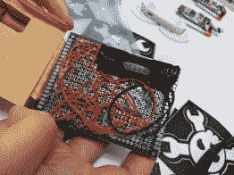](https://hackaday.com/2019/10/25/giant-leds-ruby-lasers-hologram-displays-and-other-cool-stuff-seen-at-maker-faire-rome/mfr19-partfusion-larry-bank-posture-coach-wiring/) Prototype wiring [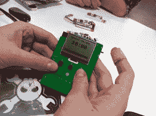](https://hackaday.com/2019/10/25/giant-leds-ruby-lasers-hologram-displays-and-other-cool-stuff-seen-at-maker-faire-rome/mfr19-partfusion-larry-bank-posture-coach-finished/) Posture aid PCB version [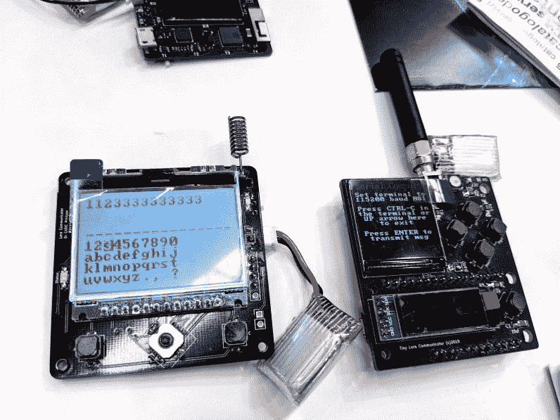](https://hackaday.com/2019/10/25/giant-leds-ruby-lasers-hologram-displays-and-other-cool-stuff-seen-at-maker-faire-rome/mfr19-partfusion-larry-bank-lora-pager/) LoRa text messagers

拉里·班克带来了他的几个项目。有一种姿势教练可以帮助治疗脊柱侧凸，它可以监测你保持身体的直度。他认为没有人会想看到他的点对点线路，但我喜欢这种东西！一同上路的还有一些使用 LoRa 标准的文本信息“寻呼机”~~，以及他设计的 USB 电源监控设备~~。

 [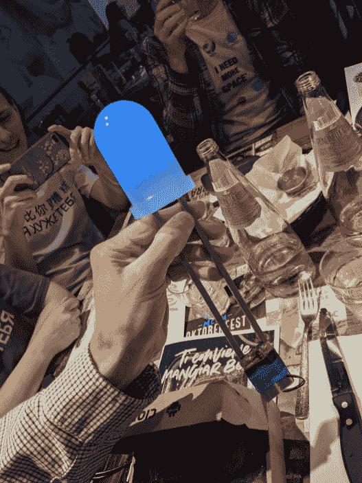](https://hackaday.com/2019/10/25/giant-leds-ruby-lasers-hologram-displays-and-other-cool-stuff-seen-at-maker-faire-rome/mfr19-partfusion-partfusion-giant-led/) Giant LED [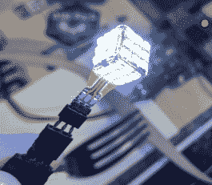](https://hackaday.com/2019/10/25/giant-leds-ruby-lasers-hologram-displays-and-other-cool-stuff-seen-at-maker-faire-rome/mfr19-partfusion-partfusion-led-cube-bright/) Tiny cube is very bright [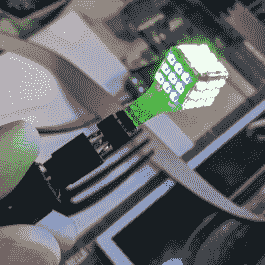](https://hackaday.com/2019/10/25/giant-leds-ruby-lasers-hologram-displays-and-other-cool-stuff-seen-at-maker-faire-rome/mfr19-partfusion-partfusion-led-cube-detail/) Flex PCB led cube [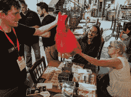](https://hackaday.com/2019/10/25/giant-leds-ruby-lasers-hologram-displays-and-other-cool-stuff-seen-at-maker-faire-rome/mfr19-partfusion-partfusion-led-garment/) LED Dress [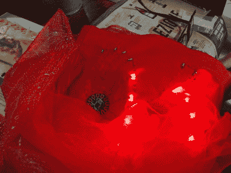](https://hackaday.com/2019/10/25/giant-leds-ruby-lasers-hologram-displays-and-other-cool-stuff-seen-at-maker-faire-rome/mfr19-partfusion-partfusion-led-garment-circuits/) LilyPad and wiring [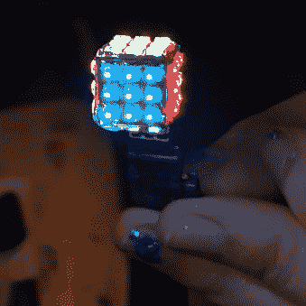](https://hackaday.com/2019/10/25/giant-leds-ruby-lasers-hologram-displays-and-other-cool-stuff-seen-at-maker-faire-rome/mfr19-partfusion-partfusion-rgb-led-cube/) Artistic LED Cube shot

我已经提到了罗伯特的巨大的发光二极管，但他也带来了一些有趣的闪光灯。他用柔性 PCB 制成的 3x3x6 RGB LED 立方体大获成功。我喜欢看红色发光二极管小礼服，它用 LilyPad 模块和一些可缝合的发光二极管增加了一些电子魔法。现在很多孩子都有 LED 鞋，电子极客父母应该抓住每一个可能的机会把它们加入衣服中。

 [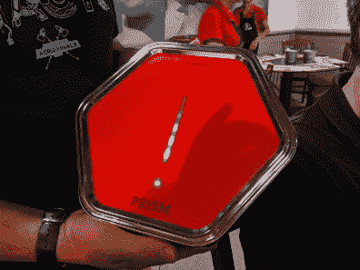](https://hackaday.com/2019/10/25/giant-leds-ruby-lasers-hologram-displays-and-other-cool-stuff-seen-at-maker-faire-rome/mfr19-meetup-prism-ev-charger/) Prism EV Charger [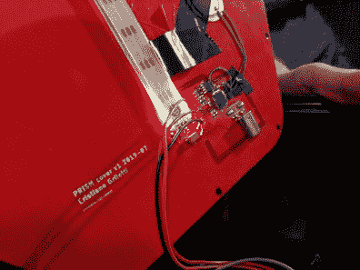](https://hackaday.com/2019/10/25/giant-leds-ruby-lasers-hologram-displays-and-other-cool-stuff-seen-at-maker-faire-rome/mfr19-meetup-prism-rear-faceplate-circuit/) Circuit on back of Prism faceplate

Mastro Gippo 带着他的 [Prism 电动汽车智能充电器](https://hackaday.io/project/166859-prism)参加了会议。这是 2019 年 Hackaday 奖的二十名决赛选手之一，我们一直在关注他的故事，因为他完善了以 PCB 为面板的注塑外壳。

## 开放式热感相机

 [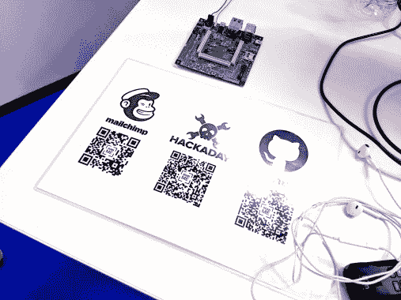](https://hackaday.com/2019/10/25/giant-leds-ruby-lasers-hologram-displays-and-other-cool-stuff-seen-at-maker-faire-rome/mfr19-heat-camera-qr-codes/) Repping Hackaday.io! [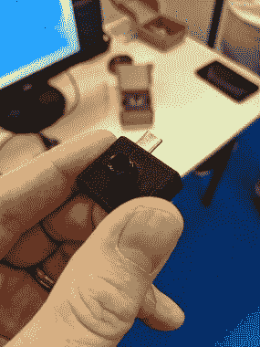](https://hackaday.com/2019/10/25/giant-leds-ruby-lasers-hologram-displays-and-other-cool-stuff-seen-at-maker-faire-rome/mfr19-heat-camera/) Open Thermal Camera

在最后一天快结束的时候，我试图找到我错过的每一个角落和缝隙，无意中发现了一个[开放式热感相机](https://hackaday.io/project/165247-open-thermal-camera)的展台，这是另一个 Hackaday 奖的参赛作品。你可能记得在[最近的一篇文章](https://hackaday.com/2019/09/22/getting-the-heat-on-with-a-thermal-camera/)中看到过这一点，我们在文章中称赞了模块设计的外观。智能手机应用程序很有趣，因为它使用了一些抖动技术来帮助提高可视化的实用性。我喜欢他们将 Hackaday.io 页面自豪地显示为二维码！

## 太空展览中拥挤的谈话

 [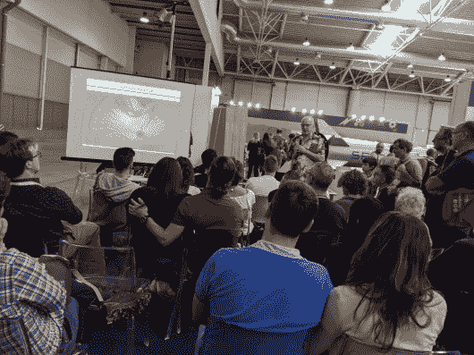](https://hackaday.com/2019/10/25/giant-leds-ruby-lasers-hologram-displays-and-other-cool-stuff-seen-at-maker-faire-rome/mfr19-space-jpl-curiosity-lander-lecture/) Packed JPL lecture has huge audience out of frame too [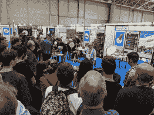](https://hackaday.com/2019/10/25/giant-leds-ruby-lasers-hologram-displays-and-other-cool-stuff-seen-at-maker-faire-rome/mfr19-space-orbital-mechanics-lecture/) Big audience for Orbital Mechanics lecture [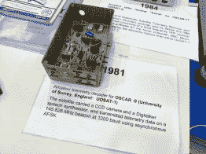](https://hackaday.com/2019/10/25/giant-leds-ruby-lasers-hologram-displays-and-other-cool-stuff-seen-at-maker-faire-rome/mfr19-space-oscar-receivers/) Oscar-6 Receiver [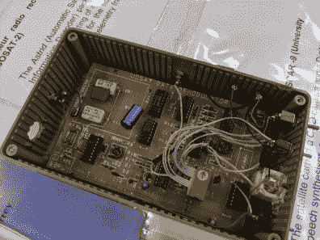](https://hackaday.com/2019/10/25/giant-leds-ruby-lasers-hologram-displays-and-other-cool-stuff-seen-at-maker-faire-rome/mfr19-space-oscar-receiver-circuit-board/) Receiver internals [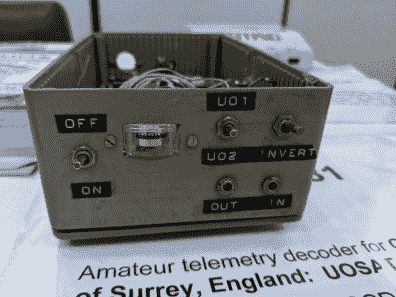](https://hackaday.com/2019/10/25/giant-leds-ruby-lasers-hologram-displays-and-other-cool-stuff-seen-at-maker-faire-rome/mfr19-space-oscar-receiver-panel/) Receiver faceplate

我真的很欣赏看到这么多人挤在博览会上的演讲，尤其是在非常大的空间展览区。其中一次演讲来自美国宇航局喷气推进实验室的亚历杭德罗·米格尔·圣马丁(Alejandro Miguel San Martìn ),他讲述了 2012 年好奇号火星车登陆火星时遇到的技术挑战——他在整个周末多次发表了这个长达 1 小时的演讲。我很喜欢他的讲座，已经忘记了那个任务中的空中起重机和无人驾驶推进器。我偶然听到另一个意大利语演讲，我想是关于轨道力学的。空间面积太大，无法在这里全部捕捉到。值得一提的一个展示是为不同的奥斯卡卫星建造的一套业余无线电接收器[。](https://hackaday.com/2016/01/14/hams-in-space-project-oscar/)

接下来还有更多，我将在后续文章中介绍 3D 打印机技术和我在展会上看到的许多其他展品。感谢我上周末见到的每一个人，感谢你们展示了你们的项目！有一种真正意义上的黑客精神，许多人带来了他们的原型和错误，与成功的构建一起展示。这告诉我们，学习新技能并找到走出死胡同的方法才是真正让科学发生的原因。

我要感谢罗马 Maker Faire 的策展人邀请我发言，并感谢意大利贸易署支付机票和酒店费用。

[图片来源:Kitty Yeung([@ KittyArtPhysics](https://twitter.com/KittyArtPhysics/status/1185685124421169153))在 Hackaday Rome Meetup 上]