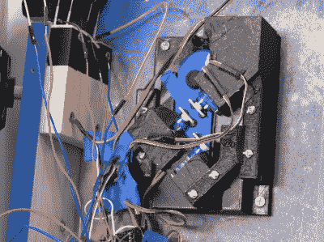

# 巨人任天堂 Switch 其实是可以玩的

> 原文：<https://hackaday.com/2021/04/05/giant-nintendo-switch-is-actually-playable/>

对于这家有百年历史的前扑克牌制造商来说，任天堂 Switch 是一款非常成功的游戏机。这种成功至少部分来自它的便携性，这一点[迈克尔·皮克]可能已经失去了一点，他为圣裘德儿童医院建造的 65 磅重的巨型任天堂 Switch。(视频，嵌在下面。)不过，他在便携性方面的损失已经超过了酷炫因素，我们相信孩子们会喜欢他们仍然可以玩怪兽游戏机。

从它的胶合板机身到 3D 打印的按钮，这个超大的建筑看起来很坚固。停靠在左欢乐控制台内的是为其老大哥供电的实际控制台。然而，也许最令人惊讶的是，小小的(嗯，正常大小的)欢乐游戏也藏在里面。这些都是通过按钮的伺服系统和操纵杆的直接传递设置来控制开关上的游戏。

虽然 Joy-Cons 是未修改的，完全可移动的，但[Michael]确实认识到这不一定是理想的解决方案。但是他确信这是一个他能在有限的时间内完成的工作，所以他去做了。他研究了 Teensys 的控制器仿真，并可能在未来的任何大型交换机项目中使用该解决方案。当然，有了这个版本，玩家仍然可以将常规的游戏控制器和专业控制器配对，以获得更实用的游戏。

我们看到的大多数任天堂 mod 都试图让主机变小，而不是变大，所以这是一个引人注目的变化。不幸的是，我们没有看到巨大的控制台安装后的运行，只有一些医院工作人员在前门推着它的剧照。但是我们可以想象，孩子们的笑容至少和我们看到它的时候一样大。

 [https://www.youtube.com/embed/fZPHz4oeS54?version=3&rel=1&showsearch=0&showinfo=1&iv_load_policy=1&fs=1&hl=en-US&autohide=2&wmode=transparent](https://www.youtube.com/embed/fZPHz4oeS54?version=3&rel=1&showsearch=0&showinfo=1&iv_load_policy=1&fs=1&hl=en-US&autohide=2&wmode=transparent)

[via [Reddit](https://reddit.com/r/gaming/comments/mjdu23/i_built_a_giant_working_nintendo_switch_for_saint/)