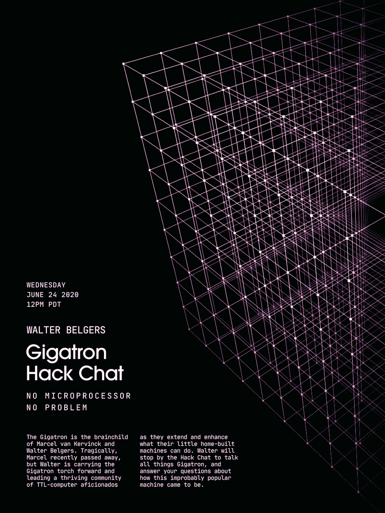

# Gigatron 黑客聊天

> 原文：<https://hackaday.com/2020/06/22/gigatron-hack-chat/>

加入我们太平洋时间 6 月 24 日星期三中午的 [Gigatron Hack Chat](https://hackaday.io/event/171602-gigatron-hack-chat) 与 [Walter Belgers](https://hackaday.io/hacker/257419-walter) ！

曾几何时，如果你想要一台电脑，你必须自己动手。也不是从亚马逊订购零件，然后把所有东西都塞在一个箱子里——你必须购买芯片，焊接或缠绕所有东西，然后无休止地修补。这个过程缓慢、痛苦、昂贵，但最终，你拥有了一台完全独特的机器，你对它了如指掌，因为你把它的每一部分都组装在了一起。

从某些方面来说，那些日子一去不复返是件好事。能够用一台便宜的、标准化的商用个人电脑来解决问题是非常强大的，但是那台机器将具有橡胶门挡的所有魅力，而没有灵魂。幸运的是，对于那些希望回到计算机革命早期的人或者那些完全错过这些日子的人来说，还有像 Gigatron T1 这样的替代品。被宣传为“极简复古计算机”的 Gigatron 是一个套件，它将建设者带回到比早期计算机革命更远的时间，因为它没有微处理器。8 位计算机的所有逻辑都是由分立的 7400 系列 TTL 芯片构成的。

Gigatron 是 Marcel van Kervinck 和 Walter Belgers 的发明。不幸的是， [Marcel 最近去世了](https://forum.gigatron.io/viewtopic.php?f=5&t=235)，但是 Walter 正举着 Gigatron 的火炬前进，领导着一个 TTL 计算机爱好者的繁荣社区，他们扩展和增强了他们自制的小机器的功能。Walter 会在 Hack Chat 上停下来谈论所有关于 Gigatron 的事情，并回答你关于这台不可思议的流行机器是如何出现的问题。

 我们的黑客聊天是 [Hackaday.io 黑客聊天群发消息](https://hackaday.io/messages/room/2369)中的社区直播活动。本周，我们将在太平洋时间 6 月 24 日星期三中午 12:00 坐下来讨论。如果时区让你失望，我们有[一个方便的时区转换器](https://www.timeanddate.com/countdown/generic?iso=20200624T12&p0=224&msg=Gigatron+Hack+Chat&font=cursive)。

点击右边的那个发言气泡，你会被直接带到 Hackaday.io 上的黑客聊天群，不用等到周三；随时加入，你可以看到社区在谈论什么。

