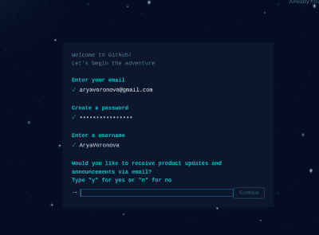
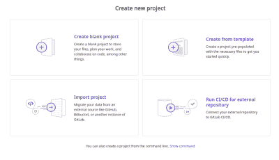
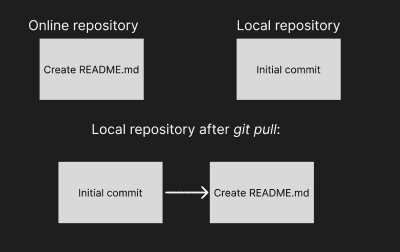
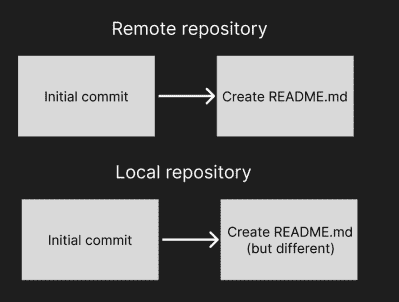

# 把你的印刷电路板放到网上

> 原文：<https://hackaday.com/2022/10/06/git-your-pcbs-online/>

上次，我已经向您展示了如何[围绕您的 PCB 项目创建一个本地 Git 库。](https://hackaday.com/2022/09/12/git-intro-for-hardware-hackers/)仅此一项就为您提供了本地备份，帮助您永远不会丢失对文件所做的更改，并且始终能够在项目开发过程中查看项目历史。

然而，Git 有用的更重要的部分是能够将我们的作品上传到各种在线 Git 存储库托管服务中的一个，并通过一个 shell 命令随时更新它。我将特别向您展示如何将您的项目上传到 GitHub 和 GitLab！

## 概述

首先，让我们回顾一下创建存储库的过程。以下是您可以参考的一系列命令——这些命令在上一篇文章中已经解释过了，所以如果您需要一个备忘单，它们就在这里。

```
# setting up identity - these are public, and can be fake
git config --global user.name "John Doe"
git config --global user.email johndoe@example.com
# initializing a repository
git init .
git branch -M main
# before your first commit, you add your .gitignore file
# then, add files as needed - use 'git status' to check in
git add board.kicad_pcb
[...]
git add README.md
# or, given proper .gitignore, you can just do this:
git add .
# put your added changes into a commit
git commit
# an editor will open to write your commit message

```

如果你手头刚好没有 PCB 项目怎么办？这里有一个带有 Jolly Wrencher SAO 板的库，你可以通过 GitHub 接口下载它作为. zip 存档。它已经是一个资源库了——如果你想测试这些命令，但手头还没有 PCB 项目，你可以免费将这个资源库推送到你自己的 GitHub 或 GitLab 帐户上，作为测试练习！如果您想重新开始并练习“存储库创建”部分，只需删除项目根目录中的`.git`目录。

## 有什么区别？

GitHub 和 GitLab 都是你的存储库的前端。它们还提供了一个额外的地方来转储您的代码——您也可以只使用一个闪存驱动器或一个 SSH 帐户的服务器。但是托管为您提供了一个 web 界面，在这里其他人可以查看您的代码及其自述文件，这样他们就知道您的代码是否让他们感兴趣，向您提问，与您共享他们自己的代码更改，下载您可能已经上传的任何额外的相关文件(如 gerbers ),并做许多其他有用的事情。您不需要使用这些功能中的任何一个，您可以禁用所有这些功能，但是一旦它们对您有用，它们就会出现。

GitHub 是最知名的平台，它在许多方面都引领了潮流。小规模软件和硬件黑客行为的主要部分发生在 GitHub 上，你可能会发现自己有兴趣参与其中的许多存储库也会在那里。有很多使用 GitHub 的教程和有趣的工具，比如我们已经介绍过的这个命令行 GitHub UI 。

GitLab 是一个不太知名但同样有用的平台，你可以用它来编写代码、PCB 和文档，它比 GitHub 有重要的优势。首先也是最重要的，GitLab 软件本身是完全开源的，所以你可以自己托管它，很多人就是这样做的。它不是唯一的自托管服务，但它是最突出和功能最完整的服务之一。就像 WordPress 既是一个软件套件又是一个平台，你不需要自己托管它。如果你想在某个地方托管你的库，你可以去`gitlab.com`注册一个账户，就像人们使用 GitHub 一样。



There’s stars flying in the background of this signup form and each transition is flashy. Also, it took me 10 seconds to find where to enter my details on the signup page.

在线浏览器可访问的存储库托管有各种各样的前端——Gitea 是另一种你会不时遇到的前端，它可以很容易地自托管，还有很多其他的前端，人们已经使用了很多年了。了解了这两个突出的前端是如何工作的，它们有什么共同点和不同点，你将很快找到其他前端。

在两个网站上注册有点相似。GitHub 的注册表格过于华丽——很明显他们投入了相当多的金钱和精力来制作它，但不清楚这是否是正确的选择。 [Gitlab 的注册过程](https://gitlab.com/users/sign_up)要平静得多，总体来说更像你所期待的正规网站。在某些时候，两者都会要求你确认你的电子邮件地址，确认之后，你的账户就可以使用了。

## 知识库创建

在这两个平台上，您需要首先创建一个存储库并将其注册到平台。你不能随心所欲地从命令行上传代码到你的账户——在你上传之前，必须在平台端创建相应的库。谢天谢地，有命令行工具来协助“创建”步骤！

Github 和 Gitlab 的流程类似，都提供了一些生活质量的功能。在这两个网站上,“新资源库”按钮都很明显，点击它，你会被邀请输入资源库名称——在 GitHub 上，也是一个可选的描述。在 GitLab 上，你需要使用“创建空白项目”选项。添加`README`、`.gitignore`和许可证的选项可能很有用。如果您的存储库中没有这些，请随意选中这些框或按下那些按钮；如果您使用 Jolly Wrencher 文件作为练习，就不要检查它们中的任何一个，除非您正在寻找 Git 学习过程中的困难调整。



If you’re just starting a software project, GitLab offers plenty of templates and integration options

GitHub 和 GitLab 都给了你一堆命令行指令，告诉你如何上传你的本地库。这些说明中有一半是关于添加一个非常简单的自述文件和进行第一次提交。在您的 PCB 项目文件夹中有一个自述文件是一个很好的实践，尽管可能有一个空的或者单行的自述文件会让您的存储库查看者有点失望。然而，如果你不在乎别人看你的存储库，那就不要担心。

重要的行是`git remote`和`git push`行，`git branch`是有用的。这就是上传奇迹发生的地方。`git remote`是用于管理给定存储库的远程非本地 Git 镜像的命令，而`git push`是用于将存储库的更改发送到镜像的命令。`git branch -M main`将主分支重命名为“main”——现在大多数教程都使用“main ”,这会让你的生活变得轻松一些。

## 简短的身份验证过程

然而，在我们推送之前，我们需要解决身份验证问题——比如，我们如何向平台表明执行这个命令行的人是有权向这个存储库上传数据的人。这两个平台以不同的方式实现这一点。对于 GitHub 来说，通常的登录加密码组合是不行的——作为一个人们共享数百万人使用的代码的平台，大部分是一字不差的，没有检查，他们已经加强了他们的防御，并把更多的责任放在了我们的肩上。

上传到 GitHub 有两条途径。要么你走 HTTPS 路线，然后你创建一个令牌来代替你的密码。或者，[您走 SSH 路线，](https://docs.github.com/en/authentication/connecting-to-github-with-ssh)这意味着您生成并上传一个用于认证的公钥。这些都是安全的选择，如果其他人依赖你的代码没有恶意软件，它们是最重要的。也就是说，有人可能会认为他们上传一些多氯联苯是多余的。这两个选项你都可以[做一次就忘了，](https://git-scm.com/book/en/v2/Git-Tools-Credential-Storage) GitHub 有简短的教程帮助你设置其中一个方法，像 GitHub Desktop 或 GitHub CLI [这样的工具会帮你搞定。](https://docs.github.com/en/get-started/getting-started-with-git/caching-your-github-credentials-in-git)

然而，GitLab 并不介意让你使用创建账户时使用的密码上传。使用密钥而不是密码有安全上的好处——它们不是难以破解的，它们很容易被撤销，泄露 SSH 密钥不会危及你的整个帐户。另外，你可以(也应该)用密码保护你的钥匙。不可否认，只使用密码也很方便——您不必为每台想要工作的机器存储令牌或注册 SSH 密钥。

SSH 密钥很好。对于“你自己的电脑”来说，它们在很多方面比密码认证更好。如果你在 Linux 上，你基本上可以免费获得 SSH 密钥，我建议你弄清楚如何使用它们——你可能已经在友好的 Raspberry Pi 中使用了 SSH 密钥；MacOS 也是如此。在 Windows 上，有关于如何生成一个可以和 Git 一起使用的 SSH 密钥的教程。

## 最后，上传

解决了身份验证问题后，您应该准备好上传代码了。让我们将您的本地 Git 存储库配置指向正确的位置。您将告诉 Git，这个本地存储库对应于一个远程存储库，俗称“远程”。

如果你有一个遥控器，它通常被命名为“origin”——这只是一个惯例，你可以随便命名；你可以有多个遥控器，但是如果你把它命名为“origin ”,教程兼容性会更好。GitHub 和 GitLab 都会给你一个用作远程 URL 的 URL，这取决于你选择的是 HTTPS 还是 SSH 验证——git lab 不会给你 SSH URLs，除非你上传一个 SSH 密钥，而 GitHub 会很乐意给你 URL，但你不能使用它们。

无论您选择哪个，运行命令`git remote add origin YOUR_URL`，当然，用您正在使用的 URL 替换您的 _URL。这会告诉您的 Git 存储库上传到哪里，现在您只需一个命令就可以在线镜像您的文件。开始时，该命令将是`git push -u origin main`——对于所有后续的推送，它将和`git push`一样短。



如果你决定添加一个自述文件、一个许可文件或者一个`.gitignore`文件，你实际上应该在`git push`之前添加`git pull`。这是因为这些文件已经被 GitHub/GitLab 作为单独的提交添加到您的存储库中，它们还不存在于您的本地存储库中，这意味着您有两个具有不同提交历史的存储库。在这种情况下，您的存储库将吸收上游的更改，并将它们保存在您的文件的顶部。

第一次推送至您的存储库后，您现在可以在浏览器中打开 GitHub/GitLab 存储库页面，并在那里看到您上传的文件。每当你下一次做出并提交你的更改时，只需一次`git push`就能把它们同步到你的电脑上。

## 一些提醒

如果您推送然后使用`commit --amend`来修复东西，您将需要`git push --force`，因为最后一次提交将被修改，重新生成它的散列并使它与您刚刚推送至远程存储库的最后一次提交不一致。也就是说，进行强制推送通常是不明智的，你最好事后再提交一次。如果你和其他人一起工作，这是最重要的，因为在你提交原始提交和修改后的提交之间，他们可能已经从你的存储库中取出了。



This is how a conflict looks. You can `push --force`, but typically a different solution is desired.

如果您需要在不同的计算机上下载您的存储库，您可以使用的命令是`git clone`,后面带有 URL。“下载 ZIP”选项是可行的，但你并不总是有一个方便的 web UI——例如，在无头安装中，像 Raspberry Pi，你可能用一些自己编写的或有用的软件来设置。

对我个人来说，由于我经常使用命令行，我发现`git clone`比 ZIP 下载更快。如果存储库是公开的，使用 HTTPS URL 克隆它不需要任何认证——事实上，在 GitHub 和 GitLab 上，你可以`git clone`在浏览器中看到的存储库 URL。比如说试试`git clone [https://github.com/CRImier/jolly_wrencher_sao](https://github.com/CRImier/jolly_wrencher_sao)`。

## 分享给大家学习借鉴

GitHub 和 GitLab 都是硬件黑客保持几个 PCB 项目在线的好选择，如果需要，你可以随时[启动一个私人服务器](https://hackaday.com/2018/06/27/keep-it-close-a-private-git-server-crash-course/)。上传过程的设置可能有点复杂，但一旦设置好，只需三个命令，就能让所有感兴趣的人在线获得最新版本的 PCB 设计。下一次，我将展示两个或更多的黑客如何使用 Git 在 PCB 项目上合作！