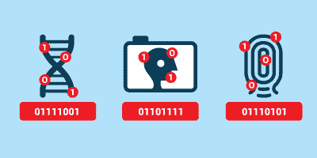

# GitHub 远离密码:未来的征兆？

> 原文：<https://hackaday.com/2020/09/15/githubs-move-away-from-passwords-a-sign-of-things-to-come/>

本月晚些时候，使用 GitHub 的人可能会发现自己在尝试使用 GitHub API 进行身份验证或使用用户名和密码在 GitHub 存储库上执行操作时，突然收到一条错误消息。原因是 GitHub 取消了这一认证选项，有几个“断电”期，包括拒绝密码，以警告人们这一事实。

这一变化最初是由 GitHub 在 2019 年 11 月宣布的,在 2020 年 2 月分配了[的弃用时间表](https://developer.github.com/changes/2020-02-14-deprecating-password-auth/),而另一个[的博客更新](https://github.blog/2020-07-30-token-authentication-requirements-for-api-and-git-operations/)在 7 月重复了这一信息。如前所述，目前只有 GitHub Enterprise Server 没有受到影响。对于其他人，从 2020 年 11 月 13 日起，为了使用 GitHub 服务，需要使用 OAuth 令牌、个人令牌或 SSH 密钥。

虽然这可能会影响相当一部分使用 GitHub REST API 和库的人，但这里更有趣的问题可能是，这是否仅仅是服务中用户名和密码登录之外的更大变革的开始。

## 还没有天塌下来

首先，好消息是，处理这种变化并不超级复杂，如果阅读 GitHub 的博客帖子让你感到困惑和各种程度的存在恐惧，如果你习惯于在命令行上用 *git* 客户端输入你的凭证，这里有一个简单的方法来解决这个问题，只需最小的改变:

1.  切换到 SSH。

就是这样。如果您的系统上已经安装了 SSH 密钥，请确保[将公钥](https://docs.github.com/en/github/authenticating-to-github/reviewing-your-ssh-keys)复制到您的 GitHub 配置文件中。此后，您可以用更多的 SSH 味道重新克隆您的存储库，或者将 git remote URL 从 HTTPS 改为它的 SSH 等价物。

这样做需要在您喜欢的文本编辑器(如 Vim)中打开本地存储库根文件夹中的`.git/config`文件，并更改遥控器的 URL。只需将“https”改为“ssh ”,并在主机名前附加“git@ ”,这样，例如`[https://github.com/Foo/Bar.git](https://github.com/Foo/Bar.git)`就变成了`ssh://git@github.com/Foo/Bar.git`。

祝贺你，你现在应该能够像以前一样使用 SSH 键来推、拉、取、重定基础、挤压和其他所有的不愉快的事情。如果您得到奇怪的 SSH 错误，可能是您在~/上设置了错误的权限。ssh 文件夹。否则，享受不要每次都输入用户名和密码(或访问令牌)的乐趣吧。

## 更广阔的前景

根据 GitHub 的说法，这种变化的原因是为了增加安全性。当使用 REST API 或通过 HTTPS 访问 git 库时，它们提供了个人访问令牌( [PATs](https://docs.github.com/en/github/authenticating-to-github/creating-a-personal-access-token) )的使用，而不是密码。这个想法是，可以为特定的服务和个人创建 pat，以限制和授予某些权利。然而，生成的令牌是一个很长的字符串，您不仅仅要记住并键入它，这使得密码管理器变得非常重要。

很明显，这些都不适用于登录 GitHub 网站本身。在那里，你仍然可以像以前一样使用你的用户名和密码，如果你还没有使用的话，可能还会加上[双因素认证](https://docs.github.com/en/github/authenticating-to-github/about-two-factor-authentication) (2FA)。这里，2FA 中的第二个因素可以是在短信或移动应用程序中发送的代码，或者类似 WebAuthentication (FIDO2)的东西，以及使用生物识别技术时所有的[潜在陷阱](https://hackaday.com/2019/09/23/fido2-the-dream-of-password-free-authentication-on-the-www/)。

对于那些已经在 GitHub 存储库查询中使用 SSH 的人来说，这意味着基本上没有什么变化。对于任何将 CI 系统或类似系统与 GitHub 集成在一起的人来说，使用访问令牌也不会感到惊讶。然而，这确实让人不禁要问，如果 GitHub 的改变只是让一些开发者匆匆忙忙地更新服务(并修复少数失败的服务)，那么它的意义何在？真的有人想摆脱密码吗？

任何曾经在大学或大型企业管理过大型多用户系统的人都知道，用户帐户管理是必不可少的。理想情况下，您希望让每个用户(无论是人、shell 脚本还是经理)都处于他们自己的小权限区域内。这或许是 GitHub 的公告最令人费解的地方。正如[黑客新闻](https://news.ycombinator.com/item?id=22848192)上的评论者在公告中指出的，扩展访问令牌以实现更细粒度和按项目的角色会更有意义。

## 知识的力量

Graphic courtesy of the EFF.

密码是否真的有问题似乎主要取决于你问谁。如果这是一项由一家销售基于密码的登录替代方案的公司委托的研究，或者是 T2 Windows Hello T3 背后的公司委托的研究，这是有史以来最不安全的事情。然而，如前所述，这些替代技术存在[重大问题](https://hackaday.com/2019/09/23/fido2-the-dream-of-password-free-authentication-on-the-www/)，尤其是生物识别技术。

在用户身份验证中，可以使用您拥有的东西、您是谁以及您知道的东西来进行识别。生物识别是扫描一个人身体的一部分，并将其与先前存储的数据进行比较的做法。这是公共数据，越来越容易复制和再现，以欺骗生物传感器。当然，如果你的生物特征数据落入坏人之手，你永远无法改变它。

一个人拥有的东西(钱包、信用卡、硬件令牌)很容易被盗或丢失。这就是为什么这种令牌不可避免地要用个人身份号码(PIN)形式的密码来解锁，这种密码被笨拙地当作密码来使用，尽管“有人知道”这完全是一种密码。

人们所知道的事情是非常惊人的，因为它们被破坏的唯一方式是忘记它们或者让某人用键盘记录器、被破坏的自动取款机等记录它们。美国联邦政府部门无力强行进入有密码保护的 iPhones 手机就证明了这一点。使用面部识别，只需要把手机举到人的面前就能解锁，[指纹识别甚至可能是合法的。在某些情况下，一张照片就足够了。](https://www.theatlantic.com/technology/archive/2017/09/can-cops-force-you-to-unlock-your-phone-with-your-face/539694/)

## 你需要的只是嘘

The OpenSSH logo.

实际上，GitHub 变化的好处似乎是，它迫使更多的人最终抛弃或重写那些旧的脚本和被遗忘但仍然活跃的 Java 后端服务，这些服务中硬编码了用户名和密码凭证。让他们使用 SSH(可以想象使用 [ssh-agent](https://en.wikipedia.org/wiki/Ssh-agent) 或 [GPG 代理](https://opensource.com/article/19/4/gpg-subkeys-ssh))可以简化维护并提高安全性。即使您只是从命令行使用 git 存储库，而不使用密码管理器，切换到 SSH 也意味着更少的输入。

作为一种身份验证机制，SSH 以您拥有的东西(密钥)和您知道的东西(密钥短语)的形式提供双因素身份验证。它的好处也得到了 GitLab 的认可，git lab 在今年 8 月 15 日[不再为免费用户账户提供多因素重置](https://about.gitlab.com/blog/2020/08/04/gitlab-support-no-longer-processing-mfa-resets-for-free-users/)。如果用户在帐户中注册了 SSH 密钥，那么在所有其他身份验证方法都不可用的情况下，用户可以使用 SSH 身份验证来[恢复帐户](https://docs.gitlab.com/ee/user/profile/account/two_factor_authentication.html#generate-new-recovery-codes-using-ssh)。

## 一直都是密码

由于将认证信息安全地存储在我们柔软的有机大脑中的能力，所有的认证方法似乎在某种程度上都可以追溯到某种形式的密码。即使是“无密码”认证令牌也需要密码(PIN ),用户必须记住它。信用卡、借记卡、网银账户、SIM 卡、密码管理器等等也是如此。

最后一点，我必须记住多个 SIM 卡、借记卡、信用卡、网上银行应用程序的 PIN 码，以及一个密码管理器，总共有十几个。猜猜这些密码最后在哪里？在密码管理器中，这是正确的，因为记住一个随机的数字串是很棘手的，但是记住十几个数字是一个边缘性的噩梦场景。那张借记卡是 7634，还是 7643？或者是为了第二张信用卡？即使埃利奥特·威廉姆斯的基于大脑的 pin 散列系统允许他将公钥写在卡上，但它仍然要求他记住私钥(以及如何在脑子里散列它们)。

也许这就是生物识别技术的吸引力:拥有真实的东西，不需要记忆或跟踪任何物理项目。然而，生物识别在密码学上相当于把你的 SSH 私钥印在你的额头(或指尖)上。

一天结束时，似乎所有的认证道路都通向密码管理器和 SSH 密钥。