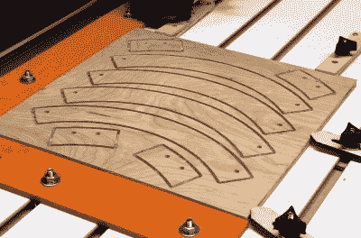

# 如果有足够的时间，即使是一个圆也会变得复杂

> 原文：<https://hackaday.com/2020/05/05/given-enough-time-even-a-circle-can-get-complicated/>

随着天气变得稍微好一点，[迈克尔]认为[在他的数控镂铣机](http://www.kronosrobotics.com/planterhanger)上运行一些工厂吊架将是一个简单的家庭项目。毕竟，你只需要从一张胶合板上切割出几个圆…对吗？

当然，但是[迈克尔]意识到简单地切出一个戒指不是一个非常有效的方法。除非你碰巧需要越来越小的植物衣架，或者一套新的杯垫，否则中间的圆盘最终会被浪费掉。几个月前，这可能没什么大不了的，但当去家得宝(Home Depot)买更多胶合板可能真的对你的健康有害时，这种低效率就不行了。

 他认为最好将戒指分解成几部分，这样可以很容易地将它们嵌套在一块方形胶合板上。当然，现在这些部分需要以一种足够坚固的方式相互连接，以使环能够承受植物的重量。

所以这意味着额外的部分需要被切掉作为支撑，你需要把它们拧在一起，所以最好在 BOM 上加一些螺母和螺栓。你可能还需要一些吊环螺栓，但在紧要关头，你可以像[迈克尔]用完好东西时那样，在螺钉头上焊上垫圈。

有些人会认为[迈克尔]花在修改设计上的时间比他避免浪费的木材更有价值，如果他在工作并按小时计酬，这可能是真的。但是当它是一个个人项目，并且隔离使得采购材料变得困难时，我们认为这是一个利用现有资源的极好例子。