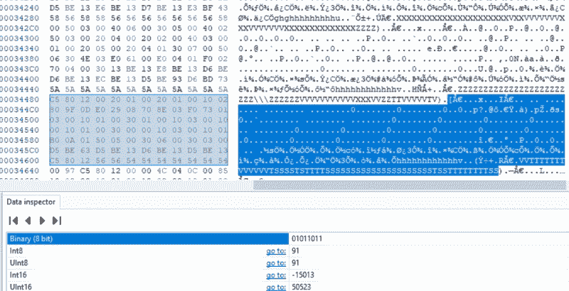

# 给召回的健身追踪器第二次机会

> 原文：<https://hackaday.com/2020/11/18/giving-recalled-fitness-trackers-a-second-chance/>

当 Basis B1 健身追踪器在 2012 年发布时，它在许多方面都领先于时代。事实上，早期的智能手表令人印象深刻，英特尔迅速收购了该公司，并使其成为他们可穿戴部门的基石。不幸的是，他们的下一款手表 Basis Peak 的一个缺陷最终烧伤了一些佩戴者。英特尔被迫召回整个产品线，一年后解散了他们整个可穿戴部门。

鉴于它们坎坷的历史，在二手市场上以相当低的价格买到这些小玩意也就不足为奇了。但是你能用它们做什么吗？这就是[Ben Jabituya]最近决定要发现的东西，他的实验结果看起来很有希望。到目前为止，他还没有找到激活全新 Basis 手表的方法，但假设你能得到一个在英特尔拔掉插头时正在使用的手表，他的黑客可以用来让它恢复运行。

Examining the downloaded sensor logs.

基本的 Android 应用程序早已从 Play Store 中移除，但[Ben]表示，在网络上找到一个旧版本并不困难。在反编译应用程序后，他发现开发人员包含了一个后门，可以让您配置通常隐藏的高级选项。

你如何访问它？作为产品开发时代的一个提醒，你只需要分别使用 *Jersey* 和 *Shore* 作为用户名和密码登录应用程序。

在开发人员选项和他从反编译代码中收集的 API 信息之间，[Ben]能够创建一个 faux Basis 认证服务器，并将应用程序指向它。这让他通过了登录屏幕，之后他能够与手表同步并下载其存储的数据。在用十六进制编辑器和一些已经在网上可用的开源代码进行检查的过程中，他能够编写 Python 脚本来解析数据，他已经足够善良地与世界分享这些数据。

我们非常高兴地看到一个开源解决方案，它不仅让这些“砖块”智能手表重新上线，还允许用户将所有生成的数据置于自己的控制之下。如果你想用一个没有释放魔法烟雾历史的设备做类似的事情，为更现代的健身追踪器开发的开源固件[可能会令人感兴趣](https://hackaday.com/2019/08/23/ota-flash-tool-makes-fitness-tracker-hacking-more-accessible/)。

 [https://www.youtube.com/embed/H06Ans1J1gs?version=3&rel=1&showsearch=0&showinfo=1&iv_load_policy=1&fs=1&hl=en-US&autohide=2&wmode=transparent](https://www.youtube.com/embed/H06Ans1J1gs?version=3&rel=1&showsearch=0&showinfo=1&iv_load_policy=1&fs=1&hl=en-US&autohide=2&wmode=transparent)

