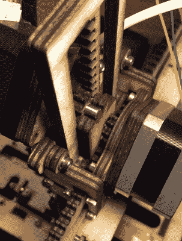

# 使用激光切割木材 3D 打印机套件回到过去

> 原文：<https://hackaday.com/2019/05/23/go-back-in-time-with-a-laser-cut-wood-3d-printer-kit/>

大约 10 年前，普通黑客获得台式 3D 打印机的唯一途径是自己用一套工具组装。即便如此，为了降低成本，许多这种套件都是由激光切割木材制成的。几年来，MakerBot 和 PrintrBot 等公司生产的木制打印机在装备特别精良的黑客空间里很常见。但是随着市场的扩大和产量的增加，公司有能力弯曲金属并注射成型零件；木制 3D 打印机的时代几乎一开始就结束了。

 但是【卢克·华莱士】认为这个想法还有点生命力。为了参加 2019 年 Hackaday 奖，[他提议复兴经典的激光切割 3D 打印机套件](https://hackaday.io/project/164156-lp3d-a-fully-lasercut-kit-3d-printer)。但这一次，事情有点不同。今天，激光切割机足够便宜，可以想象这些工具可以在你当地的黑客空间制造。由于总物料清单低于 100 美元，这些套件可以以低于最便宜的进口价格出售，这可能会推动当前选项过于昂贵或不可用的地区的采用。

当然，仅仅一个激光切割的木头框架不足以突破传说中的 100 美元大关。为了进一步降低成本，[卢克]已经重新设计了几乎所有的部件，所以它可以用木头制成。如果它不是电子的，那么它很有可能是由和框架相同的材料切割而成的。最大的变化可能是传统的皮带和滑轮系统已被齿条和小齿轮的安排所取代。

切割完所有的部分后，基本上你需要提供的就是步进电机、斜坡控制器、热端和挤压机。如果你想回到真正的旧时代，并为自己节省一些钱，他甚至设计了一种激光切割木材挤压机。或者跳过 LCD 控制器，直接通过 USB 运行。

但是指纹是什么样的呢？[Luke]在该项目的 Hackaday.io 页面上发布了一些早期测试件的图片，老实说，它们相当粗糙。但是它们看起来并不完全*不像你在真正拨入之前在早期打印机上得到的那种打印，所以我们有兴趣看看结果如何随着进一步的改进和校准而改善。(编者注:自从写了这篇文章，他得到了反冲补偿，并开始运行，它看起来已经好多了。非常令人印象深刻的东西运行在木制齿轮！)*

*The [HackadayPrize2019](https://prize.supplyframe.com) is Sponsored by:     *