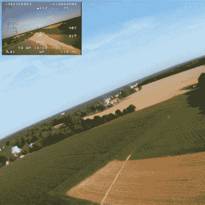

# 目标和门柱

> 原文：<https://hackaday.com/2021/08/14/goals-and-goalposts/>

冬天，我酝酿了一个模糊的计划，想学习一些现代无人驾驶飞行器的技术。每个人都需要一辆自动驾驶汽车，我们在步行距离内有一些很好的飞行场地，所以看起来它可以工作。对我来说，这意味着买最便宜的设备，自己组装飞机，并在此过程中尽可能多地思考。无论如何，我通过犯自己的错误学到了更多。听起来是个不错的暑期项目。

快进到八月，飞机造好了，控制器安装好了，我花了上个月的大部分时间试图让它们一起很好地工作。(固件预计飞机会有副翼，而我的没有，但显然我宁愿调整 PID 值，而不是简单地增加几个机翼伺服系统。)但它工作得足够好，可以在没有任何干预的情况下发射、飞行自主航路点任务和回家。任务完成了，对吧？

Destination: that furthest red roof

没有。当我在享受一个项目时，我有办法改变自己的目标。我的意思是，我真的不想被*搞定*。几周前，当一个朋友问我打算用这架飞机做什么时，我说:“给那边的农场拍些漂亮的空中视频。”现在我看到到处都有飞行的机会，我需要提高自己的技能。这架飞机需要有机发光二极管显示器。它可能还需要蓝牙进行本地配置。也许更好的远程数据链…

这是爬行特色主义和移动门柱的最佳方式。如果这是一个有期限的项目，或者是一个我不喜欢的项目，这将是一个问题。相反，设定相对低调的目标，实现它们，并让它们激励我设定下一个目标，这是一种爆炸。这让我想起了唐纳德·帕普关于[创建黑客“赢”项目](https://hackaday.com/2021/06/28/we-all-need-a-win-sometimes-so-make-them-yourself/)的伟大文章。他建议设立简单的目标来激励自己。我不认为我可以一开始就计划出一个“最佳”的目标集——我在这个过程中学到了太多，直到我知道我有什么新的能力，下一个目标才是显而易见的。爬行是唯一的方法。

你呢？你是否完全提前规划好自己的爱好项目？一点也不？或者你有某种混合的，移动目标的策略？

This article is part of the Hackaday.com newsletter, delivered every seven days for each of the last 200+ weeks. It also includes our favorite articles from the last seven days that you can see on [the web version of the newsletter](https://mailchi.mp/hackaday.com/hackaday-newsletter-649368). Want this type of article to hit your inbox every Friday morning? [You should sign up](http://eepurl.com/gTMxQf)!