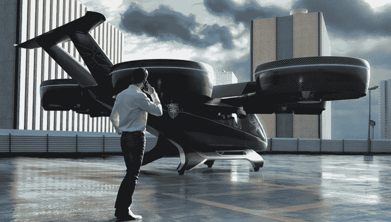

# 固特异航空公司认为飞行汽车是一种东西

> 原文：<https://hackaday.com/2019/03/29/goodyear-aero-thinks-flying-cars-are-a-thing/>

2019 日内瓦国际车展有多款“概念”车。这些交通工具通常包含一些很酷但并不实用的功能——至少在今天是这样。例如，在过去，概念车有可调颜色的内部照明，插入式混合动力发动机和电动车窗——所有这些最终都将变得普遍可用。然而，今天计算机生成图形的进步意味着你可以展示你还没开始制作的东西。例证:固特异有一个视频宣传 Aero——一种实心汽车轮胎，可以兼作你的普通飞行汽车的螺旋桨。

对我们来说，这个东西看起来更像是科幻电影的预告片，而不是任何实际的东西。四个没有中心轮毂的相对较小的轮子可以翻转，并提供足够的升力来推动一辆大型车辆上天。更有趣的是，从地面到飞行的模式转换，车辆在两个轮子上保持平衡，同时只使用两个螺旋桨来产生升力。

## 在实践中

虽然我们喜欢投机性思维，但这似乎让人难以接受。当然，当然，未来可以看到非常高速的发动机和非常轻便的车辆。但是很难想象空气动力旋转得足够快，能够产生足够的升力将一个人单独托起。还有固有的安全问题。如果你想看到一辆更可信的飞行汽车，请查看一下 [Bell Nexus](https://www.bellflight.com/company/innovation/nexus) 。下面。看到那些道具的大小了吗？固特异还表示，轮胎将包含光纤传感器来监控道路和轮胎，以及嵌入式人工智能处理器，因为毕竟什么不需要它？

## 道德和 Kickstarter

这是工程伦理中一个有趣的问题，让我们想起了许多各种各样的邪恶的 Kickstarter 活动。用计算机方法，你可以模拟出各种不可能的小玩意。你想要一部每月需要充电一次十分钟的手机吗？我们也会的！我们只是不知道怎么做。喷气背包怎么样？为什么不呢？诚然，固特异没有为这种轮胎寻求资金，所以它并不那么糟糕，但它看起来并不比 Hackaday 宣布我们未来某个时候推出的每月一次的新手机充电器更实际。

平心而论，我们并不完全是一群会飞的汽车设计师，所以也许这里发生了一些我们不了解的事情。我们也明白，这应该是前瞻性的，而不是今天就建立的。但除了视频中的车辆有反重力装置，我们不认为这看起来像是我们有生之年会看到的任何东西。飞行汽车，也许吧。但不是用微型推进器。

## 教育

不仅仅是固特异。大约每隔六个月，我们就会在报纸上看到一篇关于科学家如何发明传送器的文章，因为量子隐形传态还没有被很好地理解。我们总是看到关于下一个大型电池技术的故事，这种技术似乎永远不会真正进入市场。

亚瑟·C·克拉克有句名言，“任何足够先进的技术都和魔法没什么区别。”虽然我认为他的意思是在文化碰撞方面，我们可能处于大多数人不了解我们自己的技术的时代。如果你经常在黑客空间和剩余电子商店闲逛，这似乎很难相信。但是试着问问普通人手机是如何工作的。或者微波炉。

也许是时候开始给孩子们上一堂“技术”课了，以培养他们对高层次技术如何运作的常识。这些孩子中的一些将成为企业高管、法官和立法者，我们都已经看到了当处于这些角色的人不理解他们正在做出决策的技术时会发生什么。

这不是我们第一次抨击飞行汽车概念。就像录像带一样，飞行汽车是让[在消费市场](https://hackaday.com/2016/01/05/henry-smolinski-and-the-flying-pinto/)有很多错误开端的东西之一。录像带终于来了，但是要让车——嗯——离开地面还需要很长时间。

 [https://www.youtube.com/embed/4vbZlzxpr8M?version=3&rel=1&showsearch=0&showinfo=1&iv_load_policy=1&fs=1&hl=en-US&autohide=2&wmode=transparent](https://www.youtube.com/embed/4vbZlzxpr8M?version=3&rel=1&showsearch=0&showinfo=1&iv_load_policy=1&fs=1&hl=en-US&autohide=2&wmode=transparent)

