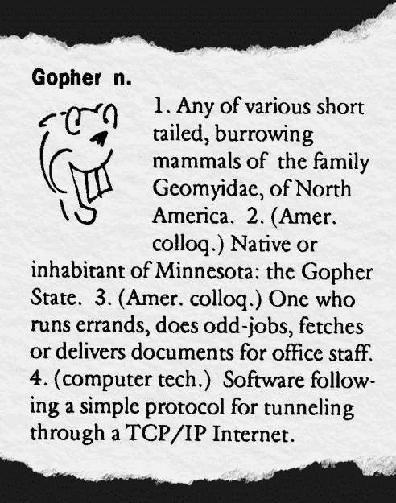
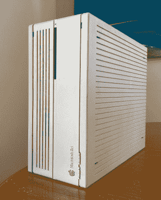
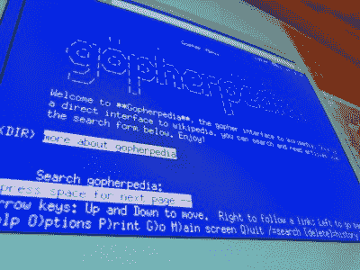
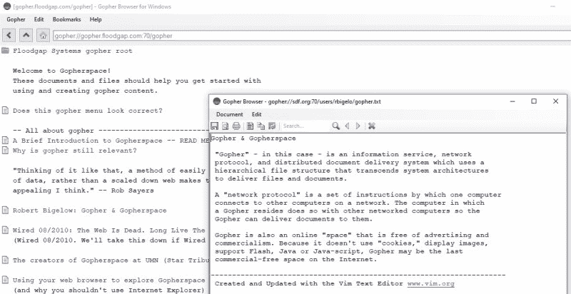
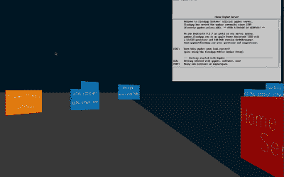

# 90 年代 WWW 的竞争标准 Gopher 仍然值得一试

> 原文：<https://hackaday.com/2021/09/28/gopher-the-competing-standard-to-www-in-the-90s-is-still-worth-checking-out/>

今年早些时候，万维网诞生 30 周年。自然地，这个里程碑受到了一卡车书呆子般的吹捧和对那些简单时代的渴望。三十年来，网络已经从一个有前途的小众实验发展成为全球话语中不可替代的组成部分。尽管有很多缺点，网络已经成为全世界数十亿人的必需品，而且不会很快消失。

当主流媒体称赞网络的巨大成功时，另一个互联网信息系统也庆祝了 30 年——Gopher。作为早期互联网中被遗忘的重量级人物，Gopher 的受欢迎程度在 90 年代后期直线下降，几乎完全消失。值得庆幸的是，就像它勇敢的同名者一样，Gopher 在热情的社区和越来越多的服务器上线的支持下，继续穿越互联网进入 21 世纪。

## 什么是 Gopher？

1991 年的北夏，当原始网络在欧洲粒子物理研究所启动的时候，[第一批地鼠服务器在明尼苏达大学](https://conservancy.umn.edu/bitstream/handle/11299/160774/CISN_May_1993.pdf)上线。由于需要一个校园范围的信息系统，Gopher 客户机和服务器软件最终逃到了更广阔的互联网上，并进入了热切的早期采用者手中。

“地鼠”这个名字是“Go-fer”的一种玩法，通常是一名员工或志愿者，负责提取和交付物品请求。同样，Gopher 客户机被设计成能够从 Gopher 服务器检索信息，并以人类可读的格式显示这些信息。地鼠也是明尼苏达大学的吉祥物。

有一段时间，Gopher 成了新的热门。用户可以通过简单的分级菜单结构来搜索和查找文本文件，类似于网络超链接，但在实现上更加严格，与当代操作系统的文件和文件夹结构没有什么不同。设置一个 Gopher 服务器相对容易，只需要适度的硬件——据报道，第一个 Gopher 服务器使用现成的苹果电脑，包括运行 A/UX(苹果 UNIX)的 Macintosh IIci 和 SE/30。

虽然 Gopher 本身就是一种资源，但它却是通往互联网其他部分的起点。如果有些东西在 Gopher 上找不到，你可以从 Gopherspace 一直隧道到 Web、FTP 服务器或新闻组，找到你要找的内容。Veronica(或“非常简单的面向啮齿动物的计算机档案全网索引”)是一个强大的 Gopher 服务器搜索引擎，并不断扩大其 Gopher 站点数据库。诸如广域信息服务器等其他服务也是可用的。

The first Gopher servers were consumer-grade Macintosh computers, including the Mac IIci.

虽然 Gopher 有一个充满希望的开端，但 Web 注定会成为在互联网上获取信息的首选方法。超文本在大众中逐渐流行起来，这得益于第一批大获成功的网络浏览器之一 NCSA Mosaic T1。Gopherspace 的僵化与色彩丰富、插图丰富的网络相比开始显得有些疲惫，由于更快的调制解调器和支持更丰富的多媒体体验的能力，网络变得越来越“可浏览”。尽管有一些真正迷人的实验，如 GopherVR，但明尼苏达大学对许可费用的社区关注是几乎看到 Gopher 永远结束的象征性稻草。到 20 世纪 90 年代末，Gopher 服务器已经成为濒危物种，而 Web 作为首要的互联网体验占据了至高无上的地位。

## 为什么今天是地鼠？

Gopher 已经有几十年没流行了。今天有一种愿望，不，是一种假设，即访问互联网必须是一种夸张的多媒体体验，这是支撑早期网络发展到现在的特征。作为一种相对普通(如果不是有效的)的方法来传递研究数据，网络现在是我们消费媒体的中心。不言而喻，网络几乎在每个方面都超越了 Gopher，可以理解的是，有些人会把 Gopher 视为旧互联网的一个特殊的残余遗迹。

Be sure to check out Gopherpedia

今年早些时候，我第一次登录 Gopher，早已过了它的全盛时期，并立即遇到了某个 *je* *ne sais quoi* 。怀旧和渴望如潮水般涌来。这是一项与网络完全不同的服务，但不是出于我预期的原因。

第一个会话在`gopher://gopher.floodgap.com:70`重新开始，但没过多久就开始以曲速穿越 Gopherspace。与相对臃肿的网络相比，纯文本界面无疑使事情变得更快，但真正的速度来自于布局的简单性——严格控制的菜单，所有的都一样，但都有清晰的标签，这意味着在 Gopherspace 中导航毫不费力。纯文本格式确保每一段内容都清晰可辨。天气和新闻很容易获取，软件(尤其是老式电脑)、phlogs(地鼠博客)等等也是如此。Veronica-2 是最初的 Veronica 搜索引擎的修订版，是 Gopher 对 Google 的回应(尽管“我 Veronicaed it”没有那么吸引人)。进一步挖掘发现了 Reddit(T2)和维基百科(T4)的现代代理，这两个受欢迎的发现进一步推迟了我不可避免的重返网络的时间。

使用 Gopher 不仅直观，而且有趣。将 Gopher 描述为旧互联网的遗迹并不公平——使用这种服务让人感觉信息丰富，而且在许多方面胜过网络。

## 如何去地鼠

Gopher clients are still available for all major operating systems.

现代客户端使得使用 Gopher 变得前所未有的容易——或者至少和以前一样容易，因为今天的浏览器已经不再支持 Gopher 了。Overbite 项目有在旧版本的 Firefox 上使用 Gopher 的解决方案，但有几个独立的 GUI 客户端可用于所有主要的操作系统。Lynx 自然支持 Gopher，对于任何年龄的计算机都是一个很好的选择。客户端也可用于现代智能手机。

如果找到一个客户端是一个很大的障碍，有代理服务可以允许通过 HTTP 访问 Gopher 内容，如[flood gap Public Gopher proxy](https://gopher.floodgap.com/gopher/)。这使得 Gopher 站点几乎可以在任何现代的 HTTP 浏览器中呈现，对于新手来说是一个很好的选择。

说到 Floodgap，新老用户经常会发现他们的 Gopher 会话在`gopher://gopher.floodgap.com:70/`开始于 Floodgap 服务器。这个服务器从 1999 年就可以访问，并且列出了 Gopher 提供的所有主要服务和站点。Floodgap 还为新的 Gopher 用户提供了大量有用的提示和技巧，并且在解释 Gopher 哲学方面做得很好。

一旦你进入了 Gopherspace，就没有什么需要说的了。这种体验可能感觉非常线性，这可能是一件好事，也可能是一件坏事，取决于你的观点。有时，浏览 Gopher 就像浏览本地磁盘上的文件目录，从一个文件夹跳到下一个文件夹，检查文件，然后沿着刚才走过的路线往回走，到达另一个出发点。像 Lynx 这样基于文本的浏览器对于这种层次导航来说感觉特别快。

下载文件同样不费力，这是一件好事，因为大多数 Gopher 浏览器不支持内嵌图像(尽管随着时间的推移，越来越多的浏览器采用了这一功能)。

学习“如何地鼠”最多是一个五分钟的练习。

## 隐私？什么隐私？

Gopher 是那个时代的产物。虽然这有点迷人，但也有一些关于个人隐私的担忧。

加密？别提了。这使得使用 Gopher 成为一种轻松的体验，即使是最老的电脑，但是值得注意的是潜在的隐私问题。与早期的 WWW 非常相似，您的浏览历史、表单提交和其他信息都是以纯文本形式传输的，这意味着拦截这些数据是一件轻而易举的事情。目前，使用 Gopher 做任何模糊的私人或个人的事情都不是一个好主意。关于如何在 Gopher 上处理加密，有一些提议和简单的概念，但是到目前为止，这个领域几乎没有什么进展。像 [Gophernicus](https://github.com/gophernicus/gophernicus) 这样的项目可能会引起那些寻求建立具有额外安全性的 Gopher 服务器的人的兴趣。

与现代网络相比，公开可访问的服务器日志在 Gopher 上绝对是一件事，甚至在 Floodgap 这样相对流行的服务器上也是如此。通过这些日志可以跟踪(或被跟踪)整个 Gopherspace，如果你有安全和隐私意识的话，这一点要记住。

## 下次去地鼠之乡度假吧

让我们澄清一下——在万维网上支持 Gopher 有些讽刺。但是我在这里，正在做那件事。

GopherVR was an early experiment. Modern derivatives are still available today.

很容易将 Gopher 作为一种可行的互联网协议的取代与前几十年的许多其他“格式战争”相比较——VHS 优于 Betamax，蓝光优于 HD-DVD。当以这种方式构建时，将任何关于地鼠复兴的谈论归因于技术尼安德特人是有意义的，也许是那些在 20 世纪 90 年代“战争”失败后仍然有所作为的人。

不管是好是坏，我们现在将总是在网络上度过我们大部分的在线生活。网络在抓住人们的想象力方面的巨大成功并不意味着 Gopher 是一个废弃的遗物。如今，事实恰恰相反。曾经争夺统治地位的 Gopher 现在与网络和谐共存。HTTP 代理允许访问 Gopher 内容，模糊了两种协议之间的界限。对于那些决定深入挖掘的人来说，他们会意识到 Gopher 从来没有真正被打败过——它现在和以前一样存在，是不太适合网络的人和内容的避难所。

Floodgap 服务器的系统管理员 Cameron Kaiser[在一篇博客文章中说得很好](gopher://gopher.floodgap.com:70/gopher/relevance.txt):

> 轻蔑地说 Gopher 是被 Web 杀死的是不负责任的，事实上 Web 和 Gopher 可以生活在各自不同的领域中，并相互促进。随着现代计算对互操作性、异构性和经济性的强调，Gopher 继续为现代用户提供很多东西，包括内容、可访问性和廉价性。即使是现在，Gopher 显然是万维网的第二把交椅，但它仍然是重要的。

我在 Gopherspace 的短暂逗留始于一次怀旧之旅，但确实留下了深刻的影响。虽然网络早已取代 Gopher 成为我们在线交流的主要媒介，但网站管理员应该从 Gopher 那里汲取灵感。

查看[地鼠都去哪儿了](https://ils.unc.edu/callee/gopherpaper.htm)获得更多关于地鼠崛起和濒临灭绝的有趣见解，以及 [Minnpost](https://www.minnpost.com/business/2016/08/rise-and-fall-gopher-protocol/) 和[花絮](https://tidbits.com/2007/03/19/down-the-gopher-hole/)的文章。