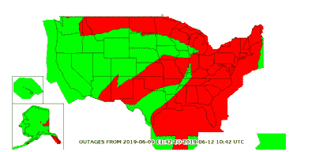

# GPS 和 ADS-B 问题导致航班取消

> 原文：<https://hackaday.com/2019/06/09/gps-and-ads-b-problems-cause-cancelled-flights/>

在过去的几天里，友好的天空中发生了一些奇怪的事情。航班被取消了。飞机停飞了。乘客感到不安是可以理解的。问题的核心是 GPS 和 ADS-B 系统。ADS-B 系统依赖 GPS 数据才能正常运行，但在本周末，GPS 数据质量问题扰乱了一些飞机上正常的 ADS-B 功能，导致取消。

## 什么是 ADS-B，为什么它有问题？

自动相关监视-广播(ADS-B)是一种在全球飞机上使用的通信系统。飞机用 1090 兆赫传送位置、速度、航班号和其他信息。这些数据由地面站接收，最终显示在空中交通管制员的屏幕上。作为交通碰撞避免系统(TCAS)的一部分，飞机也从彼此接收这些数据。

ADS-B 不是复杂或加密的信号。事实上，任何拥有廉价 RTL-SDR 的人都可以接收信号。航空爱好者知道看到一张所有飞机在你家上空飞行的地图有多酷。许多黑客已经研究过这些系统，我们已经在黑客日对此进行了报道。在美国，联邦航空局将有效地[要求所有飞机在 2020 年 1 月 1 日](https://www.faa.gov/nextgen/equipadsb/research/airspace/)前携带 ADS-B 转发器。所以你可以想象，大多数飞机已经安装了这个系统。

飞机上的 ADS-B 系统需要先获取位置数据，然后才能传输。如今，这些数据来自全球卫星导航系统。在美国，这意味着全球定位系统。GPS 目前有一些问题。这就是接收机自主完整性监控(RAIM)的用武之地。安全至关重要的 GPS 系统(飞机和轮船上的)会交叉检查他们当前的位置。如果 GPS 正在发送降级或不正确的数据，它会被发送到 FAA，FAA 会在其网站上显示这些数据。非精确方法[当前断电地图](https://sapt.faa.gov/raim-summaries.php?outageType=129001450)显示整个美国东海岸以及北部的服务质量下降。这种信号衰减的原因目前尚不清楚。

## 哪些硬件受到影响？

尽管全球定位系统没有关闭，但你可以带着手机出去验证一下。但是，它退化了。飞机的全球定位系统对此如何反应取决于内置在全球定位系统接收器中的软件。如果系统失灵，飞行员将不得不依靠像 VOR 这样的老系统来导航。但是 ADS-B 会有更多的问题。飞机 ADS-B 系统需要位置数据来运行。如果你不能传送你的位置信息，空中交通管制员需要依靠老式雷达来确定位置。所有这些都导致了飞行安全问题，这意味着飞机停飞。

通过挖掘[取消的航班列表](https://flightaware.com/live/cancelled)，人们可以收集到哪些飞机有问题。从早期的报道来看，庞巴迪 CRJ 700 和 900 似乎有问题。Airliners.net[的人们猜测](https://www.airliners.net/forum/viewtopic.php?f=5&t=1424363)任何装有罗克韦尔柯林斯飞行管理系统的飞机都有问题。

这不是一个小问题，有成百上千的航班被取消。联邦航空局召开了一个电话会议来评估这个问题。从那以后，联邦航空局[对所有受影响的航班发布了全面豁免](https://www.fly.faa.gov/adv/adv_otherdis.jsp?advn=30&adv_date=06092019&facId=DCC&title=GUIDANCE+FOR+GPS%2FADS-B+ANOMALIES&titleDate=06/09/19)。它们能飞，但只能飞到 28000 英尺。

这是一个发展中的故事，我们将继续关注它。观察行业如何处理重大问题总是有教育意义的，在接下来的日子里会有很多东西要学。