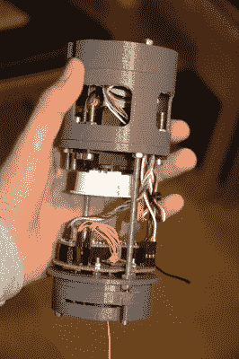

# 高空气球的 GPS 制导降落伞

> 原文：<https://hackaday.com/2021/01/07/gps-guided-parachutes-for-high-altitude-balloons/>

大多数业余高空气球载荷用一个简单的不可操纵的降落伞降落到地球，可以降落在距离发射场数百公里的偏远地区。[Yohan Hadji]在他的高中举办的一次气球发射中亲身经历了这一点，这启发了他 [R2Home](https://hackaday.io/project/176621-r2home) ，一种 GPS 引导的降落伞回收系统。

A Teensy runs the show, and controls a pair of sail winch servos pulling the brake lines

[Yohan]的第一个挑战是创造一个可以可靠展开的可控降落伞，所以他开始用借来的比例模型滑翔伞翼进行测试。他很快了解到，可靠的展开需要低于 2 的伞衣长宽比，所以他开始缝制自己的伞衣。操纵降落伞需要拉动一对制动索，降落伞的每一边各有一条。需要大约 20 厘米的控制行程，并且[Yohan]发现 RC 帆船绞盘伺服系统非常适合这种应用。整个系统被设计成适合一个 7×40 厘米的管，降落伞是在一个小的减速伞滑槽和一个伺服操作的释放机构的帮助下展开的。

[Yohan]正在开发一个定制的飞行控制器，围绕一个 Teensy 4.1，GPS 接收器和数字指南针构建。一种可能的替代方案是 [Ardupilot](https://ardupilot.org/ardupilot/) ，我们已经看到它被用在几架自主[无人机](https://hackaday.com/2020/06/30/aggressive-indoor-flying-thanks-to-steamvr/)、[滑翔机](https://hackaday.com/2019/03/27/running-a-glider-with-the-px4-flight-controller/)和[火星车](https://hackaday.com/2020/03/15/rover-runs-slow-and-steady-on-solar-power/)上。虽然这个系统可能无法返回发射点，但它肯定可以弥补这个缺口，并在指定区域安全着陆。

到目前为止，[Yohan]已经使用遥控控制器从低空的无人机上进行了一系列的[测试降落](https://www.youtube.com/watch?v=lGAGy4FwF0s)来测试部署和转向。该项目是开源的，机械设计文件和控制代码在 [GitHub](https://github.com/YohanHadji/R2Home/blob/main/LICENSE) 上。和大多数 16 岁的孩子一样，[Yohan]的资源是有限的，所以请在 [R2Home GoFundMe](https://www.gofundme.com/f/r2home?utm_campaign=p_cp+share-sheet&utm_medium=copy_link_all&utm_source=customer) 页面上给他一些经济帮助。休息后观看视频，了解开发蒙太奇和项目演示。

自 2006 年以来，美国军方一直在使用类似的系统，联合精确空投系统(JPADS)，向战场上的部队运送物资。我们也看到了为同样任务开发的一次性自主滑翔机。

 [https://www.youtube.com/embed/G4p0SzyaSYA?version=3&rel=1&showsearch=0&showinfo=1&iv_load_policy=1&fs=1&hl=en-US&autohide=2&wmode=transparent](https://www.youtube.com/embed/G4p0SzyaSYA?version=3&rel=1&showsearch=0&showinfo=1&iv_load_policy=1&fs=1&hl=en-US&autohide=2&wmode=transparent)

 [https://www.youtube.com/embed/mW4Z471nhN8?version=3&rel=1&showsearch=0&showinfo=1&iv_load_policy=1&fs=1&hl=en-US&autohide=2&wmode=transparent](https://www.youtube.com/embed/mW4Z471nhN8?version=3&rel=1&showsearch=0&showinfo=1&iv_load_policy=1&fs=1&hl=en-US&autohide=2&wmode=transparent)

