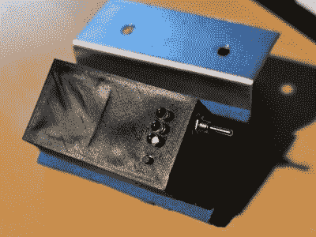

# GPS 覆盖给现实生活中的赛车一种电子游戏的感觉

> 原文：<https://hackaday.com/2018/09/04/gps-overlays-give-real-life-racing-a-video-game-feel/>

对于一个在赛道上飞速奔跑，速度快到足以让速度计达到三位数的人来说，赛车无疑是令人兴奋的，如果观众有好的座位，这往往会给他们带来相当大的刺激。但如果你只是坐在舒适的办公椅上观看 YouTube 上的原始比赛视频，这可能有点难以欣赏。对于观众来说缺乏背景，很难获得与你直接看到事件时相同的速度感和位置感。

 为了让他父亲的赛车视频更有冲击力，[【尘封】想出了一个聪明的办法，在录像中添加视频游戏风格的叠加画面](http://dusted.dk/pages/racingGpsTracker/)。该系统提供实时速度、单圈时间，甚至是赛道的微缩图，并配有标记，以显示比赛在哪里进行。最终结果是，父亲在赛道上的冒险记录可以作为*GT 赛车*的游戏片段(我们知道 *GT* 没有摩托车，但你会明白的)。

系统的第一部分是追踪器本身，它由 GPS 接收器、Arduino Pro Micro 和 SD 卡模块组成。[DusteD]通过两个并联的 18650 电池和一个 DC-DC 升压转换器将设备升压至 5V。一切都包含在他在 OpenSCAD 中设计的 3D 打印外壳中，唯一的外部元素是一个拨动开关、一个瞬时开关，以及最关键的一组 led。

这些指示灯用于系统的第二部分，即软件。闪烁的发光二极管的位置使它们能够被摄像头捕捉到，然后用于帮助将存储在 SD 卡上的数据与视频同步。[DusteD]想出了一些软件，可以从卡片上获取速度和位置信息，并将其转换成具有透明背景的 PNG 文件。然后，在 FFmpeg 的帮助下，这些被放置在视频的顶部。这需要一点点的调整来让一切正常，但正如休息后的视频显示的那样，最终结果令人印象深刻。

这个构建让我们想起了几年前我们推出的 [Raspberry Pi 驱动的 GPS 头盔相机](https://hackaday.com/2014/08/14/a-raspberry-pi-helmet-cam-with-gps-logging/)，有趣的是看到这两个项目如何以不同的方式实现本质上相同的目标。

 [https://www.youtube.com/embed/klPY_9d0xdM?version=3&rel=1&showsearch=0&showinfo=1&iv_load_policy=1&fs=1&hl=en-US&autohide=2&wmode=transparent](https://www.youtube.com/embed/klPY_9d0xdM?version=3&rel=1&showsearch=0&showinfo=1&iv_load_policy=1&fs=1&hl=en-US&autohide=2&wmode=transparent)

