# 在我们的 Maker Faire Bay Area Meetup 上的伟大黑客；从头盔、护目镜到火星车和绳索

> 原文：<https://hackaday.com/2019/05/24/great-hacks-at-our-maker-faire-bay-area-meetup-from-helmets-and-goggles-to-rovers-and-string/>

当 Maker Faire Bay Area 在周六晚上关闭时，乐趣并没有停止:在 Maker 人群中有一个强大的夜猫子池。当大门关闭时，圣马特奥周围的派对会持续到深夜，Hackaday 的聚会是最受欢迎的。

今年，Hackaday 和 Tindie 与 Kickstarter 联手，将我们的联合活动搬到了 B 街站，这个地方比往年有更多的空间供黑客使用。饮料开始流动，伟大的人开始聊天，沐浴在无处不在的发光二极管的光芒中。大量的令人敬畏的硬件出现了，所以让我们看看演示和特技出来玩。

 [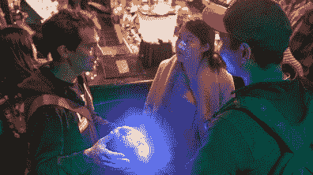](https://i0.wp.com/hackaday.com/wp-content/uploads/2019/05/HTK-meetup-Sam-Freeman-LED-goggles.jpg?ssl=1)  [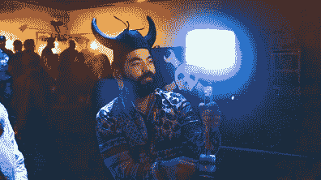](https://i0.wp.com/hackaday.com/wp-content/uploads/2019/05/HTK-meetup-melty-cube-spinning.jpg?ssl=1) 

虽然我们接待了许多 Maker Faire 老手作为回头客，但我们也很乐意欢迎那些好奇想看看人们创造了什么的新来者。萨姆·弗里曼(Sam Freeman)是许多乐于将他们的项目分解成初学者友好的部分的人之一。他的 LED 护目镜从[一个 Adafruit 教程](https://learn.adafruit.com/kaleidoscope-eyes-neopixel-led-goggles-trinket-gemma)开始，不断进化到今天的版本。[ [丹尼尔·杨](https://www.instagram.com/lasersandleds/) ]同样友好地解释了他的魔法[融化的立方体](https://www.instagram.com/p/Bxlu4QYBMpy/?utm_source=ig_web_copy_link)在这个 LED 巫师的杖头上旋转。它的特点是两个 ESP8266 一起工作，以避免需要昂贵的滑环:一个位于立方体内驱动 led，另一个处理旋转电机。热情、平易近人、乐于解释是我们发展社区的方式。

     [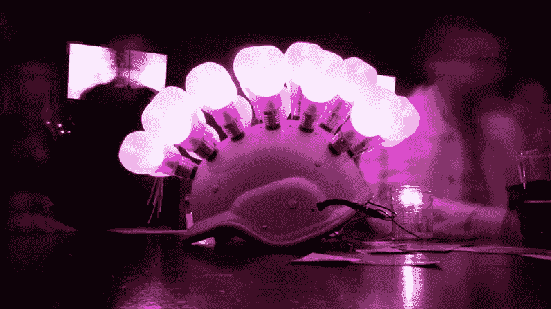](https://i0.wp.com/hackaday.com/wp-content/uploads/2019/05/HTK-meetup-bulb-hat-long-exposure.jpg?ssl=1) 

[加勒特]是一个有很多想法的人，从他头上点亮的灯泡数量来看。这款声音感应电子设备是为迪斯科舞会打造的，由一副 LED 眼镜改造而来。(看看 USB 电源是怎么进入头盔的。WS2812 发光二极管被装在塑料灯泡形状的聚会礼品里。它没有我们想象的那么热，但是它比看起来要重。事后看来，加勒特希望他没有在这个项目的早期切断头盔的原始下巴带。

 [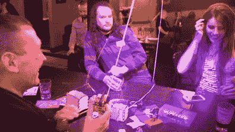](https://i0.wp.com/hackaday.com/wp-content/uploads/2019/05/HTK-meetup-scorch-string-shooter-large.jpg?ssl=1)  [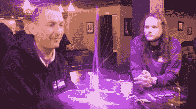](https://i0.wp.com/hackaday.com/wp-content/uploads/2019/05/HTK-meetup-scorch-string-shooter-small.jpg?ssl=1)  [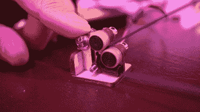](https://i0.wp.com/hackaday.com/wp-content/uploads/2019/05/HTK-meetup-scorch-string-shooter-small-closeup.jpg?ssl=1)  [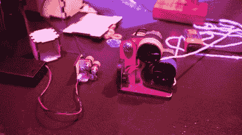](https://i0.wp.com/hackaday.com/wp-content/uploads/2019/05/HTK-meetup-scorch-string-shooter-both.jpg?ssl=1)    [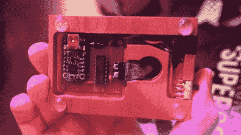](https://i0.wp.com/hackaday.com/wp-content/uploads/2019/05/HTK-meetup-scorch-levitator-base.jpg?ssl=1) 

不过，这并不总是与 led 有关！斯科奇带来了他的两个射手，他们的指令[已经发布在网上](https://www.thingiverse.com/thing:2989857)。建造一个将取决于车轮上可用牵引材料的大小。他的大单元是围绕自行车内胎建造的，小单元([视频](https://photos.app.goo.gl/EokWwDPHLU6xWhB9A))是围绕牙齿矫正器中使用的橡皮筋建造的。除了两个弦射手，他还带来了一个基于 Make 发布的[指令的超声波悬浮器。在网上读到它们是一回事，看到一小片铝箔实际上在我们面前的空中漂浮是完全不同的另一回事。](https://makezine.com/projects/micro-ultrasonic-levitator/)

同样地，能亲眼看到小小的[女性保镖](https://hackaday.com/2019/04/28/femtobeacon-is-a-tiny-esp32-coin-shaped-dev-board/)也是一种享受。是的，我可以给你看一张一枚 25 美分硬币旁边的照片，但这和我手里拿着一枚硬币希望不要把它掉在黑暗的酒吧地板上是不一样的。创造者[Femtoduino] [在 Hackaday.io](https://hackaday.io/project/5823-femtobeacon) 上记录了这个项目，并且[在 Tindie](https://www.tindie.com/stores/femtoduino/) 上出售单位。其他 Tindie 卖家也出席了，一些人带来了他们的产品出售，其他人带来了最近的项目只是为了好玩。

 [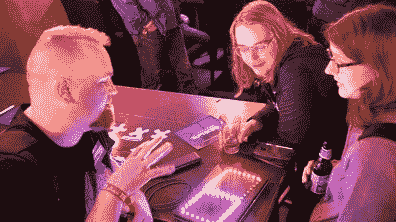](https://i0.wp.com/hackaday.com/wp-content/uploads/2019/05/HTK-meetup-maniacal-segment-1.jpg?ssl=1)  [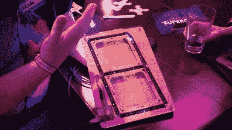](https://i0.wp.com/hackaday.com/wp-content/uploads/2019/05/HTK-meetup-maniacal-segment-2.jpg?ssl=1) 

[ [Maniacal Labs](https://www.tindie.com/stores/ManiacalLabs/) ]带来了之前在 KiCon 上看到的大型 7 段显示器。这一位数代表一段对话，也是一个项目的证明概念，该项目将采用其中的 12 位数。

    

[Luther Johnson]带来了一整套 maker Lisp 设置:一台微型便携式嵌入式 Lisp 计算机，配有 USB 键盘和 VGA 显示器。

 [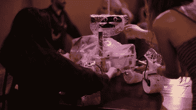](https://i0.wp.com/hackaday.com/wp-content/uploads/2019/05/HTK-meetup-Sawppy-moved-to-table.jpg?ssl=1)  [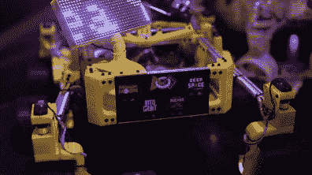](https://i0.wp.com/hackaday.com/wp-content/uploads/2019/05/HTK-meetup-Marco-Sawppy.jpg?ssl=1) 

一对主要由 3D 打印的火星漫游车模型正在展出，其中一个是由你真实的(穿着雨衣)和一个在线分享的成功故事。[Marco]找到了 [Hackaday.io 项目页面](https://hackaday.io/project/158208)，并组装了他的黄色漫游车，融入了他自己的定制内容。Maker Faire 是这些漫游者兄弟姐妹和他们的创造者的第一次真实世界会面。

我们今年的 [Hackaday 奖](https://prize.supplyframe.com/)鼓励参与者研究如何将他们的想法从单一原型扩展到批量生产。我们相信，将它们交到人们手中，将会增强我们改善世界的集体能力。因此，对于我们来说，与 Kickstarter 联手举办这次活动是非常理想的，邀请产品团队通过 Kickstarter 寻求资金。这些创新者对他们的想法进行了大量的思考，这是我们向他们学习的机会。

 [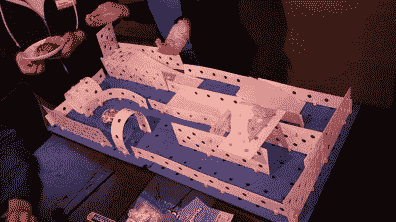](https://i0.wp.com/hackaday.com/wp-content/uploads/2019/05/HTK-meetup-Kinazium-layout.jpg?ssl=1)  [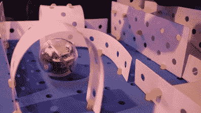](https://i0.wp.com/hackaday.com/wp-content/uploads/2019/05/HTK-meetup-Kinazium-sphero.jpg?ssl=1)  [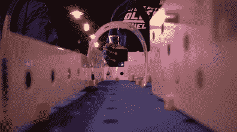](https://i0.wp.com/hackaday.com/wp-content/uploads/2019/05/HTK-meetup-Kinazium-robot-view.jpg?ssl=1)  [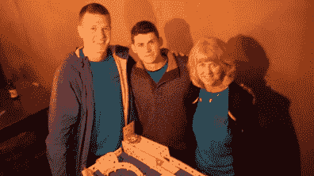](https://i0.wp.com/hackaday.com/wp-content/uploads/2019/05/HTK-meetup-Kinazium-team.jpg?ssl=1) 

Kickstarter 上的一个项目是 [Kinazium](https://www.kickstarter.com/projects/kinazium/kinazium) ，它为教育者提供了一套建造适合手掌大小机器人的小型机器人迷宫的工具。教室里的老师很欣赏不用剪刀或刀子就能得到迷宫零件，不用胶带或胶水就能把它们拼在一起。

 [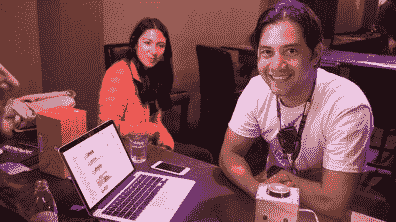](https://i0.wp.com/hackaday.com/wp-content/uploads/2019/05/HTK-meetup-chatterbox-Kevin.jpg?ssl=1)  [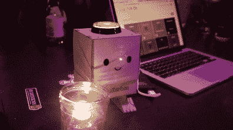](https://i0.wp.com/hackaday.com/wp-content/uploads/2019/05/HTK-meetup-chatterbox-candle.jpg?ssl=1) 

出席的另一个 Kickstarter 项目团队是 [Chatterbox](https://www.kickstarter.com/projects/hellochatterbox/chatterbox-the-smart-speaker-that-kids-build-and-p) ，提供亚马逊 Echo 和谷歌 Home 等智能扬声器的技术，但没有这些流行设备的零售广告监控包袱。可爱的外观吸引着孩子们，符合 COPPA 标准的软件堆栈可以在线保护他们。我们认为这些功能也会吸引有安全意识的成年人。

这些和更多的项目装饰了 B 街站的桌面，使它成为周六创客集市后的最佳落脚点。我们要感谢每一个参加我们聚会的人。一个分享我们的工作、我们的好奇心和我们创造酷东西的热情的地方。我们都互相激励，把我们的想法变成现实，我们希望明年能见到大家(还有新面孔)!

[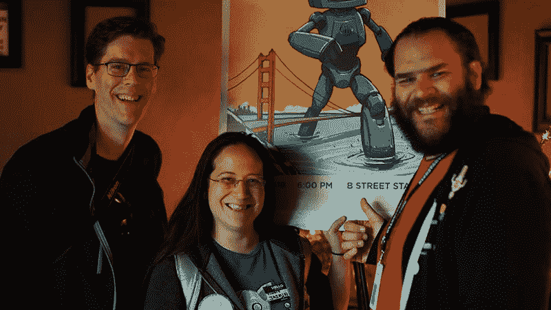](https://hackaday.com/wp-content/uploads/2019/05/HTK-meetup-crew.jpg)