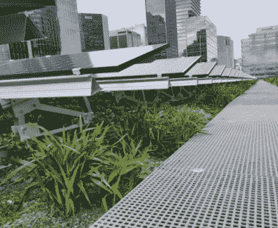
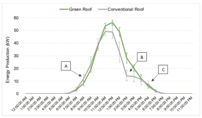
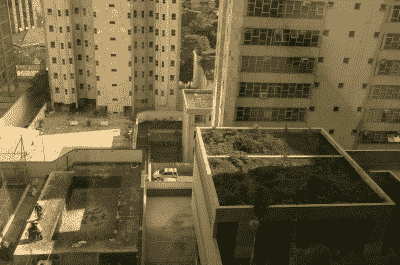

# 绿色屋顶有助于提高太阳能电池板的效率

> 原文：<https://hackaday.com/2021/09/20/green-roofs-could-help-improve-solar-panel-efficiency/>

在过去的几十年里，建筑界掀起了一场运动，将大型城市发展与植物和绿色植物结合在一起。我们已经看到了一些建筑，以及数百个被植被覆盖的摩天大楼和大型建筑的渲染图。

美学往往是美丽的，但这个想法是为了它的有形利益，也是为了纯粹的视觉荣耀。自然地，植物将二氧化碳转化为美味的、赋予生命的氧气会有明显的促进作用。然而，根据澳大利亚悉尼最近的一项研究，建筑物屋顶的绿化也有助于提高太阳能装置的产量。

The solar installation on top of Daramu House, Sydney, complete with greenery on the roof. Source: UTS Report

这项研究由悉尼科技大学的 Peter Irga 博士领导，并为悉尼市发表了一份报告。这项研究的机会来得很突然，这要归功于悉尼市中心并排的两栋相似的办公楼。每栋建筑的屋顶都安装了光伏太阳能系统来发电。在一栋建筑上，大量的植物被放置在屋顶和太阳能电池板周围，而另一栋建筑则是光秃秃的。

在八个月的时间里，在实验过程中，充满绿色植物的屋顶比光秃秃的屋顶效率高 3.6%。在峰值发电时间，两者之间的差异高达 20%。这导致绿色屋顶的净发电量为 69 兆瓦时，而裸露屋顶的净发电量为 59.5 兆瓦时。在实验期间产生的额外 9.5 兆瓦时，按当地市场价格计算，价值 2595 美元。

性能差异的关键在于温度。太阳能电池板在更高的温度下工作得不好，Irga 指出，“温度超过 25 度会使光伏电池板的效率降低。”在澳大利亚这样的地方，这可能是个问题，那里的夏季阳光充足，但日常气温通常在 30 至 45 摄氏度之间。

A graph showing the difference in performance between the solar installations on the two buildings. Arrows A, B and C point to areas where urban shading caused a discrepancy.
However, note the large boost the green roof array receives at peak times. The cooling effect is most important during full sun conditions when temperatures are highest.
Source: UTS Report

绿色屋顶通过一种叫做蒸发蒸腾的过程给建筑物降温，或者更准确地说，是蒸发和蒸腾这两个过程。土壤和其他屋顶表面的水分被蒸发，减少了空气中的热量。此外，绿色屋顶植物中的小孔，称为气孔，本质上是植物与周围环境交换气体的孔。植物通过这些气孔向大气中流失水分，进一步加剧了降温过程。理想情况下，这些水的绝大部分来自降雨，避免了灌溉成本，灌溉成本会破坏屋顶的整体效率和环境效益。

据报道，绿色屋顶上的温度比其他相同的裸顶办公楼低 20 摄氏度左右。这是一个了不起的数字，也是实验中绿色屋顶设计质量的证明。这归结于仔细选择正确的植物种类，它们能够在屋顶上存活并茁壮成长，同时还提供良好的冷却性能。

因此，这种显著的温度下降使太阳能电池板保持在更有效的工作范围内，导致 3.6%的效率增益。这个数字是在模拟照明条件下确定的，目的是消除两座建筑周围城市环境的差异，以免破坏结果。这听起来可能不多，但每年都有大量资金用于研究太阳能电池板效率的单点百分比收益。相比之下，提供一种廉价的自然冷却解决方案可能会产生巨大的影响。

Rooftop solar installations and green roofs alike must be designed carefully to deal with shading from surrounding buildings. This can impact the amount of power that can be generated, as well as require the use of appropriate plant species for the amount of sun available.

绿色屋顶还提供了其他好处。该研究报告称，在整个实验过程中，屋顶吸收了近 9 吨温室气体，并显著减少了雨水外流。这些植物也深受当地野生动物的喜爱。研究小组注意到，昆虫和鸟类很快就聚集到绿色植物中。甚至在楼顶上也发现了食肉动物，这是在悉尼中央商业区的一座塔上看到的令人惊讶的事情。

总的来说，这是一个展示了很多净收益的项目。此外，它不必仅限于绿色屋顶。其他太阳能装置可以受益于共同定位的绿色植物，这种植物自然地冷却其周围环境，并导致更好的太阳能电池阵列性能。期待这一领域的更多研究，尤其是本地化的研究。绿色屋顶和类似技术高度依赖于当地的气候条件，通常需要设计成与当地的动植物相适应。对于那些一头扎进去的人来说，似乎会有重大的收获！