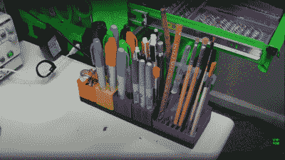
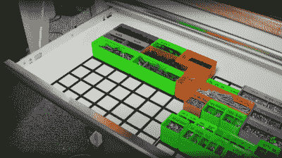

# Gridfinity: 3D 打印超快速工具存储和检索

> 原文：<https://hackaday.com/2022/04/18/gridfinity-3d-printed-super-quick-tool-storage-and-retrieval/>

我们最喜欢的电子人[Zack Freedman]一直被一个我们很多人都非常熟悉的常见问题所困扰——工具存储及其最佳检索。他的解决方案是 [Gridfinity:一个模块化的车间组织系统](https://www.youtube.com/watch?v=ra_9zU-mnl8)。

Never chase your pen around on the desk again

用[Zack]的话来说，完美的车间将工具和材料按以下方式排列:(a)每件物品都有一个专门的家，放在你用得着的地方。(b)物品暴露在外，并处于即时粉碎的位置。(c)储物系统可保护您免受溢出和伤害等事故的影响。(d)安装起来毫不费力，并且容易放回和重新排列。Gridfinity 这样的即时访问存储解决方案不是为了帮助你存储更多的东西，而是为了完成更多的项目。这个想法非常简单——展示你的东西，这样你就可以快速找到你需要的东西，并尽快回到项目中来。我们认为这些目标非常准确！

从实施的角度来看，该系统由具有网格结构的 3D 打印基板组成。它内部有一个角度，所以储物盒可以放进去，但不容易被敲掉。储物单元以各种尺寸和方向落入网格中，这样所有东西都包含在网格的外部边界内，因此整个组件可以轻松放入抽屉中。小零件储存箱有一个弯曲的内表面，使人们能够在需要时轻松地挖出零件。顶部的部分盖子允许它们在需要时垂直堆叠。

Super-quick access to fully sorted stock – no more searching

虽然该系统正在开发中，但仍有大约 100 个不同的存储单元，从 3D 打印机喷嘴到镊子架，应有尽有。在 Fusion360 中实现为参数化模型，很容易为您的东西调整现有的模型，或者从提供的模板创建全新的模型。

如果不首先考虑[工具组织之王【亚当·沙维奇】](https://hackaday.com/2015/02/28/adam-savages-first-order-of-retrievability-tool-boxes/)，关于工具组织的讨论将是不完整的，一阶检索原则是一个强有力的原则。更直接的解决方案是，你可以走[的钉板轮式路线](https://hackaday.com/2015/08/06/keep-shop-tools-nearby-with-this-peg-board-on-rollers/)，或者如果你行动不便且手头拮据，那么就舒适地使用法国夹板，并在墙壁上建造完全定制的。无论你提出什么解决方案，请与我们分享！

 [https://www.youtube.com/embed/ra_9zU-mnl8?version=3&rel=1&showsearch=0&showinfo=1&iv_load_policy=1&fs=1&hl=en-US&autohide=2&wmode=transparent](https://www.youtube.com/embed/ra_9zU-mnl8?version=3&rel=1&showsearch=0&showinfo=1&iv_load_policy=1&fs=1&hl=en-US&autohide=2&wmode=transparent)

