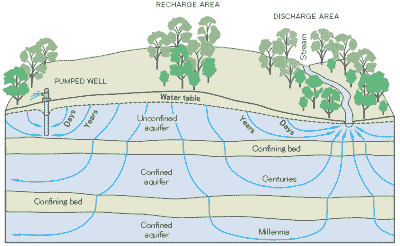
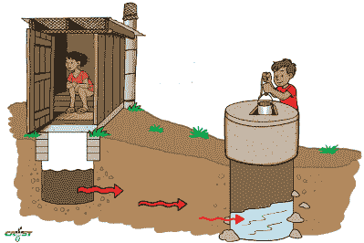

# 地下水:一条被忽视的生命线的管理

> 原文：<https://hackaday.com/2022/09/13/groundwater-management-of-a-much-neglected-lifeline/>

很明显，如果你挖或者钻入土壤，在某个时候你会碰到地下水。钻得足够深，你就会到达含有大量淡水的含水层。在这之后，你可以把水从这些井里抽出来，这样你就有充足的淡水了。很长一段时间以来，许多人都是这么想的。由于地下水形式的淡水储量巨大——大部分液态淡水都是地下水——我们实际上可以比它们补充的速度更快地清空它们。

正如 20 世纪 30 年代的尘暴灾难和今天的干旱以及地表下沉问题所显示的那样，我们不能简单地使用土壤和地下水而不考虑任何后果。虽然 19 世纪有许多新移民来到西部干旱和半干旱地区，如加利福尼亚州，他们相信“雨过天晴，T4”的神秘主义，但 20 世纪和 21 世纪最初的几十年告诉我们，耕地和抽取地下水进行灌溉并不能将干旱的气候变成繁茂的气候。

也许具有讽刺意味的是，即使随着干旱的增加，大多数人类居住区还是使用雨水排水和综合污水系统来排走雨水，而不是让地下水自然补充。幸运的是，现在越来越多的地区看到了管理地下水的必要性。

## 不浪费

Drought monitor statistics for Germany on September 10th, 2022, showing the drought effects on multiple levels in the ground. (Credit: [UFZ](https://www.ufz.de/index.php?en=37937) Drought Monitor)

一个人有多重视雨水和融雪，很大程度上取决于他拥有多少。对于像我这样在荷兰西部地区的一个农场长大的人来说——在潮湿的粘土和直接通向泵站的沟渠中——收集雨水不是问题，而找到防止洪水的方法更重要。

当你所在地区获得的雨水可能仅够维持当年的作物时，这个等式就完全改变了，需要从附近的河流或深井中灌溉，以防止地里的作物死亡。几个世纪以来，对于许多文化来说，旱地农业对于应对干旱气候至关重要。这意味着通过有限的土壤耕作来最大限度地减少蒸发，增加作物行间的间距来最大限度地减少对有限土壤水分的竞争，以及种植适应干旱气候的作物或栽培品种。

这并不是说即使在沙漠环境中也不可能种植任何作物或类似作物。几千年来，人类一直利用灌溉在原本完全禁止的地方种植作物。对人类自身来说也是如此，因为我们每天也需要淡水，这就要求我们从与农作物相同的河流或地下水中汲取。

这里的教训是，可用的淡水越少，收集最后一滴雨水就越重要，并尽可能节约使用。另一个重要的考虑因素是，即使排水系统不能立即将水抽走，土壤结构对于雨水渗入土壤也是必不可少的。长期干旱后，通常存在于土壤颗粒之间并允许水分留在颗粒之间的孔隙将大部分消失。

结果是，这种超干燥、超致密的土壤不容易吸收雨水，讽刺的是，这可能是导致山洪爆发的原因。这里可以做的是给土壤更多的时间来吸收水分，通过使用池塘、[洼地和类似的景观结构来防止径流，并最大限度地延长土壤的浸泡时间。这不仅会增加土柱表层的水分，更重要的是有助于](https://en.wikipedia.org/wiki/Swale_(landform))[地下水补给](https://en.wikipedia.org/wiki/Groundwater_recharge)。

## 那种下沉的感觉

Schematic of an aquifer showing confined zones, groundwater travel times, a spring and a well.

除了收集雨水和融雪径流用于灌溉、饮用水和补充地下水位，越来越普遍的做法是将处理过的水重新注入含水层，而不是将其排放到河流和其他地表水。这样做的一个主要好处是，它有助于抵消土壤的沉降，这是一个常见的问题，当水从含水层中提取的速度超过它补充自己。

墨西哥城是一个正在下沉的城市的例子，它正遭受着从建造它的地下蓄水层中过度抽取的后果。因此，这座城市正以每年超过 15 厘米的速度下沉，而水资源短缺不断增加从含水层中抽取更多水的压力。更糟糕的可能是沿海地区从地下蓄水层过度取水，因为这会导致[盐水入侵](https://en.wikipedia.org/wiki/Saltwater_intrusion)，盐水流入并污染淡水。情况越糟糕，含水层就越有可能被完全废弃，或者需要像脱盐这样的强化处理。

所有这些都应该表明，含水层以及一般的地下水是一种宝贵的资源，应该得到认真对待，以便成为一种可持续的资源。这使我们想到另一个主要的风险因素，即污染。

## 保持清洁

Groundwater contamination from a pit latrine. (Credit: CAWST)

尽管土壤基质将起到一种过滤器的作用，但这往往只能过滤掉较大的颗粒。径流水中可能含有病原体、重金属和各种化学物质。在许多地区，化粪池、[粪坑](https://en.wikipedia.org/wiki/Cesspit)和厕所的使用相当普遍，所有这些都有将病原体引入地下水的风险，这些病原体可能最终进入从位置不当的水井中提取的水中。

这种类型的地下水污染在过去已经导致了疾病和类似疾病的传播，并且仍然是一个激烈争论的话题。开采天然气的水力压裂法包括向岩石中注入化学物质，这些化学物质最终会进入地下水，并引发了诉讼和医学研究。最终，人们开始意识到，地下水是我们最终共享的东西，就像公共游泳池里的水一样。

为了防止雨水径流污染地下水，最近引入了生态湿地的概念。这重复了沼泽的基本概念，增加了过滤功能，允许它保留重金属、淤泥和碎片。通过选择特定的植物在这些生物带中生长，这种生长可以充当自然过滤器，同时也允许碎片沉淀。重金属将大部分保留在沉积在这些生物水域的沉积物中，允许定期清除和更换这些沉积物进行处置。

在一项对已在南加州存在数年的现有生物带的研究中， [Evans 等人(2018)](https://www.sciencedirect.com/science/article/abs/pii/S004896971833417X?via%3Dihub) 分析了锌、铅、钴和锰在生物带土壤中的保留率。他们发现大量的这些金属被隔离。

## 共享资源

归根结底，淡水是一种宝贵的资源，如果管理得当，不仅可以给农作物和人类带来繁荣和健康，还可以给整个环境带来繁荣和健康。通过使用池塘、洼地和其他蓄水结构，半干旱和干旱地区的人们可以优化少量的降雨，同时不会给含水层和附近的水体带来过多的负担，特别是如果与旱地农业相结合的话。

通过将雨水径流注入含水层，并让其渗入土壤而不是将其带入排水系统，干旱的影响可以大大减轻，同时防止含水层干涸造成永久性破坏。最后，通过防止地下水污染，我们可以确保从井中抽出的水不含有重金属、病原体和类似的不愉快物质。

只要我们学会接受雨水和丰富的地下水不是我们必须依赖的东西，可能需要我们努力维护或最佳利用，事情应该会好起来。