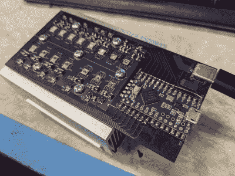

# 用光生长银纳米棱镜

> 原文：<https://hackaday.com/2022/05/09/growing-silver-nanoprisms-with-light/>

对于普通黑客来说，纳米粒子听起来有点像科幻小说——太深奥了，遥不可及，我们可能无法在自己的巢穴中工作——但 YouTube 上[应用科学]的[本·克拉斯诺]已经证明，它们绝对可以由普通人制造，而且重要的是它们可以被调整。[带灯](https://www.youtube.com/watch?v=v8pko9IlFW4)。没错，纳米粒子的生长似乎受到特定波长照射的强烈影响，这锁定了它们的尺寸，从而定义了它们的光弯曲特性。这是光介导合成的概念，它使纳米粒子根据波长聚集成不同的构型。这个想法是从硝酸银的储备溶液开始，然后还原形成银纳米球，然后转化为更大的银纳米棱镜，其大小根据照明光源的波长而定。

这个过程似乎很简单，将硝酸银和柠檬酸钠的溶液进行真空脱气以去除氧气，然后用氩气或氮气吹洗。硼氢化钠作为还原剂，从硝酸银溶液中产生银金属纳米颗粒。柠檬酸钠在银纳米粒子产生时包裹着它们，防止它们聚集成糊状沉淀物。添加 PVP  ( [聚乙烯吡咯烷酮](https://en.wikipedia.org/wiki/Polyvinylpyrrolidone))作为胶体剂，防止包覆的纳米粒子聚集在一起，并帮助保持溶液稳定足够长的时间，以完成光介导的合成过程。最后，用氢氧化钠将 pH 值调节至 11。得到的银纳米颗粒储备溶液呈浅黄色，可用于使用光源进行最终颗粒尺寸选择。

光源是定制的，因为[Ben]说他在货架上找不到合适的东西。这是一个简单的设计，使用一个 Teensy 来驱动一组 [PAM2804](https://www.diodes.com/assets/Evaluation-Boards/PAM2804-User-Guide.pdf) LED 驱动器，每个驱动器驱动自己的中等功率 LED，每个驱动器对应一个不同的目标波长。正如[Ben]所强调的，试图用 RGB LED 设置来近似特定颜色的天真方法是行不通的，因为尽管人眼感知到了颜色，但实际的波长峰值将完全错误，并且反应不会按照预期进行。硬件设计可在[多视角 GitHub](https://github.com/benkrasnow/MultiSpectLED) 上获得，供你观赏。

纳米粒子有各种各样奇怪而奇妙的特性，例如[使不可焊接的](https://hackaday.com/2019/04/15/nanoparticles-make-mega-difference-for-unweldable-aluminum/)，[使铝能够被 3D 打印](https://hackaday.com/2017/09/25/3d-printing-aluminum-with-nanoparticles/)，甚至使我们[最喜欢的液体玩具之一——铁磁流体](https://hackaday.com/2018/10/26/failing-at-making-ferrofluid/)的生产成为可能。

 [https://www.youtube.com/embed/v8pko9IlFW4?version=3&rel=1&showsearch=0&showinfo=1&iv_load_policy=1&fs=1&hl=en-US&autohide=2&wmode=transparent](https://www.youtube.com/embed/v8pko9IlFW4?version=3&rel=1&showsearch=0&showinfo=1&iv_load_policy=1&fs=1&hl=en-US&autohide=2&wmode=transparent)

