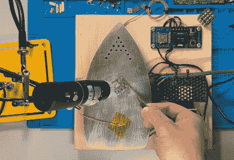

# 陀螺无线发光二极管芯片是相当飞

> 原文：<https://hackaday.com/2020/03/23/gyroscopic-wi-fi-led-die-is-pretty-fly/>

尽管雕塑般的 LED 立方体很酷，但你唯一能做的就是看着它们。它们不会经得起大量的处理，尽管在构建它们时弯曲所有这些引线很乏味，但你可能无论如何也不想弄乱它们。

 [另一方面，LED 骰子是结实、闪亮的玩具，有许多可能性](http://www.instructables.com/id/Six-Sided-PCB-LED-Dice-With-WIFI-Gyroscope-PIKOCUB/)，特别是如果它们有陀螺仪和无线控制，就像[moekoe]制造的那样。在这个 25 厘米的小骰子里面是同样小的 ESP8285-01F，它让[moekoe]通过 Blynk 应用程序控制彩虹灯光秀。

正如你将在精彩的建造视频中看到的，这个建造看起来很有挑战性，而不是不可能，立方体被焊接点永久密封。大多数但不是所有这些都在表面周围传输电源、接地和数据。

一旦立方体组合在一起，[moekoe]使用弹簧针对其进行编程，并可以通过接触垫给里面的小脂肪充电。我们喜欢使用立方体印刷夹具来帮助将 PCB 边缘焊接在一起的想法，但不如我们喜欢[moekoe]的[自制 SMT 焊接设置](https://www.makermoekoe.net/post/maker-moekoe-s-kind-of-soldering-iron)。

如果你想要一种更简单的方法来制作雕塑般的 LED 立方体，[给自己造一台铅成形机](https://hackaday.com/2019/08/25/lead-former-makes-led-cubes-a-little-easier-to-build/)。

 [https://www.youtube.com/embed/6NPTslF68Q0?version=3&rel=1&showsearch=0&showinfo=1&iv_load_policy=1&fs=1&hl=en-US&autohide=2&wmode=transparent](https://www.youtube.com/embed/6NPTslF68Q0?version=3&rel=1&showsearch=0&showinfo=1&iv_load_policy=1&fs=1&hl=en-US&autohide=2&wmode=transparent)

