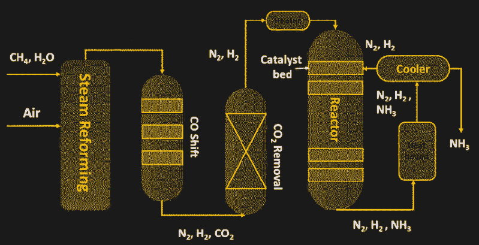

# 哈伯-博世与合成氨生产的绿色化

> 原文：<https://hackaday.com/2022/01/11/haber-bosch-and-the-greening-of-ammonia-production/>

我们在地球上生活在氮海洋的底部。我们呼吸的空气中有近 80%是氮，这种元素是构成生命的重要成分。氮对蛋白质的骨架至关重要，蛋白质构成了生命赖以生存的支架，并催化我们细胞中的无数反应，构建这些生物聚合物所需的信息编码在核酸中，核酸本身就是富含氮的分子。

然而，以其丰富的气态形式，氮仍然不能被更高的生命形式直接获得，是不可利用的惰性和不起反应的。我们必须从少数物种那里窃取我们重要的氮供应，这些物种已经学会了将大气中的氮转化为更具活性的化合物如氨的生物化学技巧。或者至少直到最近，当我们这个物种中几个特别聪明的成员发现了一种利用化学和工程的结合从空气中提取氮气的方法，这就是现在众所周知的哈伯-博施过程。

哈伯-博世公司取得了巨大的成功，由于其氮产量给农作物施肥，直接导致人口从 1900 年的 10 亿增长到今天的近 80 亿。现在你体内 50%的氮可能来自某处的哈伯-博施反应堆，所以我们的生活都依赖于它。尽管哈伯-博世如此神奇，但它也存在问题，尤其是在这个运行它所需的化石燃料供应日益减少的时代。在这里，我们将深入探讨哈伯-博世，我们还将看看未来可能使我们的固氮行业脱碳的方法。

## 容易找到，难以使用

There had to be a better way. Guano mining was once one of the few sources of fertilizers. Source: [Mystic Seaport Museum](https://educators.mysticseaport.org/artifacts/guano_trade_poster/#)

氮问题的核心，以及氨的生产既必要又如此耗能的原因，源于元素本身的性质，特别是它与同类其他元素紧密结合的趋势。氮有三个不成对的电子可以成键，三键导致构成我们大气大部分的双原子氮很难打破。

这些三键是气态氮如此惰性的原因，但这也给需要元素氮才能生存的生物带来了问题。大自然已经找到了解决这个问题的方法，通过固氮过程，使用酶作为催化剂将双原子氮转化为氨或其他含氮化合物。

固氮微生物使氮在食物链上下游生物可利用，在人类历史的大部分时间里，自然过程是获得作物施肥所需氮的唯一方法。含氮化合物矿床的开采，如硝石(硝酸钾)或从蝙蝠和鸟类粪便中提取的鸟粪，曾是工农业硝酸盐的主要来源。

但是这种矿藏相对稀少，而且范围有限，因此在养活迅速膨胀的世界人口和为他们提供提高生活水平所需的产品方面都存在问题。这导致化学家从 19 世纪末开始寻找将大气中大量储存的氮转化为可用氨的方法。虽然有几个成功的竞争者，德国化学家弗里茨·哈伯从空气中制造氨的实验室演示成为事实上的过程；化学家兼工程师卡尔·博施将其放大并工业化后，哈伯-博施工艺就诞生了。

## 压力下

Haber-Bosch 工艺的简单化学性质掩盖了其复杂性，尤其是在工业规模下。整个反应看起来很简单——一点氮气，一点氢气，你就得到氨:

但问题在于前面提到的 N [2] 分子中的三键，以及等式中的双箭头。这意味着反应可以双向进行，根据压力和温度等反应条件，实际上更有可能逆向进行，氨分解回氮气和氢气。推动反应向产生氨的方向发展是关键，提供分解大气中双原子氮所需的能量也是关键。另一个诀窍是提供足够的氢，一种在我们的大气中并不特别丰富的元素。

为了实现所有这些目标，哈伯-博世工艺依赖于热和压力——两者都很重要。该过程从通过天然气或甲烷的蒸汽重整生产氢气开始:

蒸汽重整作为连续过程发生，其中天然气和过热蒸汽被泵入含有镍催化剂的反应室。第一重整器过程的输出物被进一步反应以除去一氧化碳和未反应的甲烷，并洗涤掉任何含硫化合物和二氧化碳，直到除了氮气和氢气之外什么都不剩下。

然后将两种原料气体以三个氢分子比一个氮分子的比例泵入厚壁反应室。反应容器必须非常坚固，因为促使反应完成的最佳条件是 450℃的温度和 300 倍大气压的压力。反应的关键是反应器内部的催化剂，大部分是基于铁粉的。催化剂允许氮和氢结合成氨，氨通过冷凝成液态而被除去。

哈伯-博世的便利之处在于博世带来了可扩展性。合成氨厂可能规模庞大，通常与其他使用氨作为工艺原料的化工厂位于同一地点。哈伯-博施法生产的氨约有 80%用于农业，或者作为液体直接施入土壤，或者用于制造颗粒肥料。氨也是数百种其他产品的成分，从炸药到纺织品到染料，2018 年全球产量超过 2.3 亿吨。

Schematic of the Haber-Bosch process. Source: by [Palma *et al*](https://www.researchgate.net/publication/343655790_A_Review_about_the_Recent_Advances_in_Selected_NonThermal_Plasma_Assisted_Solid-Gas_Phase_Chemical_Processes), CC-BY

## 更干净更环保？

从环境的角度来看，在使用甲烷作为原料和燃料之间，哈伯-博世是一个非常肮脏的过程。在全球范围内，哈伯-博世消耗了近 5%的天然气产量，占全球能源供应总量的约 2%。然后是这个过程产生的一氧化碳；虽然大量的氨被捕获并作为有用的副产品出售，但是氨的生产在 2010 年产生了大约 4 . 5 亿吨的二氧化碳，约占全球总排放量的 1%。再加上大约 50%的食品生产完全依赖于氨，你就有了一个成熟的脱碳目标。

将哈伯-博世从氨基座上推倒的一个方法是利用电解过程。在最简单的情况下，电解可以用来从水而不是甲烷中制造氢原料。虽然仍然可能需要天然气来产生氨合成所需的压力和温度，但这至少会消除甲烷作为原料的可能性。如果电解池可以由风能或太阳能等可再生能源提供动力，这种混合方法将对净化哈伯-博世公司大有帮助。

但一些研究人员正在寻找一种完全电解的方法，这种方法将使氨的生产比混合方法更加环保。在最近的一篇论文中，来自澳大利亚莫纳什大学的一个团队详细介绍了一种电解过程，这种电解过程使用与锂电池相似的化学物质，以完全不同的方式制造氨，这种方式有可能消除哈伯-博世的大部分污染。

该方法在小型电化学电池中使用含锂电解质；当电流施加到电池时，溶解在电解质中的大气氮与锂结合，在电池的阴极形成氮化锂(Li [3] N)。氮化锂看起来很像氨，三个锂原子代表三个氢原子，有点像一个脚手架，在上面建造氨。剩下的就是用氢取代锂原子——这是一个说起来容易做起来难的壮举。

这个过程的秘密在于一类叫做磷的化学物质，它们是带正电荷的分子，中心是磷。莫纳什团队使用的鏻盐被证明可以有效地将质子从电池的阳极运送到氮化锂，氮化锂很容易接受捐赠。但他们还发现，磷分子可以再次经历这一过程，在阳极获得一个质子，并将其传递给阴极的氮化锂。这样，氮化锂中的所有三个锂原子都被氢取代，导致在没有甲烷作为原料的情况下在室温下产生氨。莫纳什过程似乎很有希望。在实验室条件下进行的 20 小时测试中，一个小电池每平方厘米的电极表面每秒产生 53 纳摩尔的氨，其电效率为 69%。

 [https://www.youtube.com/embed/lSYCac7KD8o?version=3&rel=1&showsearch=0&showinfo=1&iv_load_policy=1&fs=1&hl=en-US&autohide=2&wmode=transparent](https://www.youtube.com/embed/lSYCac7KD8o?version=3&rel=1&showsearch=0&showinfo=1&iv_load_policy=1&fs=1&hl=en-US&autohide=2&wmode=transparent)

如果该方法能够证明，它比哈伯-博施有很多优点。其中最主要的是缺乏高温和高压，而且事实上整个系统可能只依靠可再生电力运行。这也有可能是小型分布式氨生产的关键；氨的生产不依赖于相对较少的中央工厂，而是有可能小型化，并更靠近使用点。

当然，莫纳什过程有许多障碍需要克服。在一个电动汽车和其他电池供电设备已经超出锂提取极限的世界里，依赖锂电解质似乎是站不住脚的，而且锂矿开采严重依赖化石燃料的事实，至少在目前，也损害了电解氨的绿色潜力。尽管如此，这仍然是一个令人兴奋的发展，而且可能会以更清洁、更环保的方式为世界提供食物和燃料。