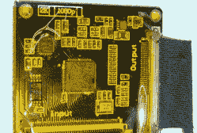

# 黑掉 ThinkPad 显示器

> 原文：<https://hackaday.com/2019/02/21/hack-a-thinkpad-display/>

 黑客真的很喜欢他们的工具。这导致了语言、编辑器、键盘甚至笔记本电脑的圣战。笔记本电脑的问题在于它们会老化，而且并不总是优雅地老化。[Syonyk]喜欢他的 ThinkPad T430S，除了一点，它的 TN 显示屏不是很好。这些平板屏幕使用了一种较老的技术，并随着不同的视角显示颜色变化以及其他问题。因此，他设法在替换屏幕和适配器的帮助下[将设备的屏幕升级到 IPS](https://syonyk.blogspot.com/2019/02/thinkpad-t430s-ips-screen-upgrade.html) (见右图)。显然，许多类似的 ThinkPads 可以进行相同的升级。

问题是，笔记本电脑使用 LVDS 与 TN 屏幕对话，而较新的屏幕可能会使用嵌入式显示端口(eDP)，这是一种完全不同的协议。然而，现在有一种转换器是[Syonyk]在易贝发现的(当然是来自中国)。大约 70 美元，主板的 LVDS 输出可以转换为电子数据处理。当然，你还需要一块 IPS 显示面板。

随着新闻充斥着网络安全的故事，[Syonyk]想到了在他的笔记本电脑中放一块来源可疑的电路板的风险。然而，该板根本不与 CPU 接口，因此除了刮擦屏幕之外，它似乎不太可能做任何事情，而且它也没有一种简单的方法来发送数据。

作为一名拆卸笔记本电脑的老手，他毫不费力地打开了这台电脑——众所周知，ThinkPad 相对容易操作。他确实传递了一些关于确保你不会意外烧坏保险丝的好建议。

看起来工作量很大，但一点都不难。除了有更好的显示屏，笔记本电脑现在也有更高的分辨率。如果你打算让机器继续运转，这是一个很好的升级。

很多人喜欢黑掉 ThinkPads。如果你想升级的话，你可以升级几乎所有的。