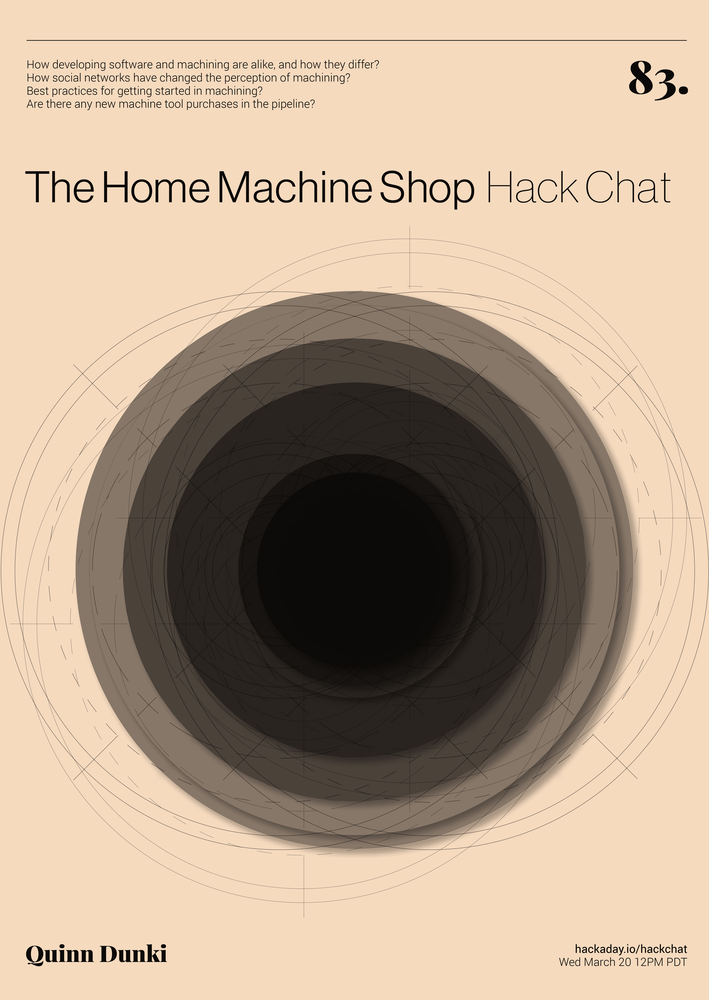

# 黑客聊天:奎因·邓基的家用机器商店

> 原文：<https://hackaday.com/2019/03/18/hack-chat-the-home-machine-shop-with-quinn-dunki/>

太平洋时间周三中午，加入我们的[家庭机械商店黑客聊天](https://hackaday.io/event/164060-the-home-machine-shop-hack-chat)！

即使你在这里的时间不长，你也可能会认出奎因·邓基是 Hackaday 的常驻顾问机械师。奎因最近写了一系列关于“机床之王”车床的文章，涵盖了从精密机床的历史到制造你的第一个芯片的方方面面。她记录了采购和安装新车床的整个过程，指出了初露头角的家庭机械师可能面临的所有潜在陷阱。你可以在她的 YouTube 频道 Blondihacks 上更深入地了解她的加工冒险[。](https://www.youtube.com/c/Blondihacks)

不过，扔热金属碎片并不是奎因的全部成就。早在她涉足机床之前，就有了维罗妮卡，这是一台由零开始建造的 6502 机器，是奎因对那些将她带入编写软件生活的机器的敬意。[我们已经在我们的页面上展示过几次维罗妮卡](https://hackaday.com/2014/10/05/hackaday-10th-anniversary-quinn-dunki-and-veronica/)，她总是很受欢迎。

请加入我们的黑客聊天，我们将讨论:

*   开发软件和机械加工有什么相似之处，又有什么不同；
*   社交网络如何改变了对加工的看法；
*   加工入门的最佳实践；和
*   有新的机床采购计划吗？

当然，我们鼓励你在讨论中提出自己的问题。你可以在[家用机器商店黑客聊天](https://hackaday.io/event/164060-the-home-machine-shop-hack-chat)上发表评论，我们会把它放在黑客聊天讨论的队列中。

 我们的黑客聊天是在 [Hackaday.io 黑客聊天群发消息](https://hackaday.io/messages/room/2369)上的现场社区活动。本周我们将在太平洋时间 3 月 20 日星期三中午坐下来。如果时区让你心烦意乱，[我们有一个方便的时区转换器](https://www.timeanddate.com/countdown/generic?iso=20190320T12&p0=224&msg=The+Home+Machine+Shop+Hack+Chat&font=cursive)。

点击右边的那个发言气泡，你会被直接带到 Hackaday.io 上的黑客聊天群，不用等到周三；随时加入，你可以看到社区在谈论什么。

