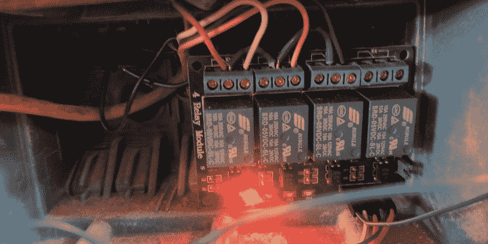
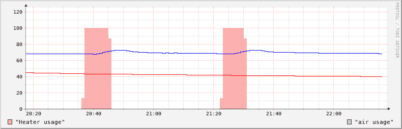
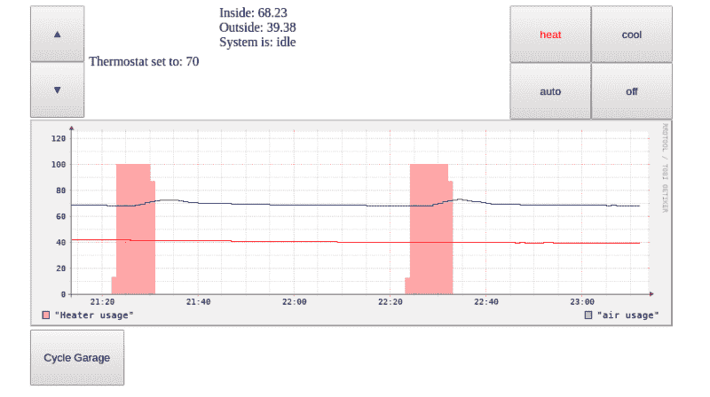
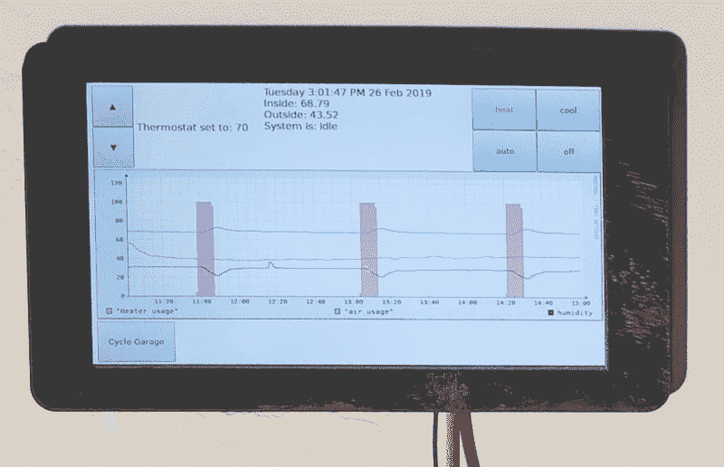

# 黑我的房子:树莓派作为触摸屏恒温器

> 原文：<https://hackaday.com/2019/02/27/hack-my-house-raspberry-pi-as-a-touchscreen-thermostat/>

你的恒温器是你家里最古老也是最简单的自动化设备。多年来，这些都是一个温度设置，仅此而已。可编程恒温器带来了更多的控制；它们是装在你炉子上的闹钟。然后，Nest 出现了，并增加了漂亮的设计和“学习功能”，与旧系统相比，感觉就像魔术一样。但是我们可以玩得更开心。我用我最喜欢的单板电脑 Raspberry Pi，通过建造我自己的触摸屏恒温器，把它命名为热(和冷)的守护者。

水银恒温器开启了这一切，并且非常简单，一个装有水银的玻璃胶囊，附着在缠绕的双金属片上。随着温度的变化，这个装置倾斜，水银珠移动，与电线接触或断开。更复杂的恒温器已经用电子器件取代了水银珠，但信号方法仍然相同，只是一个简单的接触开关。

这使得恒温器成为有抱负的家庭自动化黑客的主要目标。这个特别的项目我已经想了很久，并且很兴奋地用简单的原材料投入其中:我的树莓 Pi、触摸屏和机械继电器板。

## 给加热器通电



如果你更换你的标准家用恒温器，你会发现最常见的设置是 4 线或 5 线连接到你的 HVAC 设备。其中包括一根 24 伏交流电源线，用于开关加热器、空调和风扇的导线，以及一根可选的“公共”电线，通常用于为智能恒温器供电。为了保持向后兼容，实际上我所在地区的所有住宅暖通空调设备都使用这种布局。一种常见的故障排除技术是给 HVAC 系统“通电”——直接将 24 伏电线连接到加热器线路或 AC 线路。

对于黑客来说，一个简单的继电器就可以完美地驱动系统。对于我上面显示的设置，我把红色的 24 伏线接到黄色的加热器线上，系统开始工作。我用的是 SainSmart 的 4 通道继电器模块。任何有 GPIO，能和温度传感器对话的东西，都足以造一个恒温器。然而，正如你们都知道的，我已经承诺在我家的每个房间里都安装一个树莓派(Raspberry Pi)，我正在使用所有额外的电力来运行官方的 7 英寸触摸屏，作为 HVAC 的显示器和接口。我还使用了一些 Adafruit MCP9808 温度传感器，它们通过 I2C 总线与我们的 pi 对话。

## I2C 明白了:永远不要穿过小溪

在构建的中途，我确实遇到了一个非常奇怪的问题。完美工作几分钟后，温度传感器开始返回 0C，触摸屏停止响应触摸，`i2cdetect`认为每个地址都有一个 i2c 设备。我知道触摸屏和温度传感器共享 I2C 总线，所以我开始排除总线挂起的原因。

显示器有 4 个引脚和一根带状电缆。这些引脚是电源、接地和两个 I2C 引脚。当连接原始的 Raspberry Pi A 或 B 时，这些 I2C 引脚需要连接到 Pi 的单一 I2C 总线。从 Pi A+和 B+开始，还有第二条专用于显示器的 I2C 总线，通过带状电缆进行物理连接。我不知不觉地将显示器连接到了两辆 I2C 公交车上，更不用说将两辆公交车连接在一起了。当他们碰巧同时说话时，两个人都倒下了。TLDR:只连接两个专用电源引脚和排线，不要连接显示器上的 I2C 引脚。

## 使用 Python 和 Flask 进行温度监控

上次，我们使用 Python 和 Flask 向连接到车库门的 Raspberry Pi 发送请求。我们还扩展了这个想法，为恒温器 Pi 构建了一个 HTTP 接口。对正确路径的 HTTP 请求将返回检测到的温度值。读者指出了树莓 Pis 过热的可能性，所以我也将 Pis 的 CPU 温度添加到监控温度列表中。

```

from flask import Flask
import smbus
import os
import time
import RPi.GPIO as GPIO
app = Flask(__name__)
GPIO.setmode(GPIO.BCM)
GPIO.setup(17, GPIO.OUT, initial=GPIO.HIGH)
GPIO.setup(18, GPIO.OUT, initial=GPIO.HIGH)
GPIO.setup(27, GPIO.OUT, initial=GPIO.HIGH)
bus = smbus.SMBus(1)
config = [0x00, 0x00]
bus.write_i2c_block_data(0x18, 0x01, config)

@app.route("/enable/<pin>")
def enable(pin):
        GPIO.output(int(pin), GPIO.LOW)
@app.route("/disable/<pin>")
def disable(pin):
        GPIO.output(int(pin), GPIO.HIGH)
@app.route("/temp/<sensor>")
def temp(sensor):
        if sensor == "internal" :
                temp = os.popen("vcgencmd measure_temp").readline()
                ctemp = float(temp.replace("temp=","").replace("'C",""))
                return str(ctemp * 1.8 + 32)
        if sensor == "external" :
                bus.write_byte_data(0x18, 0x08, 0x03)
                time.sleep(0.5)
                data = bus.read_i2c_block_data(0x18, 0x05, 2)
                ctemp = ((data[0] & 0x1F) * 256) + data[1]
                if ctemp > 4095 :
                        ctemp -= 8192
                ctemp *= 0.0625
                ftemp = ctemp * 1.8 + 32
                return str(ftemp)
if __name__ == "__main__":
        app.run(host='0.0.0.0', port=80, debug=False)

```

正如您在上面看到的，我们已经将这两个温度作为 RESTful 接口的一部分公开。现在我们可以访问这些数据，我们该如何处理呢？输入 [RRDTool](http://oss.oetiker.ch/rrdtool/) 。

## 循环数据库和漂亮的图表

您可能不熟悉这个名称，但是您可能见过 RRDTool 生成的图形，最著名的是在 Cacti 监控套件中。RRDTool 是一个简单的循环数据库，建立在创建漂亮的图形的基础上，其理念是旧数据比新数据需要更少的分辨率。每分钟跟踪温度可能是有用的，但通常只有最后几个小时的数据。上周的数据不需要如此精确:每小时的平均温度可能就足够了。上个月，你可能只关心日均值，等等。RRDTool 允许您为每个数据源指定多个循环归档，具有不同的时间跨度和粒度。



我使用的另一个技巧是指定一个数据源来跟踪加热器或空调何时运行。这允许将温度与 HVAC 占空比进行比较，这有助于跟踪绝缘和效率问题。此外，这些数据对于调节恒温器以避免“短周期”也很重要，当系统运行时间不够长以达到完全效率，而是在短时间内连续开关几次。

## 将所有部件缝合在一起，组成一个自动恒温器

既然我们已经对加热器、温度监控和数据库的连接进行了分类，现在是时候把它们放在一起了。我选择了一分钟的周期:轮询我们所有的数据源，记录数据，每 60 秒运行一次加热器控制逻辑。为了避免短周期，有一个温度宽度设置，你可以称之为系统滞后。我已经确定了一个 4 度的摇摆:一旦观察到的温度比目标值低 2 度，恒温器就会打开，一直运行到温度比目标值高 2 度。这就是推出自己的系统的好处:你可以决定它将如何运作。

```

import time
from rrdtool import update as rrd_update
import pycurl
import json
from StringIO import StringIO
starttime=time.time()
tempSensors = ("thermostat-temp-external", "thermostat-temp-internal", "office-temp-external", "office-temp-internal",
               "office-temp-outside", "garage-temp-internal", "garage-temp-external", "livingroom-hum-external",
               "livingroom-temp-external", "livingroom-temp-internal", "office-hum-outside")
#settings = {"temp": 70, "mode": "heat", "heater-width": 2, "ac-width": 2}
c = pycurl.Curl()
c.setopt(c.URL, 'http://thermostat/disable/17')
c.perform()
c.setopt(c.URL, 'http://thermostat/disable/27')
c.perform()
c.close()
state = {"activity": "idle"}
while True:
	with open('/var/www/data/settings', 'r') as f:
        	settings = json.load(f)
	f.closed
	temperatures = {}
	c = pycurl.Curl()
	for sensor in tempSensors:
		try:
			buffer = StringIO()
			c.setopt(c.URL, 'http://' + sensor.replace("-", "/")) #change dashes to /
			c.setopt(pycurl.WRITEFUNCTION, buffer.write)
			c.perform()
			temperatures[sensor] = float(buffer.getvalue())
			rrd_update('/var/www/data/' + sensor + '.rrd', 'N:%f' %(temperatures[sensor]))
		except Exception as e:
			print(e)
	with open('/var/www/data/temps', 'w') as f:
        	json.dump(temperatures, f)
	f.closed
	if settings["mode"] == "heat": #if mode heat (auto should compare to the outside temp, to figure out heat or AC
		if state["activity"] == "idle" and temperatures["thermostat-temp-external"] < (settings["temp"] - (settings["heater-width"] / 2.0)) : c.setopt(c.URL, 'http://thermostat/enable/17') c.perform() c.close() state["activity"] = "heating" elif state["activity"] == "heating" and temperatures["thermostat-temp-external"] > (settings["temp"] + (settings["heater-width"] / 2.0)) :
			c.setopt(c.URL, 'http://thermostat/disable/17')
			c.perform()
			c.close()
			state["activity"] = "idle"
	with open('/var/www/data/state', 'w') as f:
        	json.dump(state, f)
	f.closed
	if state["activity"] == "heating" :
		rrd_update('/var/www/data/heater-state.rrd', 'N:100')
	else :
		rrd_update('/var/www/data/heater-state.rrd', 'N:0')
	if state["activity"] == "cooling" :
		rrd_update('/var/www/data/ac-state.rrd', 'N:100')
	else :
		rrd_update('/var/www/data/ac-state.rrd', 'N:0')
	time.sleep(60.0 - ((time.time() - starttime) % 60.0))

```

## 触摸屏:你会想要一个图形用户界面



剩下的就是用户界面了。实际的硬件是一个覆盆子 Pi 3 B+，[在 PXE](http://hackaday.com/2018/10/08/hack-my-house-running-raspberry-pi-without-an-sd-card/) 上启动，带有官方的 7 英寸触摸屏，安装在一个 3 组墙盒上。对于软件，我们在全屏模式下使用 Chromium，并为 Pi 显示器的小尺寸建立了一个优化的网页。你可能还记得[当连接车库开门器](https://hackaday.com/2019/02/13/hack-my-house-garage-door-cryptography-meets-raspberry-pi/)时，我们在网页上放了一个按钮。今天，我们将该页面扩展为一个中央控制面板。

```

<?php $settings = json_decode(file_get_contents('/var/www/data/settings')); $temps = json_decode(file_get_contents('/var/www/data/temps')); $state = json_decode(file_get_contents('/var/www/data/state')); if ($_SERVER['REQUEST_METHOD'] === 'POST') { if ($_POST["up"]) { $settings->{'temp'} += 1;
    }
    if ($_POST["down"]) {
      $settings->{'temp'} -= 1;
    }
    if ($_POST["heat"]) {
      $settings->{'mode'} = "heat";
    }
    if ($_POST["cool"]) {
      $settings->{'mode'} = "cool";
    }
    if ($_POST["auto"]) {
      $settings->{'mode'} = "auto";
    }
    if ($_POST["off"]) {
      $settings->{'mode'} = "off";
    }
    if ($_POST["GDO"]) {
      $curl_handle = curl_init();
      curl_setopt( $curl_handle, CURLOPT_URL, 'http://garage/moment/20' );
      curl_exec( $curl_handle ); // Execute the request
      curl_close( $curl_handle );
    }
    $file = fopen('/var/www/data/settings', "w") or die("Unable to open file!");
    fwrite($file, json_encode($settings, JSON_NUMERIC_CHECK));
  }
?>
<!DOCTYPE html>
<html>
<head>
 <meta http-equiv="refresh" content="60">
 
 
</head>
<body onload="startTime()">

<div style="width:790px; margin:auto;">

<div style="height:140px;">

<div style="float:left;">

<form method="post">
     <input type="submit" name="up" value="▲" style="padding:25px 25px;">
    </form>

<form method="post">
     <input type="submit" name="down" value="▼" style="padding:25px 25px;">
    </form>

   </div>

<div style="float:left; margin-left:5px; margin-top:60px;">
    Thermostat set to: <?php echo $settings->{'temp'}; ?>
   </div>

<div style="float:left; margin-left:25px;">

<div id="txt"></div>

    Inside: <?php echo round($temps->{'thermostat-temp-external'}, 2); ?>

 Outside: <?php echo round($temps->{'office-temp-outside'}, 2); ?>

 System is: <?php echo $state->{'activity'}; ?>
   </div>

<div style="float:right;">

<form method="post">
     <input type="submit" name="cool" value="cool" style="height:70px; width:100px;<?php if($settings->{'mode'} == "cool"){echo "color:red;";}?>">
    </form>

<form method="post">
     <input type="submit" name="off" value="off" style="height:70px; width:100px;<?php if($settings->{'mode'} == "off"){echo "color:red;";}?>">
    </form>

   </div>

<div style="float:right;">

<form method="post">
     <input type="submit" name="heat" value="heat" style="height:70px; width:100px;<?php if($settings->{'mode'} == "heat"){echo "color:red;";}?>">
    </form>

<form method="post">
     <input type="submit" name="auto" value="auto" style="height:70px; width:100px;<?php if($settings->{'mode'} == "auto"){echo "color:red;";}?>">
    </form>

   </div>

  </div>

<div style="margin:auto; text-align:center;">
<?php $opts = array ( "-w", "709", "-h", "200", "-Y", '-a', "PNG", "--start=-14400","--end=now", 'DEF:heater-state=/var/www/data/heater-state.rrd:state:AVERAGE', 'AREA:heater-state#FF000050:"Heater usage"', 'DEF:air-state=/var/www/data/ac-state.rrd:state:AVERAGE', 'AREA:air-state#0000FF50:"air usage"', 'DEF:livingroom-hum=/var/www/data/livingroom-hum-external.rrd:humidity:AVERAGE', 'LINE1:livingroom-hum#000000:humidity', 'DEF:therm-temp=/var/www/data/thermostat-temp-external.rrd:temperature:AVERAGE', 'LINE1:therm-temp#0000FF', 'DEF:outside-temp=/var/www/data/office-temp-outside.rrd:temperature:AVERAGE', 'LINE1:outside-temp#FF0000' ); $graphObj = new RRDGraph('-'); $graphObj->setOptions($opts);
  try {
    $ret = $graphObj->saveVerbose();
  } catch (Exception $e) {
    echo 'Caught exception: ',  $e->getMessage(), "\n";
    echo rrd_error()."\n";
  }
  if(!$ret){
    echo rrd_error()."\n";
  } else {
    #var_dump($ret);
    echo '';
  }
?>
  </div>

<div style="float:left;">

<form method="post">
    <input type="submit" name="GDO" value="Cycle Garage" style="padding:25px 15px; margin-right:25px;">
   </form>

  </div>

</body>
</html>

```

大部分是简单的 PHP 和 HTML。最有趣的元素是 RRDTool 图在页面加载时动态生成并包含在 html 文档中的方式。这允许将来进行定制，比如缩小和查看旧数据的能力，或者选择要包含的其他数据源。

[](https://hackaday.com/wp-content/uploads/2019/02/raspberry-pi-touchscreen-colorbalance.jpg)

3D 打印支架很好地完成了这个项目。为了获得准确的读数，让温度传感器远离 Pi 的热源非常重要。

我们还将推出更多内容，所以请睁大眼睛，随时[在 twitter](twitter.com/jp_bennett) 上关注我，了解我的家庭自动化冒险中偶尔出现的高峰或下一步的建议！