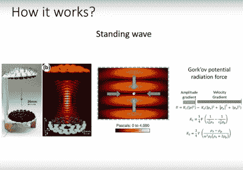
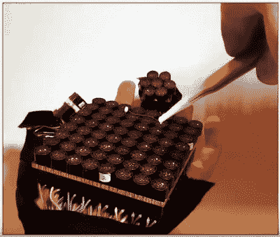

# 将声悬浮用于超越新奇的应用

> 原文：<https://hackaday.com/2018/08/09/hackaday-belgrade-asier-marzo-explains-acoustic-levitation/>

 [https://www.youtube.com/embed/vURtf8uGsFg?version=3&rel=1&showsearch=0&showinfo=1&iv_load_policy=1&fs=1&hl=en-US&autohide=2&wmode=transparent](https://www.youtube.com/embed/vURtf8uGsFg?version=3&rel=1&showsearch=0&showinfo=1&iv_load_policy=1&fs=1&hl=en-US&autohide=2&wmode=transparent)

我们都见过声悬浮，这是我们这个时代的科学创新之一，也是向公众展示令人印象深刻的科学物理演示的常规。超声波扬声器阵列使小物体和液体珠悬浮在半空中，这种景象非常神奇，吸引了所有年龄段的人。因此，英国布里斯托尔大学专攻超声波领域的研究科学家阿西尔·马索在贝尔格莱德 Hackaday 就此主题所做的一次演讲特别引人入胜，内容丰富。

他首先解释了声悬浮的概念及其机制。作为一个有着悠久历史的想法，他告诉我们，几百年前，人们试图用大量最响亮的乐器来移动岩石，但都无济于事。往昔的一批音乐家缺乏控制他们个人相位的能力，当然他们的组合作品在一粒豌豆大小的砾石面前都会止步不前，更不用说一块巨石了。

Explaining the standing wave produced by an ultrasonic array.

## 驻波的力量

鉴于我们现在可以在相控阵超声波扬声器之间产生驻波，他解释了允许悬浮的机制。驻波产生高强度和“安静的”低强度声音的模式，物体位于这些安静区域之一。因此，这种声音的波长决定了它的大小，对于他所使用的超声波来说，它的波长大约只有几毫米。

解释完它的工作原理后，我们又被带到了它的应用领域。这一点特别有趣，因为这是我们在儿童演示中从未见过的一面，这就是“看，我们可以让水滴漂浮起来！”。能够找到它的用途的领域的数量是令人惊讶的，并且形成了谈话的下一个阶段。

## 声悬浮的真实应用

给出的第一个例子是在光谱学领域，当从基板上的液滴反射光时，一定量的反射光来自基板。如果样品是悬浮的，所有的反射都来自它，而不是别的。微重力实验是另一个有趣的应用，在这种情况下，有可能复制以前需要国际空间站等航天器环境的一些工作。这是一个特别出乎意料的转折。

Manipulating a solid particle with a wearable array.

这项技术可以以更高的频率用于液体介质中的微小颗粒——一项演示包括以某种模式移动单个血细胞。但是阿西尔还有更多锦囊妙计。这项技术可以用于人类与计算机和现实世界的互动。我们看到一种显示器，其中的像素是悬浮在网格中的小塑料球，它们甚至可以通过在电场下旋转来改变颜色。连续的展示使用的不是网格中的球，而是图形中的点云，这证明了栅格并不是传达信息的唯一方式。最后，我们看到了应用于可穿戴设备、手持式牵引光束和一套驻波镊子的阵列。他举了一个例子，拿起一个 SMD 元件，我们可以看到这是无价之宝。

## 悬浮是我们力所能及的

对我们来说，好消息是这是一项尖端科学，在我们的水平上也是可以达到的。他通过 A [声学悬浮网站](http://www.acousticlevitator.com)在网上选择了一些设计。有一个超声波阵列，一个声学悬浮器和一个声学牵引梁，这些组件是像 Arduinos 和电机驱动板这样的普通部件。甚至小学生也用套件组装它们，实验者用其中一个对声场进行纹影摄影。最后，我们看到了 Ultraino，这是一个雄心勃勃的项目，为大型阵列提供软件和驱动硬件，其中每个传感器都是单独驱动的，然后是流体超声的未来工作和超声音频扬声器项目的前景。

Hackaday 涵盖了来自我们社区各个角落的大量项目和主题。每一个都以自己的方式令人兴奋，从一个看起来简单的 Arduino 项目到一个多年的爱的工作。虽然我们很少能说我们看到了一个真正前沿的科学，同时用我们理解的术语解释它，并给出一个我们可以自己实验的可理解的版本。我们真的很期待来自这个方向的项目，因为声学悬浮成为硬件黑客军械库中的另一个已知数量。