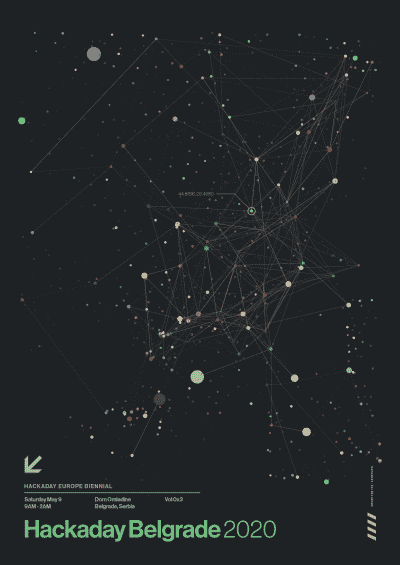
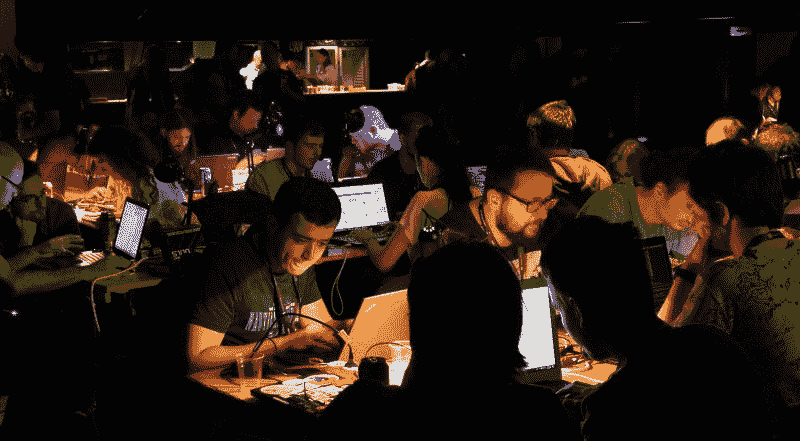

# 贝尔格莱德 Hackaday:征集提案

> 原文：<https://hackaday.com/2020/01/06/hackaday-belgrade-call-for-proposals/>

参加 2020 年 5 月 9 日在塞尔维亚贝尔格莱德举行的 Hackaday 贝尔格莱德会议！两年一次的硬件会议离现在只有 17 周了。早鸟票将很快发售，但现在开始，你可以通过提交一份演讲提案进入会议。被接受的演讲者可以免费入场，另外，当门票开始销售时，每个提交高质量演讲提案的人都将被优先考虑。

 是的，我在和你说话。Hackaday 努力将首次发言的人纳入我们会议的发言人名单。我们正在寻找独特的、前沿的、异想天开的、疯狂的、令人生畏的或改变世界的围绕硬件创造的主题。从学习新工具或技术到制造冒险，从固件项目的代码争论到完成艺术装置，从被遗忘的硬件历史到在您自己的工作台上使不可能成为可能，我们需要听到您的故事！

那个项目，你去了深杂草和工作的方式回来了吗？黑客日会议上的每个人都想听到尽可能多的细节。毕竟，我们是你的黑客伙伴。事实上，你应该带上硬件。

## 我们需要你

所有这些都不是在真空中发生的。这是第三次贝尔格莱德会议，现在已经进入偶数年的滴答节奏。前两部都卖完了，这一部也会卖完，结果总是[一场充满行动的、近 24 小时马拉松式的冲刺](https://hackaday.com/2018/06/01/a-wild-hackaday-belgrade-confirms-status-as-one-of-worlds-greatest-hardware-cons/)讲座、研讨会和硬件黑客。但这行得通的唯一原因是因为像你这样了不起的人把在那里作为他们生活中的一个优先事项。

Badge hacking at 2018 Hackaday Belgrade

所以，冒险一试，[整理好你的演讲计划，并在 3 月 2 日](https://form.jotform.com/93375488418168)前提交。但是不要止步于此，让你的朋友和你的英雄们也这样做。在你的日程表上划出 5 月 9 日(大约上午 9 点到 2 点)，在下班前一天休息。当你这么做的时候，说服你的老板和同事和你一起去。贝尔格莱德见！